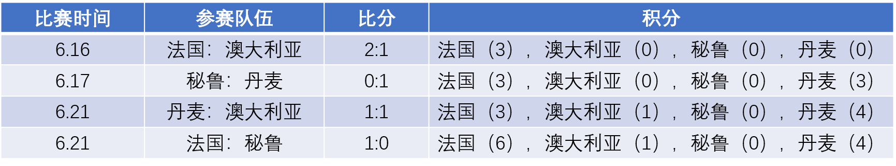
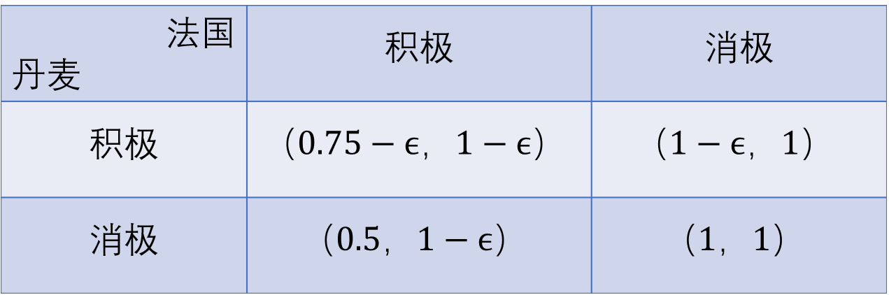
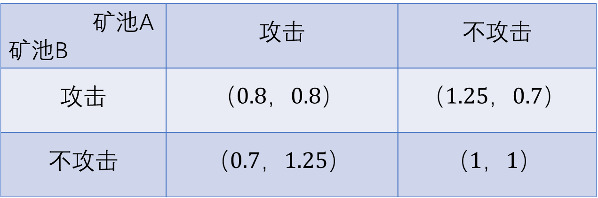
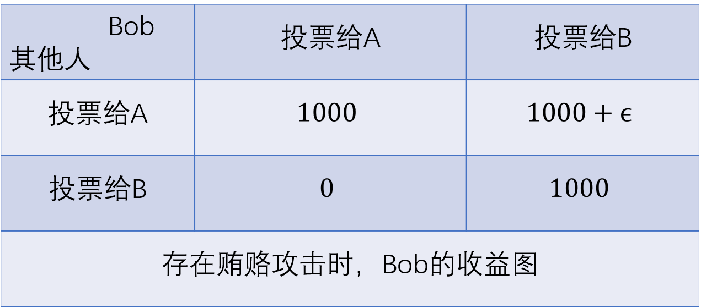

博弈论被认为是20世纪经济学最伟大的成果之一，其思想被广泛的应用到经济学，政治学，计算机科学，生物学，运筹学等学科。通过分析博弈各方的收益情况而对参与者的行为进行预测，博弈论已经被应用于处理国际关系、研究军事战略、制定公司经营策略等领域。诺贝尔经济学奖获得者约翰.纳什(John F. Nash)在他的博士论文中提出的“纳什均衡”概念，完全颠覆了传统经济学家的固有观念，因此“纳什均衡”对经济学的影响被类比为“DNA双螺旋结构对生物科学的影响”。纳什均衡提供了一种分析社会和经济参与者行为的工具，安比(SECBIT)实验室的研究员利用均衡的概念来揭示世界杯比赛中消极比赛、比特币系统中矿工挖矿博弈，以及共识系统所面临的挑战背后所蕴含的均衡模型。

6月26日，第21届世界杯小组赛C组法国对战丹麦队的比赛由于两个国家队踢默契球而引起了球迷的抱怨，安比(SECBIT)实验室的研究人员通过博弈论的分析方法来讨论比赛规则对球队行为的影响，从而说明规则会影响参与者的行为。接着，我们描述了在比特币挖矿的情境下，矿池之间存在的博弈现象。最后，我们讨论了比特币系统共识算法所面临的潜在威胁。通过对这些实例的分析，安比(SECBIT)实验室希望将博弈论的思想引用到智能合约的部署中，当开发人员在设计有多个参与者参加的智能合约时，通过添加智能合约的博弈论属性来预测参与者的行为。

## 世界杯消极比赛与重复剔除的占优战略均衡

在世界杯小组赛中，每个小组有4支球队，通过互相比赛最终两支获得最高分数的球队出线进入下一轮，小组赛的得分规则是：赢一场得3分，平局的话两队各得1分，输的队伍得0分。如果两支队伍积分相等，出线队伍通过比较净胜球和红黄牌数量来决定。

世界杯C组有四支队伍：法国，丹麦，秘鲁和澳大利亚。在法国队和丹麦队比赛之前，法国队已经战胜澳大利亚和秘鲁，得到了6分，丹麦队战胜秘鲁，打平澳大利亚积4分，澳大利亚积1分，秘鲁两场全输积0分。具体赛况如下图所示。

C组还剩下两场比赛，分别是丹麦对战法国，澳大利亚对战秘鲁。

在这个前提下，我们画了下面的收益图来表示丹麦对战法国的比赛的可能结果。

在上图中，有两个参赛队伍法国和丹麦，每个参赛队伍有两个策略：积极比赛和消极比赛。消极比赛中，每个球队的重点不在于如何积极地发动进攻获得进球，而是将比赛的重心放在如何消磨时间上，比如持续在后场传球。还有就是派遣替补队员上场，让主力球员休息从而避免意外受伤。

在这张图表中有四个状态组合，第一个状态（积极，积极）表示两个队都积极地应对比赛，这个状态下丹麦队的收益是 $( 0.75 - \epsilon )$，$( 0.75 )$ 表示丹麦队有较大的可能性出线，$( \epsilon )$ 是一个很小的小数，它表示的意思是队伍中的队员由于获得黄牌或者受伤而需要付出的代价。法国队的收益是$( 1 - \epsilon )$，这表示虽然法国队出线了，但是球队队员由于受伤或者黄牌而导致收益下降。

第二个状态（积极，消极）表示丹麦队积极比赛，而法国队消极比赛，在这种情况下，丹麦队获胜的可能性大大的增加，但是由于需要付出相应的代价，丹麦队的收益成为$( 1 - \epsilon )$。法国队由于以前的两场比赛均获得了胜利，因此无论这场比赛是输是赢都会出线，因此法国队的收益为1.

第三个状态（消极，积极）表示丹麦队消极比赛而法国队积极比赛，这样丹麦队输掉比赛的概率很大，是否出线会受到澳大利亚和秘鲁比赛结果的影响，因此我们设置其收益为$( 0.5 )$，与此同时，由于法国队积极比赛会付出代价，因此法国队的收益为$( 1 - \epsilon )$。

第四个状态（消极，消极）表示两队都消极比赛，在此状态下，由于平局两队都可以增加积分，这样无论澳大利亚和秘鲁的比赛结果如何，法国和丹麦都会出线，因此我们设置两队的收益都为1.

观察本次比赛的收益图可以发现，对于法国队而言，无论采取什么策略都可以出线，但是积极比赛会让其损失$(\epsilon)$的收益。因此消极比赛是法国队的占优战略。我们假设法国队是理性的，因此法国队会**剔除自己的劣势策略**：“积极”，而选择对自己最有利的策略：消极比赛。我们同样假定丹麦队是理性的，他会正确的预测到法国队会选择消极比赛，在此状况下，丹麦队获得最大收益的策略也是消极比赛。在实际比赛中，法国队让替补队员首发上场比赛，这无疑给了丹麦队一个消极比赛的信号，因此丹麦队会做出消极比赛的决定。

在本次博弈中，状态（消极，消极）是一个纳什均衡状态。

>纳什均衡：在一个状态下，没有一个参与者可以在独自改变策略的情况下增加自己的收益。

接下来我们将会运用相同的分析方式来描述比特币挖矿系统中所存在的均衡现象。

## 矿工博弈

比特币系统的安全性依赖于其自身所具有的稳定的激励规则，这个激励系统所运用的底层数据结构是区块链，区块链中记录了所有比特币的交易记录，因此区块链可以被认为是一个在分布式系统中维护的一个全局账本。由于区块链的开放性，任何人都可以加入到这个系统中，比特币系统中的参与者（即矿工），需要通过提供代价高昂的计算来提供工作量证明（Proof of Work）来产生新的区块，矿工产生新的区块的过程被称为挖矿。当一个矿工完成了比特币系统所要求的工作量证明，一个新的区块会被添加到原有的区块链当中，提供工作量证明的矿工会得到相应的比特币奖励。随着比特币系统的发展，其中所运用的激励规则被认为是稳定且可扩展的。

由于比特币的市值很高，越来越多的矿工加入到挖矿的队列，为了保证每个区块的创立时间保持基本恒定（每10分钟产生一个新的区块），比特币系统在不断地调整挖矿的难度。因此计算能力小的矿工很难依靠自己的算力生成新的区块，这就导致矿工会选择加入其它挖矿的机群，从而聚集成一个**矿池**一起进行挖矿，如果这个矿池成功的生成一个新的区块，即完成工作量证明（Proof of Work），这个区块所得到的比特币奖励会根据每个矿工的贡献进行分配。

在一个矿池中，会有一个管理员和诸多矿工，管理员负责分配和监督矿工进行工作。如果有一个矿工完成了一个工作量证明（Proof of Work）,管理员会将其发布到网络中并且将新区快添加到区块链中。为了对矿工进行管理，管理员每隔一段时间会要求矿工矿工向其提交部分工作量证明(partial Proof of Work)。通过这个检查机制，管理员一方面可以确认所有的矿工都在为挖矿而工作，另一方面也可以评估每个矿工的工作量，从而计算矿工的收益。有些矿池为了增加自己的算力，会公开自己的服务器接口，其他矿工只需要注册便可以加入矿池，接收挖矿任务，进而发送工作量证明给管理员，当这个矿池创造出新的区块，每个矿工根据自己贡献的大小获得利润分成。

### 区块截留攻击

在正常状况下，不同的矿池各自独立挖矿，独自分享挖矿的收益。然而，一个矿池（A）可以对另一个矿池（B）发动攻击，矿池A将其中的一部分矿工注册到矿池B,这些矿工像正常矿工一样接收矿池B管理员所分发的挖矿任务，然后入侵的矿工会开始挖矿，如果他们完成了部分工作量证明任务，他们会将这些信息发送给管理员。但是，如果他们完成了一个完整的工作量证明，他们会选择丢弃该信息，拒绝向管理员发送工作量证明。由于入侵矿工会向管理员发送部分工作量证明，他们会被管理员认定为正常矿工，并且在该矿池其他矿工创建新的区块链的时候得到利润分成，因此攻击者可以获得被入侵的矿池的收益。一个矿池可以通过比较期望收益和实际收益的差异来确定自己是否受到攻击，但是由于每个矿工所要完成的部分工作量证明的任务相对较小，矿池管理员很难判断出到底是哪个矿工发起了攻击。

为了衡量一个矿池的挖矿效率，我们提出了一个衡量标准：
> 收益密度：一个矿池的收益密度是矿池中每个矿工的平均收益与每个矿工单独挖矿所获得收益的比率。

显而易见，一个矿池的收益密度越高，其获得的收益就相对更多。一个没有受到攻击的矿池的收益密度是1，而一个受到攻击的矿池的收益密度会小于1。

现在我们构建一个具有两个矿池的博弈模型，在这个模型中，我们假设除了矿池A和矿池B之外的所有矿工均独自挖矿。而且矿池A和矿池B的运算能力并没有超过整个系统中运算能力的50%。每个矿池都可以设置自己的攻击比率，即在自己所有的矿工中选择一定数量的矿工作为入侵矿工，矿池可以根据自己的算力来调整自己的攻击比率，从而最大化自己的收益。

我们设定$r_a$为矿池A的收益密度，$r_b$为矿池B的收益密度。$r^{\prime}_b$是矿池B在受到矿池A攻击而不做出反击的情况下的收益密度，$r^{\prime}_a$是矿池A在受到矿池B攻击而不做出反击的情况下的收益密度。

当矿池A受到矿池B的攻击，其收益会下降，当矿池A发起反击的时候，他的收益会上升，而矿池B的收益会下降。为了更直观的表示两个矿池的博弈过程，我们特意构造了一个更为直接的博弈模型，见下图：

在上图所示的博弈中，对于矿池B而言，当矿池A选择攻击时，矿池B同样选择攻击会获得0.8的收益密度，如果矿池B不选择反击，他只会获得0.7的收益密度，所以当矿池A发动攻击时，矿池B应当选择反击；当矿池A选择不攻击时，如果矿池B选择攻击，他会获得1.25的收益密度，这个收益要大于矿池B不攻击的收益。因此对于矿池B而言，发动攻击是一个可以获得高收益的优势策略。对于矿池A而言，重复上述分析，他的优势策略也是发动攻击。因此这个博弈存在一个**占优策略均衡**，即状态（攻击，攻击）。这个状态也是一个纳什均衡状态，也就是说，一方参与者独自改变策略，不会增加自己的收益。

这个博弈模型是一个典型的**囚徒困境**模型，但是，由于挖矿行为是一直持续的行为，所以这个博弈可以无限次的重复发生，而囚徒困境只进行了一次博弈。在这个模型中，相互发动攻击会造成双方收益的下降，所以对于两个矿池而言最好的状态是达成默契互不攻击（虽然单方攻击可以提升收益，但是如果对方发动反击，双方利益都会受损）。

当博弈推广到具有多个矿池的一般情况下，矿池之间互相发动攻击依然会造成收益下降；如果有矿池单方面发动攻击也会增加收益，但是有受到报复的风险。总而言之，受到攻击的矿池挖矿的效率并没有得到提升，并且由于其将利润分给了入侵矿工，原有的矿工收益会下降。发动攻击的矿池由于分散了一部分矿工进行攻击，其计算能力也会下降，但是由于入侵其他矿池，他会得到额外的收益。入侵行为会导致整个挖矿系统的算力缩减，进一步会导致比特币系统降低挖矿的难度。在实际挖矿中，矿场可以选择建造自己私密的矿池，开放的矿池可以选择降低自己的规模，从而减少被攻击的风险。上面所描述的博弈模型的数学推导可参考论文[1].

接下来我们讨论比特币系统中可能存在的另一种类型攻击：贿赂攻击。

## 贿赂攻击者模型与共识算法

在这个模型中，我们假设有两个候选人A与B，我们想要通过投票的方式从这两个参与者之中选择出一个优胜者。每个参与投票的人可以投一票，最终获得票数最多的候选人赢得胜利；投票给胜利者的候选人可以获得1000人民币的奖励。假设Bob是参与投票的参与者，其获得的收益可以由下图表示。

我们现在假设候选人B有很多预算，他准备对投票的参与者发起贿赂，并且承诺付给投票给他的参与者$( 1000 + \epsilon )$人民币，通过贿赂的手段候选人B可以获得胜利，$( \epsilon )$代表一个很小的小数。受到贿赂攻击后的Bob收益如下。可以看到本轮博弈会产生新的均衡点，即接受贿赂攻击者选择投票给贿赂者，由于会有较高的潜在收益，投票给贿赂者还是一个很稳定的状态。

比特币系统同样存在这样的潜在攻击威胁，一个攻击者可以通过贿赂其他矿工来让大家同意其挖掘的区块。由于参与者众多，贿赂其他矿工的成本太高（取得其他矿工的信任很难），现在的比特币系统成功的避免了贿赂攻击。关于贿赂攻击的详细讨论可以参考以太坊的博客[3].

## 结语

通过上面的分析，安比(SECBIT)实验室的研究人员为世界杯上法国队和丹麦队的默契球比赛建立了一个博弈模型，并且根据模型分析了产生默契球比赛的原因。消极比赛的行为不仅存在于世界杯比赛，在奥运会羽毛球比赛中也会发生消极比赛的状况,相关报道可参考[2]。接下来的实例分析了在比特币挖矿的场景下，矿池之间的博弈，虽然互相发动攻击是一个均衡状态，但是为了长远的利益考虑，矿池之间通过达成互不攻击的默契可以保证各方的共同利益。最后，我们又讨论了比特币共识算法所存在的潜在攻击威胁，但是由于在现存系统中攻击的成本太高，比特币系统成功的避免了贿赂攻击。

由于博弈论的广泛应用，已经有很多数学家和经济学家获得了诺贝尔经济学奖，例如，2012年诺贝尔经济学奖颁发给了美国经济学家埃尔文·罗斯（Alvin E. Roth）与罗伊德·沙普利（Lloyd S. Shapley），以表彰他们创建稳定分配理论和进行市场设计的实践。安比(SECBIT)实验室的研究员通过利用博弈论的分析工具对两个不同场景（比赛及加密货币）下的活动进行建模，说明了博弈论和纳什均衡的概念及应用。更进一步，安比(SECBIT)实验室希望开发人员在设计有多个用户参与的智能合约的时候，可以运用博弈论的分析工具对智能合约中的规则进行分析和证明，从而引导参与者做出更有利于全体社会收益的行为。

## 参考文献

* [1] Eyal, I., 2015, May. The miner's dilemma. In Security and Privacy (SP), 2015 IEEE Symposium on (pp. 89-103). IEEE.
* [2] 于洋/王晓理消极比赛 四对女双被取消奥运资格 http://2012.163.com/12/0801/20/87RM0LPI000506A2.html
* [3] The P + epsilon Attack. https://blog.ethereum.org/2015/01/28/p-epsilon-attack/

合作交流请联系info@secbit.io。

------

**安比（SECBIT）实验室**

安比（SECBIT）实验室专注于区块链与智能合约安全问题，全方位监控智能合约安全漏洞、提供专业合约安全审计服务，在智能合约安全技术上开展全方位深入研究，致力于参与共建共识、可信、有序的区块链经济体。

安比（SECBIT）实验室创始人郭宇，中国科学技术大学博士、耶鲁大学访问学者、曾任中科大副教授。专注于形式化证明与系统软件研究领域十余年，具有丰富的金融安全产品研发经验，是国内早期关注并研究比特币与区块链技术的科研人员之一。研究专长：区块链技术、形式化验证、程序语言理论、操作系统内核、计算机病毒。
