# Last Winner 的最后赢家 - 智能合约超大规模黑客攻击手法曝光

> 安比（SECBIT）实验室创始人郭宇：2009年，中本聪创造了一个虚拟的去中心化新世界。这仿佛是一片流着奶和蜜糖的应许之地，人们欢呼雀跃，蜂拥而至。但与所有的生态系统一样，新世界有生命，就有捕食者。有交易者，就有黑客。区块链上的应用在进化，攻击者也同样，我们给大家展示的是区块链世界不为人知的另一面，暗流涌动。意料之外，也在意料之中。

Last Winner（类 Fomo3D）游戏大火，导致以太坊异常拥堵，Gas 费用暴涨。大量以太币资金入场。

北京时间 2018 年 8 月 10 日凌晨 1:38，加州时间 9 日上午 10:38，安比（SECBIT）实验室收到合作伙伴美国硅谷 AnChain.ai 公司消息，基于 AI 的态势感知系统发出预警信息，发现部分游戏合约出现大量交易并且存在异常的资金流动情况。安比（SECBIT）实验室的小伙伴赶紧根据最新线索，对相关合约和交易进行观察、跟踪、分析。

安比（SECBIT）实验室由中国科学技术大学博士郭宇创建，从密码学、代码语义、形式化验证、博弈论、编译器等多种理论角度切入，在智能合约安全技术上开展全方位深入研究。

AnChain.ai 由辛辛那提大学计算机博士方春生 Victor Fang 创建，方博士是硅谷上市网络安全公司 FireEye 史上第一位首席数据科学家，负责 AI 产品研发。AnChain.ai 专注安全威胁情报、区块链态势感知，凭借 AI 技术助力区块链生态安全。

下文敏感地址只保留前 4 位。片尾有**三个彩蛋**，智能合约爱好者请不要错过。


## 悄然上线：莫名火爆的 Last Winner

Last Winner 是一款基于以太坊智能合约的 DApp 游戏，于 8 月 6 日上线，这款游戏一经推出，就“异常”火爆。

这款游戏合约地址为 0xDd9fd6b6F8f7ea932997992bbE67EabB3e316f3C。据 Etherscan 显示，短短六天时间内，该游戏合约就已产生 27 万余笔交易。甚至前段时间以太坊网络大拥堵也与 Last Winner 游戏密切相关。8 月 8 日 和 9 日，在 Last Winner 和 Fomo3D 超大规模交易量的共同作用下，以太坊未确认交易数量创年内新高，平均 Gas 费用一度飙升至正常 10 倍以上。


该游戏第一轮奖池金额为 1.6 万多个以太币，而玩家总投资额更超过 10 万以太币，资金量巨大。目前游戏第一轮已结束，第二轮奖金池已迅速累积至 7000 多以太币。

疯狂的现象级游戏背后**暗流涌动**。

## 疑团重重：前期大量参与者的资金来历不明

据知名媒体「区块律动」报道，Last Winner 由名为「蚁群传播」的**资金盘传销组织**推广运营，有着数量众多的会员和极强的推广拉下线能力 [1]。而据另一款火爆游戏 Fomo3D 开发团队称，Last Winner 是仿 Fomo3D 游戏，其背后运营团队准备了 20 万 ETH 来进行自动刷量交易。因此，Last Winner 游戏火爆的背后，可能是一场精心布局的传销游戏，初期利用机器人发起批量交易，伪造活跃假象，吸引新韭菜入场。

Last Winner 游戏合约存在大量非正常交易，并且伴随着大量合约的创建与自毁，与正常人类调用行为特征偏离很大，这引起了我们的高度警惕。

## 疯狂推广：只面向国人，合约源码却未公开

在各大论坛、媒体、以及微信群中，都可以见到 Last Winner 游戏的推广文章，而这些文章有着类似的描述，并且都附上**推广邀请码**。但 Last Winner 英文相关资料非常少。


显然，这是一款针对中国人的游戏，有着诱人的推广（**拉下线**）奖励，因此在网络上广为传播。并且，这款游戏有适配安卓和 iPhone 手机的 App，简化了使用操作，降低了参与门槛。

但是，十分可疑的是，作为一款基于智能合约的区块链游戏，Last Winner 居然没有公开合约源代码！这是一个非常危险的信号。为何这样一个游戏能这么火爆，吸引**这么多人**参加？

我们直觉上感到这款游戏到处透露着诡异的气息。

## 安全性存疑：实则是 Fomo3D 山寨版

Last Winner 官方宣传语写道：

> Last Winner（LW）是首款完全去中心化的类 Fomo3D 游戏 DApp，完全基于以太坊智能合约原生开发。只要下载安装 App 就可参与游戏。

类 Fomo3D 游戏，且未公开源代码，这不得不让人产生怀疑。要知道，短短时间内原创开发一个好玩又**安全**的 DApp 游戏难度非常大。

安比（SECBIT）实验室迅速使用内部工具逆向分析了 Last Winner 的合约代码（字节码）。果不其然，这款游戏合约代码函数名称与 Fomo3D 高度相似，疑似直接拷贝（抄袭）了 Fomo3D 的源码，但却又新增了 10 余个可疑**未知函数**。

尽管 Fomo3D 在 Etherscan 公开了源代码，但这并不代表它开源给任何人随意使用。

安比（SECBIT）实验室之前报道过：在 Fomo3D 爆红之后，各类山寨版 Fomo3D 层出不穷。之前这些山寨版游戏往往复制 Fomo3D 官网和合约源码，并可疑地在一些地方进行修改。而 Last Winner 在此基础上更进一步，推出移动客户端，并疯狂推广，却不公开智能合约源代码。

智能合约游戏或 DApp 的亮点之一就是公开透明。Last Winner 游戏则完全违背了这一点，动机十分可疑，参与该类游戏的风险极高！

当时严峻的形势是：一方面有多个地址疑似疯狂发起攻击交易，另一方面项目方游戏合约未公开源码，高度可疑却吸引了巨量资金。我们感觉到态势十分紧急，于是迅速开展分工合作。AnChain.ai 中美团队日夜交替分析和监控异常交易，收集证据，定位攻击来源与攻击规模。

安比（SECBIT）实验室的小伙伴们则兵分两路，分别开展对**不透明游戏合约**和**黑客攻击手法**的逆向分析。

## 前情回顾：类 Fomo3D 游戏空投机制存漏洞

Fomo3D 游戏参与形式是用以太币购买游戏道具，除了最后一个购买的人可以获得巨额大奖外，平时参与者还有机会获得“空投”奖励。

这里有主奖池和副奖池的概念，最终的巨额大奖和**空投奖励**分别从从主奖池和副奖池中获取。

所有进入游戏的以太币，有 1% 数量会进到副奖池。每一次购买道具都会有概率获得空投。空投的概率从 0% 开始，每增加一笔不小于 0.1 ETH 销售订单，空投概率会增加 0.1%。同时空投奖金额与购买金额也挂钩，如果购买 0.1 ~ 1 ETH，就有概率赢得 25% 副奖池奖金，购买更多则比例越大。

一进入游戏界面，就会看到**鲜明提示**，通知当前中奖概率和奖池金额。这一设计，原本是想增加游戏趣味性，并起到吸引资金入场、延长游戏时间的作用。但实际情况却并非如此。

通过观察 LastWinner 游戏合约以及部分地址的异常交易行为，我们心中有了**初步答案**。

让我们把时间退回到 20 多天前，**早在 7 月 24 日**，安比（SECBIT）实验室和派盾（PeckShield）科技分别同时预警：Fomo3D 游戏的智能合约存在随机数漏洞可被利用，Fomo3D 及所有抄袭源码的山寨合约均存在该安全漏洞 [2]。原本设计上随机性较大的空投游戏可通过**特殊手段操纵**，大大提高中奖概率。

经安比（SECBIT）实验室字节码智能扫描工具逆向分析，Last Winner 游戏空投奖励代码与 Fomo3D 基本一致，相似度达 91%，可能存在同样漏洞。随着游戏火爆进行，机敏的黑客肯定也闻风而动。

## 不能说的秘密：黑客制造秘密武器攫取高额收益


在区块链态势感知系统所展现出来的数据面前，我们不由地倒吸一口凉气。

图中的这些可疑地址，如同“病毒”一般紧紧缠绕在 Last Winner 合约四周，肆意吞噬着 Last Winner 内的资金。

我们观察到，图中紧靠 Last Winner 的这些地址，有着**类似的行为模式**。

如：

1. 不停地往某合约地址上发起交易，同时附带 0.1 个以太币
2. 不少交易状态为失败
3. 成功的交易又会涉及大量“内部交易”
4. “内部交易”调用逻辑十分复杂，并伴随大量合约的创建和自毁

安比（SECBIT）实验室迅速得出初步结论：这些不明合约就是黑客用来攻击 Last Winner 的秘密武器，黑客正是通过这些合约，持续吸走 Last Winner 游戏内的以太币。

## 案发现场：大量类似交易，超高回报率

上面态势感知图中，**占地面积最大**的嫌疑地址引起了我们的注意：0xae58，于是从这个地址展开了追踪。

**8 月 9 号当天**，0xae58 地址内以太币余额就以超过 300 个，而当时他正在大量往地址 0x5483 上发起交易，每笔交易转账金额都是 0.1 Ether。显然，黑客正通过 0x5483 智能合约向 LW 发起攻击。

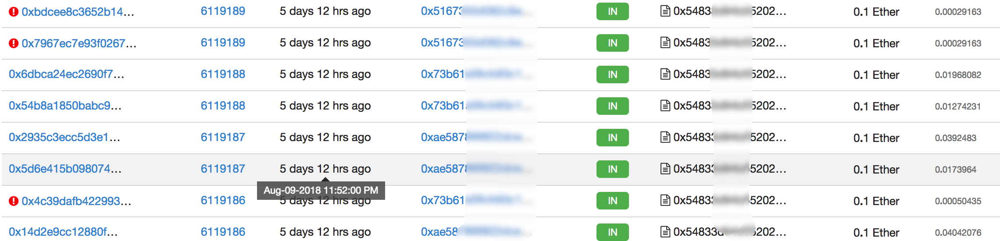

让我们观察下面这条状态显示为成功的交易。表面上看是 0xae58 向攻击合约 0x5483 转了 0.1 Ether，实际却涉及了一大堆地址间的相互转账，最终随着 0x7c77 合约**自毁**，0.189 个 Ether 转移回 0xae58 的账户中。

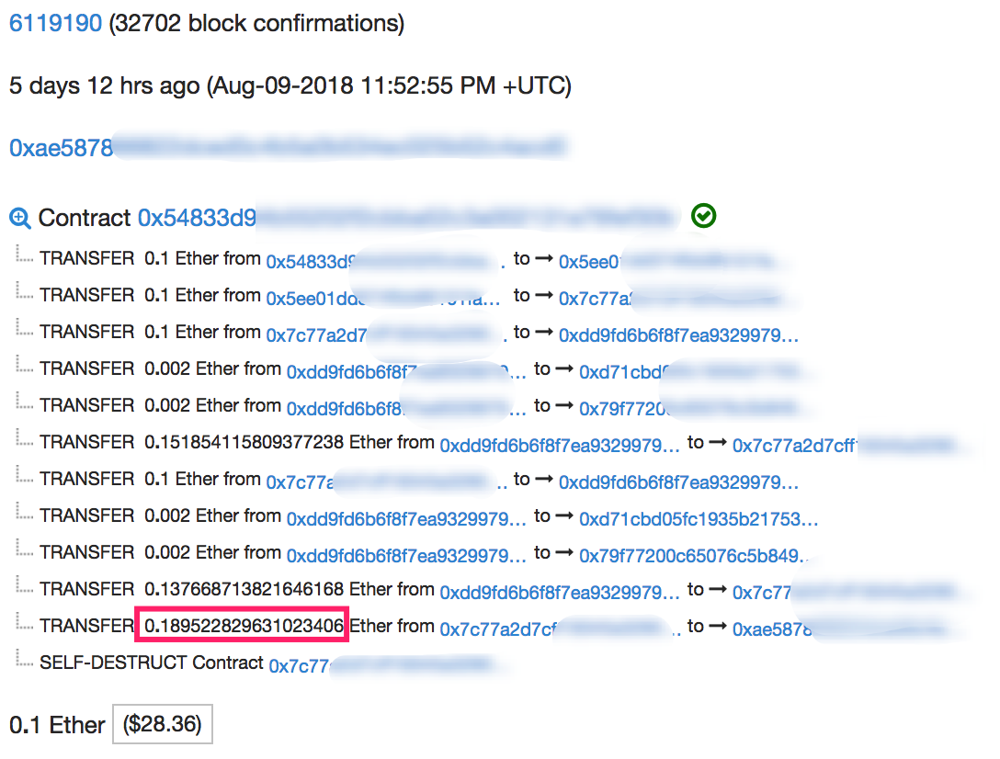

这十分神奇，攻击者投入 0.1 个以太币，最终收获 0.189 个，**瞬间回报率高达 89%**，简直暴利。

我们很快发现，除了 0xae58 地址外，还有**四个地址**也持续不断地向 0x5483 合约发起类似交易，持续获得高额回报。

而失败的交易，仅消耗 27712 燃料（Gas），**成本损耗十分低**。

研究目标立刻锁定为攻击合约 0x5483。由于无法获得源码，安比（SECBIT）实验室立刻使用内部工具展开逆向分析。

## 暴利：数据面前我们再次震惊

**8 月 13 日**，当我们沉浸在研究黑客的攻击合约各种细节优化和精巧设计之时，黑客攻击数据全景分析新鲜出炉。

其中，攻击获利最大的是以 0x820d 地址为首的团队。他们累计获利超过 5000 个以太币。AnChain.ai 团队和安比（SECBIT）实验室将该黑客团伙精确定位，并将其命名为 BAPT-LW20 (Blockchain APT – Last Winner)。

BAPT-LW20 团队在短短 6 天时间内，共发送将近 5 万笔交易，从中攫取 5194 个 Ether，获利价值将近 1200 万人民币。 

由下图每小时发起的**攻击交易数量趋势图**（下图），我们可以看出攻击的高峰期发生在 **8 月 8 日 ～ 10 日**，每小时平均攫取将近 100 以太币，将近 22 万人民币。这正好也是 LW 游戏最火爆的时间段。随着游戏进入后期，入场资金急剧下降，收益降低，黑客也不得不也降低了攻击频率。

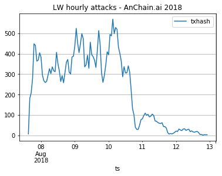

再看看**黑客每小时攫取以太币数量趋势图**（下图）。惨淡的漫漫熊市里，黑客却在狂赚以太币。


下图是“Last Winner 中黑客的交易量占比和攫取 ETH 占比”，可见黑客发送的交易量只占总交易量的 9.877%，但是却攫取了Last Winner奖金池中49%的奖金。黑客的娴熟攻击技能，为他们带来了普通玩家难以企及的好运，而普通玩家在这场游戏里面几乎很难获得空投奖励。

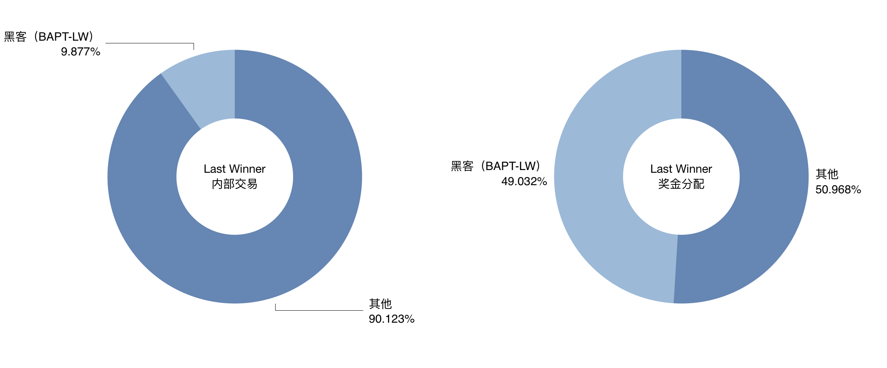

## 火线追凶：BAPT-LW20 团队攻击 LW 始末

安比（SECBIT）实验室尝试追踪复原 BAPT-LW20 团队攻击时间线。

下图是 BAPT-LW20 团队某账户余额变动情况。


0x820d 是 BAPT-LW20 团队所有攻击合约的部署者，也是攻击的实施者之一，可认为是 BAPT-LW20 团队的队长。0x820d 地址最早活跃于 **7 月 20 日**，账户中的初始以太币均由 0x73B6 地址转入。而 0x73B6 也是同一天开始活跃的新地址，它的初始以太币来自总部位于美国旧金山的 Kraken 交易所。

0x820d 在收到来自 0x73B6 的 10 个以太币后，随即部署了它的第一个合约。可能有些地方不太理想，他并没有继续使用该合约。**三分钟后**，0x820d 部署下了第二个合约，攻击对象是 Fomo3D。在一组准备工作设置、若干次失败的调用以及两次虽然成功但却没有收益的尝试过后，0x820d 应该是发现了攻击合约里的 bug 和优化空间。

在接下来的 **14 个小时内**，他依次部署了 8 个合约进行攻击测试，无奈都不成功。终于在第 9 个合约 0xBad7 中首次完成攻击，以 0.1 ETH 的投入换回了 0.125 ETH。

0xBad7 是 0x820d 团队首个可以正常工作的攻击合约，他们在 7 月 21 日至 7 月 23 日三天时间内总计调用该合约 11551 次，小有斩获。

**7 月 23 日**，0x820d 又部署了新的合约，将攻击对象转移为另一款 Fomo3D 山寨游戏老鼠会 **RatScam** (0x5167350d082c9ec48ed6fd4c694dea7361269705)，0x820d 团队在一天时间内使用了 2299 次攻击合约。

**一天后**，0x820d 又找到了新目标，一个名为 **FoMoGame**（0x86D179c28cCeb120Cd3f64930Cf1820a88B77D60） 的山寨游戏，部署新合约（0xb599）进行攻击。这款游戏知名度不高，入场资金并不多，黑客调用了 126 次之后就放弃。

接下来的**三天内**，0x820d 前后部署了 10 个新合约进行优化与攻击测试。

终于，在 **7 月 26 日**上线了他们的新版攻击合约（0x5483）。该合约总共发生过 23835 笔交易，最近一次活跃时间在 8 月 10 号（7 天前）。这款攻击合约，可由攻击者 **自定义受害游戏合约地址**。因此 0x820d 在接下来的几天内，**持续混合攻击 Fomo3D 原版、RatScam、FoMoGame 等游戏**，并持续观察其他山寨游戏的动态，等待时机。同时，继续部署若干个新合约进行调优测试。

终于，**8 月 6 日** Last Winner 游戏上线，**24 小时后** 0x820d 团队就使用准备好的 0x5483 合约，针对 Last Winner 发起第一次攻击，并在接下来的 4 天内集中力量，疯狂利用空投漏洞展开攻势。

**8 月 10 日**，0x820d 调用 0x5483 攻击合约 withdraw 接口，提走了里面的余额，攻击疑似暂停。

原来，他们早已经部署了新版合约攻击合约 0x9C10，又发起了超过 30000 笔交易，至今仍在活跃攻击。

## 不仅仅是空投：BAPT-LW20 黑客团队拿走 LW 最终大奖

北京时间 8 月 17 日上午，Last Winner 游戏第一轮最终结束，最终大奖由 0x5167 地址获得，奖金额总计 7,754 以太币。

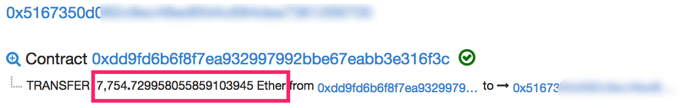

**而这个地址正是 BAPT-LW20 黑客团队的五个地址之一**。

如下图，14 小时前，黑客还在利用**攻击合约**获取空投奖励。随后，他改变了方案，直接用自身地址购买道具参与游戏，不断尝试夺取最终大奖。在此之后，又继续调用合约攻击 LW 游戏。


安比（SECBIT）实验室猜测黑客潜伏很久，早已做好充分的准备，长时间利用脚本监控 LW 游戏状态，最终才能在众人放松警惕之时获得大奖。

**BAPT-LW20 黑客团队利用空投漏洞获利超 5,194 Ether，同时又夺取最终大奖 7,754 Ether，累计获利 12,948 Ether。**

## 同行相杀：Zethr 团队两天时间就成功利用漏洞

这场超大规模的类 Fomo3D 智能合约游戏被攻击事件，攻击者使用的秘密武器也正是智能合约。

据安比（SECBIT）实验室调查分析，0x20C9 地址最先成功利用原版 Fomo3D 空投漏洞并获取奖励。我们将他定位，并将其命名为 BAPT-LW10。

0x20C9 于 **7 月 8 日** 10 点 07 分创建了攻击合约 0xe7ce，在接下来的十分钟内，前后调用了三次，最终在第四次时成功获得奖励，投入 0.1 以太币，收回 0.19 个，回报率高达 90%（见下图）。


此后，0x20C9 继续部署多个攻击合约，进行调试优化。最终，在 **7 月 23 日**部署了最终版本 0x39ac 攻击合约，接下来的时间前后调用过 90 余次，而攻击对象涉及 Fomo3D 原版、Last Winner 以及其他山寨版 Fomo3D。

据我们观察，0x20C9 是最早研究并成功利用空投漏洞的黑客。研究过程中，安比（SECBIT）实验室发现 0x20C9 与另一款游戏 **Zethr** 密切关联。

最终我们在 Zethr 游戏合约代码中发现了他的身影。他是热门游戏 Zethr 的八位核心开发者之一，代号为 **Etherguy**。

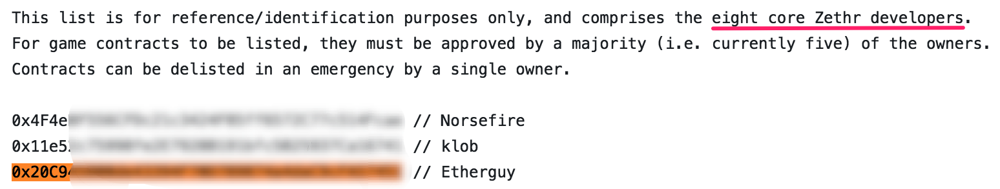

显然，作为 DApp 游戏开发同行，Etherguy 以及他所在的 Zethr 团队很早就研究了 Fomo3D 项目代码。Fomo3D 合约 7 月 6 日部署上主网，Etherguy **两天后就发现并成功利用了漏洞**。从调用规模来看，Etherguy (BAPT-LW10) 应该主要还是出于研究目的，并没有太多获利。

让其他黑客获利最多的正是 Last Winner 游戏。

## 游戏细节：Last Winner 为何让黑客如此疯狂

从最初 Fomo3D 上线后不久，空投漏洞就已被人发现并成功利用。随着游戏的广泛传播，以及该漏洞被逐渐披露，空投漏洞的攻击手段也在这一过程中不断升级进化，最终部分黑客团队完成了精巧的攻击方案，可低成本、高效率获得奖励，并可大规模工程化地攻击任意任何同类游戏合约，疯狂收割以太币。

据安比（SECBIT）实验室分析，除 LW 游戏以外，不少黑客团队都曾尝试攻击其他类 Fomo3D 游戏合约。但获利都远小于 BAPT-LW20 团队在 LW 游戏中所得。

我们试图从 LW 游戏本身寻找答案。

LW 游戏是 Fomo3D 山寨版，本身没有太多创新，但入场资金完全集中在游戏开始后的**第 2 天至第 5 天**内。巨量入场资金，会让游戏空投奖池迅速累积，因此这段时间也是黑客攻击的黄金时机。

更要命的是，Last Winner 团队修改了空投游戏参数，使进入副奖池（空投奖池）的以太币比例**由 1% 调整到 10%**，相当于空投奖励金高了 10 倍！

一方面，游戏运营团队可能是利用高额空投奖励吸引用户疯狂加入；另一方面，他们可能并不知道空投漏洞的严重性，而提高奖励比例则会让该问题进一步放大。

**Last Winner 游戏简直成为了黑客的提款机！**

特别地，前面提到 Last Winner 游戏第一轮入场资金已达 10 万以太币，这也就是说，单单这一款游戏就有超过 1 万个以太币都持续暴露在被攻击的风险下，成为黑客的囊中之物。要知道，这款游戏第一轮最终奖池也才 1.6 万余以太币。本来空投奖励都是很小的金额，但黑客持续利用空投漏洞，积少成多，终成 Last Winner 最大赢家。

我们追踪到有多个团队对 Fomo3D 及山寨合约开展大规模自动化攻击，企图攫取利益。

而 BAPT-LW20 团队在游戏开始后 **24 小时**左右就加入了战局，并迅速扩大作战规模，最终占得先机，获取巨额收益。

安比（SECBIT）实验室追踪到还有其他黑客团队向 Last Winner 合约开展攻击。部分黑客 8 月 11 号以后才入局，虽规模也很大，但终究因为错过黄金时机而获利较少。

## 攻击合约：设计复杂又精巧

攻击合约 0x5483，创建于 7 月 26 日，创建者为 0x820D，同时也是持续调用攻击合约的五个地址之一。

起初，攻击合约的创建时间让我们感到疑惑，前面提到 LW 游戏合约于 8 月 6 日才部署上主网。难道 0x820D 可以未卜先知，或者他与项目方有什么不可告人的秘密？

带着这个疑问，我们尝试从合约 0x5483 的代码（字节码）中寻找答案。

经过逆向发现，该合约有七个公开函数，其中一个疑似函数名是 `withdraw(uint256)`，用于将攻击合约中积累的以太币转走。

安比（SECBIT）实验室在字节码中发现了上面提到的五个地址。原来这两个函数都会跳转到同一个内部函数，检查交易发起人是否是这五人地址之一。如果是，则可继续执行，如果不是，则提前让交易失败。

这也解释了为什么偏偏是这五个地址一直在调用攻击合约。**因为他们是一个团队，合约特地为他们而设计，而其他人根本无法正常调用。**

初步猜测，攻击合约这么设计是为了分散权限和资金，降低出问题或被发现的风险。

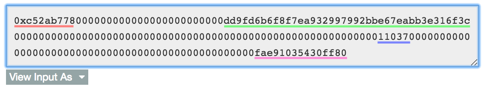

上图正是一笔攻击交易的传入参数。第一部分是调用函数哈希 ID，后面跟着三个参数。注意看第一个参数，攻击者传入的明显是一个地址。显然，这个地址正是 LW 游戏合约地址。

原来如此，攻击目标对象可以作为参数传入。“黑客真机智！”，我们不由地感慨。之前的一个困惑被解开，早在 LW 游戏上线前就已部署好的攻击合约 0x5483，其实是一个**通用型武器**。

继续研究，接下来合约的复杂程度出乎我们意料。我们沿着生成的控制流程图（CFG）追踪合约函数调用过程，程序指令以及**分支情况**非常之多（下图是一小部分截图），让人难以完全跟上。


安比（SECBIT）实验室使用动态追踪调试技术，结合逆向分析结果与攻击交易内部记录，搞清楚了黑客所使用的手法。


其他攻击交易也都是类似的过程，黑客调用攻击合约，攻击合约再调用提前创建好的合约，进而创建新的合约，以新合约的身份参与 LW 游戏，买游戏道具，然后几乎**必定获得**空投奖励。

**这一过程中不断新建的合约，就是态势感知系统中预警的大量异常合约创建与自毁。**

追踪攻击合约调用历史，发现攻击者在部署完攻击合约后，就立即多次调用特定函数，每次新建 10 个新合约。而函数总共恰好调用了 100 次，因此**新建了 1000 个新合约**（记住这个细节）。

在攻击交易中，攻击合约最先调用的就是这预先创建好的 1000 个合约之一，似乎是**特地**从中挑选出来一个地址。

## 智能合约：一切皆可预测

攻击函数控制流程图（CFG）中一个相隔很远的**循环**引起了我们的注意。

我们恍然大悟。攻击函数所做的就是不断循环地在 1000 个合约中，挑选“合适”的地址来完成下一步新建合约操作。所谓“合适”的地址，就是指能确保每次参与游戏都能获得空投奖励。

前面提到，以太坊智能合约中可以很容易的预测随机数，因为随机数的来源都是区块或者交易中特定的一些公开参数，如交易发起者地址、区块时间戳、区块难度等等。因此空投游戏利用随机数来控制中奖概率是不可行的。

而这里，黑客利用了另一个以太坊的特征，一个地址（账户）创建一个合约，合约地址是可按照特定规则计算得到的，任何人都可以根据已知信息进行推算。

因此，黑客循环利用自己控制的 1000 个合约地址，推算各地址下一次新建的合约地址，而该地址恰恰是空投游戏中奖数字的随机源。攻击合约通过一系列预演推算来筛选出“合适”的地址来完成攻击操作（技术细节后文会详细讨论）。

这才是黑客能够以超高概率获得空投的真正原因！

## 技术流：攻击手法细节披露

类 Fomo3D 游戏空投漏洞的根本原因在于，以太坊智能合约环境中难以生成无法预测的随机数。而 Fomo3D 开发者在其合约中增加了「判断调用者是普通人类还是合约」的逻辑来尝试规避，但此逻辑实现存在漏洞。黑客利用攻击合约提前预测随机数，并通过在构造函数内调用游戏合约的方法来伪装成普通人类（非合约）地址，从而大大增加自身中奖概率。

时间再次回到 **7 月 23 日**，以太坊基金会开发团队负责人之一 Péter Szilágyi 在 Reddit 上首次公开爆出这个漏洞并给出 1.0 版本的 POC 方案（详细可以参考引文 [3]）。这主要是利用了这些特点：

- 空投游戏用来控制中奖概率的随机源，可被提前获得
- 用户能否获得空投奖励以及奖励金额，可在另外一个合约中提前计算出来，从而决定后面的操纵逻辑
- Fomo3D 空投机制中尝试限制只有非合约地址（普通人类）才能参加游戏以防止上述情况的发生。但该判断方法存在漏洞，在构造合约的过程中（即合约构造方法里）参与游戏即可绕过该限制。

因此攻击者可以部署一个智能合约，并在合约的构造方法中计算出自己是否能够获益，如果能则投入以太币参加游戏空投获利，否则就不参加（参见下图）。

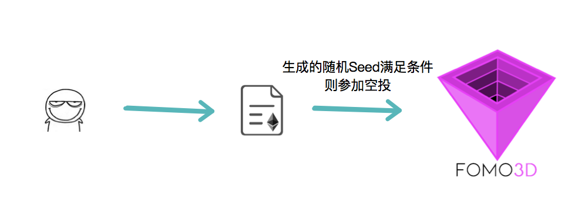 

Péter 提出的这个方案只是一个最简单的原型，因为每次部署合约都要消耗不少 Gas，而且**工作效率很低**且收益率并不高，采用该方案攻击，发起上千笔交易，都不一定能够真正获得空投奖励。

看到这里你可能会有疑问，上文的攻击者似乎手法更高明，而且**实际成功攻击的发生时间要早得多**。

Zethr 开发者 Etherguy 早在 **7 月 8 日**就已使用更高明的手法成功获利，解决了上文 **1.0 方案**中的部分问题，我们姑且称之为 **2.0 版本**。

这个思路是通过**合约循环创建子合约**（参见下图），直到子合约满足空投条件可以获利为止。这样做的好处是，在 Gas 充足的情况下，每次调用合约几乎一定可以获得收益，提高了工作效率。然而这种方案和 1.0 版本的攻击成本接近，并没有从本质上提高收益率。

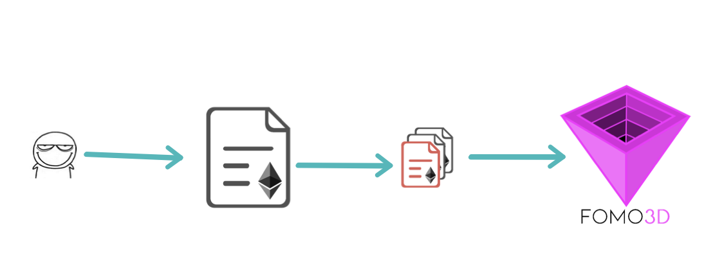 

而这次事件的最大获利者 BAPT-LW20 团队，就是在 2.0 版本的思路上进行了进一步优化**降低了投入成本**，提高了收益率。 **3.0 版本**则疯狂创建代理合约，通过利用计算下一步新建合约地址的技巧提前预判，筛选出符合条件的代理合约再创建出新的子合约，在子合约的构造函数中再完成上述攻击（见下图）。而且攻击目标地址可配置，可多人同时协作攻击。当游戏奖池金额不足以覆盖攻击成本时，发出的攻击交易会自动提前失败，仅消耗很低的 Gas 费用。

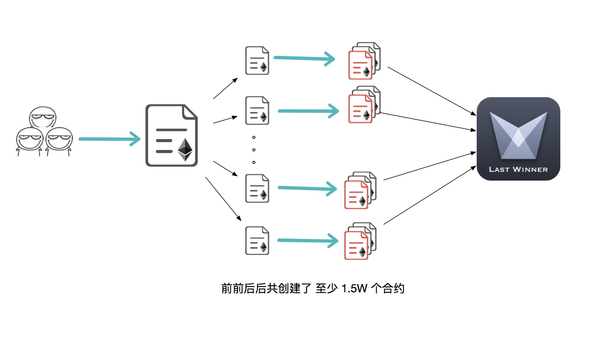 

在分析各类攻击合约过程中，我们还见到另外一种更高明的做法：主攻击合约有着良好的设计模型，支持**核心算法动态替换与升级**。原理上则是利用了 `delegatecall` 进行操作。安比（SECBIT）实验室会持续关注这批黑客的动向。


## 彩蛋一：空投与挖矿

我们知道在 PoW 挖矿的时候，矿工通常需要进行如下计算：

```js
BlockHash = Hash(Header+Nonce)
Check(BlockHash < Diff)
```

当 BlockHash 结果小于当前难度值的时候，代表找到了一个合法的 Nonce。

在 Fomo3D 的空投奖励里有着类似挖矿的机制：

```js
function airdrop() private view returns(bool)
{
  uint256 seed = uint256(keccak256(abi.encodePacked(
  (block.timestamp).add
  (block.difficulty).add
  ((uint256(keccak256(abi.encodePacked(block.coinbase)))) / (now)).add
  (block.gaslimit).add
  ((uint256(keccak256(abi.encodePacked(msg.sender)))) / (now)).add
  (block.number))));
  if((seed - ((seed / 1000) * 1000)) < airDropTracker_)
    return(true);
  else
    return(false);
}
```

用户唯一可以操纵的就是 `msg.sender` 字段，我们是否可以将 `msg.sender` 作为 Nonce 来挖矿呢？

答案显然是可以的，智能合约的地址是根据 `发起者账户 + nonce` 决定的，于是有了第 1 代方法：

```
                       创建合约
用户（地址+nonce0） --------------------> 新合约（尝试攻击）
用户（地址+nonce1） --------------------> 新合约（尝试攻击）
用户（地址+nonce2） --------------------> 新合约（尝试攻击）
用户（地址+nonce3） --------------------> 新合约（尝试攻击）
```

但是这种方式需要用户持续部署合约，消耗的矿工费代价非常大，且成功率极低，每次都是以 1/1000 的中奖概率在尝试。

由于第 1 代惊人的失败率，显然无法利用，于是有了第 2 代攻击方法：

这种方法的主要思想是，合约创建的新合约地址由 `合约地址+nonce` 确定：

```
      部署合约    |------------------| hash(caddr, nonce)
用户 ----------> |循环创建合约，      | -------> 新合约（尝试攻击）
                 |直到攻击成功或到达终 | -------> 新合约（尝试攻击）
                 |止条件才停止，可能需 | -------> 新合约（尝试攻击）
                 |要部署大量合约。    | -------> 新合约（尝试攻击）
                 |----------------- |
```

这种方式类似于挖矿，固定区块头部，不断修改 nonce 来试探能否成功获得奖励，但是问题在于，如果在循环第 1000 次才发现合法的 nonce，那么意味着之前部署的 999 个合约都属于浪费 Gas 的操作。

那么如何更高效地寻找合法的 nonce 呢？

我们回想比特币挖矿，一个挖矿任务中，不仅有 nonce，还有 extraNonce [4]。

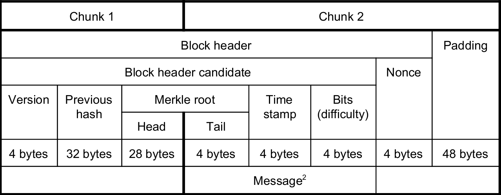

> 在比特币区块的 Coinbase 字段中，有一个自由修改的区域，修改这个区域会导致 MerkleRoot 被修改，从而实现 Header 被修改，具有 nonce 的效果，因此被称作 extraNonce。 

为什么需要引入 extraNonce 呢？原因在于 nonce 为 32 bit 数字，搜索范围只有 2^32，矿机几乎一瞬间就遍历完了，通过不断修改 extraNonce 来扩大本地搜索范围，我们甚至可以不修改 nonce 只修改 extraNonce 来挖矿。

也许黑客也想到了这一点，他们通过提前部署 1000 个代理合约来实现有 1000 个 extraNonce 的效果。
至此，攻击方法升级到了第 3 代：

```
                    部署合约
用户 --------------------------------------> 管理合约 C

      调用合约C，预先创建代理合约(extraNonce)
用户 --------------------------------------> 1000个代理合约

      调用合约C，循环尝试可以成功攻击的代理合约
用户 --------------------------------------> 部署合约(尝试攻击)
```

显而易见，这种攻击方式同时实现了 2 个效果：

* 提升了攻击成功率
* 减少了攻击合约部署数量，大大减少了 Gas 消耗。

## 彩蛋二：黑客预先创建的合约数量与中奖概率

前文提到黑客预先部署 1000 个代理合约，这个数字有什么讲究呢？

```js
if((seed - ((seed / 1000) * 1000)) < airDropTracker_)
```

seed 经由一系列以太坊链上环境以及多次 Hash 运算得出。Hash 结果对 1000 取余数，可以得到 0～999 的伪随机数。

我们假设哈希输出结果是均匀的，并且哈希是抗碰撞的，那么平均每次中奖的概率为 1/1000。

模拟结果：

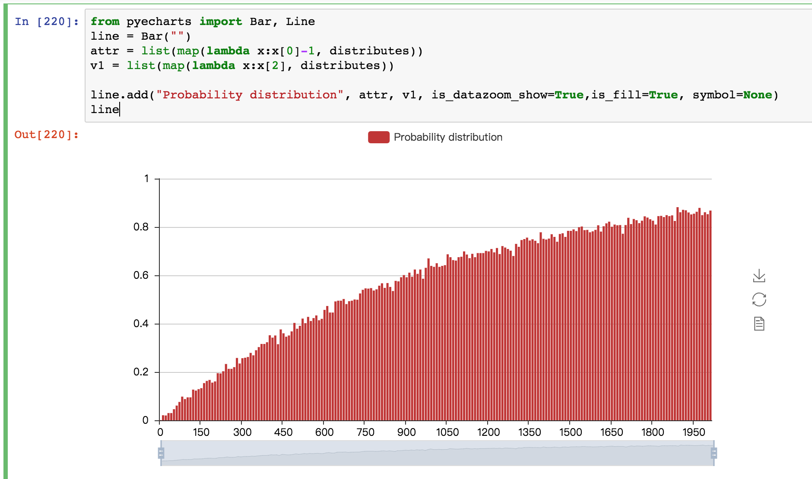

公式运算结果：

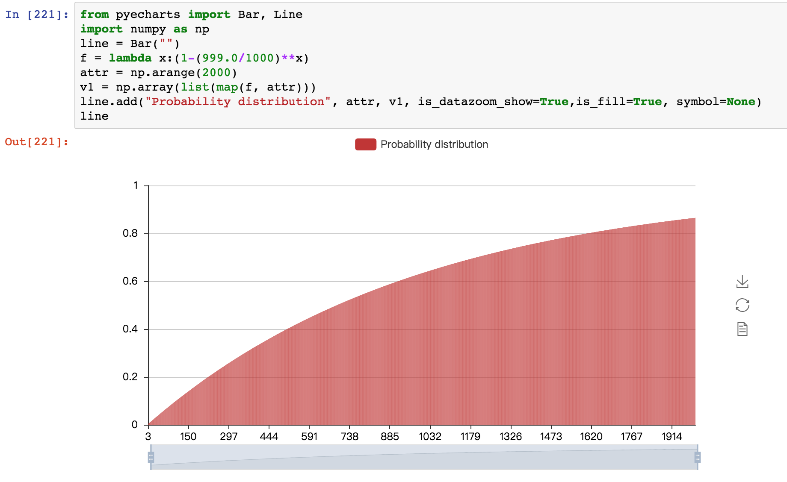

尽管更多合约能够提供更高的中奖概率，但是需要考虑到 Gas 消耗与 Gas Limit 等因素，不宜过大。

安比（SECBIT）实验室认为黑客选择部署 1000 个合约，是根据概率代码 1/1000 想当然做出的判断。

## 彩蛋三：黑客可能利用了空投概率计算的另一个 bug

黑客仍然需要更高效地攫取利润，他们甚至“发现”了 Fomo3D 空投规则在这种攻击方式下暴露出的缺陷。

攻击合约需要在最开始获取空投奖励信息，作为后续操作的依据。因此，攻击合约会先依次调用游戏合约的两个查询接口，分别是 `0xd87574e0 airDropPot_()` 和 `0x11a09ae7 airDropTracker_()`。

Fomo3D 空投奖励的 `airDropTracker_` 计算方式为如下方法：

```js
if (_eth >= 100000000000000000)
  {
    airDropTracker_++;
    if (airdrop() == true)
      {...}
  }
```

Fomo3D 判断是否能中空投奖励使用了如下方法：

```js
if((seed - ((seed / 1000) * 1000)) < airDropTracker_)
  return(true);
```

根据我们分析，0x820d 后期更新的攻击合约直接去除了对 `airDropTracker_` 的判断，但这样做其实**有利有弊**。

如果你了解细节，猜出了黑客的用意，或者知晓这种做法的优缺点，欢迎添加小安同学微信（secbit_xiaoanbi），她会把你加入到「SECBIT 智能合约安全技术讨论」的群里。

## 尾声：下一个是谁？

**8 月 14 日**，BAPT-LW20 黑客团队的 0x820d 再次部署了两个新版攻击合约，这一次他们将炮筒又对准了另一款一天前新部署的不知名合约。

望着大屏幕上 AnChain.ai 态势感知态势感知平台不断闪烁的红点，安比（SECBIT）实验室和 AnChain.ai 都很清楚，区块链世界里的战役还远远没有结束。

2009年，中本聪创造了一个虚拟的去中心化新世界。这仿佛是一片流着奶和蜜糖的应许之地，人们欢呼雀跃，蜂拥而至。但与所有的生态系统一样，新世界有生命，就有捕食者。有交易者，就有黑客。区块链上的应用在进化，攻击者也同样，我们给大家展示的是区块链世界不为人知的另一面，暗流涌动。意料之外，也在意料之中。

## BAPT-LW20 & BAPT-F3D 大事件时间表：

- 2018/07/06 Fomo3D 游戏合约上线
- 2018/07/08 Zethr 核心开发者 Etherguy 发现并利用空投漏洞
- 2018/07/20 Fomo3D 游戏在国内走红
- 2018/07/20 BAPT-LW20 黑客团队地址开始活跃
- 2018/07/21 BAPT-LW20 团队第一次成功利用 Fomo3D 空投漏洞
- 2018/07/23 BAPT-LW20 团队攻击山寨游戏⽼鼠会 RatScam
- 2018/07/23 Péter 在 Reddit 爆料 Fomo3D 空投漏洞
- 2018/07/24 安比（SECBIT）实验室发布 Fomo3D 及山寨版游戏空投漏洞预警
- 2018/07/24 BAPT-LW20 黑客团队攻击 FoMoGame
- 2018/07/26 BAPT-LW20 黑客团队部署新版攻击合约 0x5483
- 2018/08/06 类 Fomo3D 游戏 Last Winner 上线
- 2018/08/07 LW 游戏开始火爆
- 2018/08/07 BAPT-LW20 黑客团队开始攻击 LW 游戏
- 2018/08/09 以太坊未确认交易数创年内新高
- 2018/08/10 凌晨 AnChain.ai 态势感知系统发出预警
- 2018/08/10 安比（SECBIT）实验室与 AnChain.ai 联手开展调查
- 2018/08/10 BAPT-LW20 黑客团队转移旧合约中资金，使用新版合约继续开展攻击
- 2018/08/11 完成 BAPT-LW20 攻击时间线复原
- 2018/08/12 完成 BAPT-LW20 攻击手法复原
- 2018/08/13 针对更多攻击源分析
- 2018/08/13 完成 BAPT-F3D 和 BAPT-LW20 攻击数据全景分析，黑客获利超 5000 Ether
- 2018/08/14 BAPT-LW20 黑客团队再次部署新版攻击合约，开始攻击一个不知名合约
- 2018/08/17 BAPT-LW20 黑客团队夺取 LW 最终大奖 7754 Ether
- 2018/08/17 安比（SECBIT）实验室完成 BAPT-LW20 攻击事件报告

## 参考文献

- [1] 区块律动：8万笔交易「封死」以太坊网络，只为抢夺Fomo3D大奖？https://mp.weixin.qq.com/s/5nrgj8sIZ0SlXebG5sWVPw
- [2] Pwning Fomo3D Revealed: Iterative, Pre-Calculated Contract Creation For Airdrop Prizes!, https://peckshield.com/2018/07/24/fomo3d/
- [3] Péter Szilágyi 提出的空投漏洞利用 POC，https://www.reddit.com/r/ethereum/comments/916xni/how_to_pwn_fomo3d_a_beginners_guide/, 2018/07/23
- [4] AsicBoost - A Speedup for Bitcoin Mining, https://arxiv.org/pdf/1604.00575.pdf, 2016/03/31

以上数据均由安比（SECBIT）实验室和 AnChain.ai 提供，合作交流请联系info@secbit.io。

------

**安比（SECBIT）实验室**

安比（SECBIT）实验室专注于区块链与智能合约安全问题，全方位监控智能合约安全漏洞、提供专业合约安全审计服务，在智能合约安全技术上开展全方位深入研究，致力于参与共建共识、可信、有序的区块链经济体。

安比（SECBIT）实验室创始人郭宇，中国科学技术大学博士、耶鲁大学访问学者、曾任中科大副教授。专注于形式化证明与系统软件研究领域十余年，具有丰富的金融安全产品研发经验，是国内早期关注并研究比特币与区块链技术的科研人员之一。研究专长：区块链技术、形式化验证、程序语言理论、操作系统内核、计算机病毒。