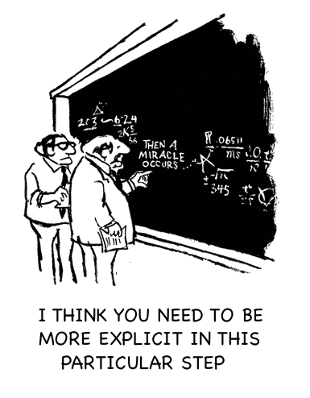

> 世界上是否有一种技术可以保证计算机程序绝对安全，能够完全抵挡住黑客的进攻？

*2015年夏天，一组黑客奉命对美国军方一款名为Little Bird的无人直升机发动电子攻击，目的是掌控无人机的控制权[1]。该攻击测试持续进行了几个月之久，在每次正式进攻开始前，黑客们占尽先机，他们已经被授权进入了该无人机系统的一部分子系统。接下来，黑客们要做的就是侵入这个无人机的飞行控制系统，从而完全掌握该无人机的控制权。在此次攻击测试刚开始的时候，黑客团队很容易就能侵入该无人机的控制系统。在接下来的一段时间内，来自美国国防部高级研究计划署（DARPA）的专家们重新开发了该无人机的核心控制程序，当该程序被部署到Little Bird上之后，黑客们对Little Bird重新发动攻击。在给定的六周时间内，黑客们使用了当今世界上所有的攻击手段，都未能攻破新部署的系统。*

到底是什么技术给予了Little Bird超强的防御能力，从而使它阻挡了所有的攻击？答案就是：**数学证明！**

**通过数学证明来进行程序设计与验证的技术通称为形式化方法**。如果说这个世界上是否有一种技术可以保证计算机程序绝对安全，能够完全抵挡住黑客的进攻？答案已经呼之欲出了。

在区块链领域，据安比（SECBIT）实验室调查显示,仅2018年上半年就已经有大约**11亿美元**的加密货币被盗，不仅如此，与区块链系统相关的漏洞（如以太坊中的智能合约漏洞）以及围绕加密货币的生态系统安全问题（如多个中心化交易所被盗）更是层出不穷。目前区块链系统中的相关漏洞，以及加密货币生态系统的安全问题归根结底是相关程序设计与实现的问题。以智能合约为例，其一经部署、发布便不能更改的特性，为形式化方法在区块链领域的应用探索提供了可能性。

形式化方法的核心思想由计算机科学先驱，1972年图灵奖获得者Edsger Dijkstra（大名鼎鼎的Dijkstra最短路径算法发明者）率先提出，其目的是**通过严格的逻辑推理开发出正确且可靠的程序**，从而避免程序出现错误。如今大部分的计算机系统都通过软件测试来保证程序的正确性，然而正如Dijkstra所说的那样：“*程序测试能证明错误的存在,但不能证明错误不存在*”。

人类已经在软件和硬件开发方面由于程序设计错误付出了十分惨痛的代价。1996年6月4日，雄心勃勃的欧洲航天局首次发射新一代重型航天运载火箭-阿丽亚娜5型（Ariane 5），欧洲航天局花费了约**80亿美元**和**9年时间**设计和研发该型运载火箭，虽然这是阿丽亚娜5型火箭的首次发射，欧洲航天局依然将价值不菲的卫星搭载到该火箭上。然而，火箭在发射仅仅37秒后便偏离了预定轨道，最终坠毁。经过详细调查，调查委员会认定火箭发射失败是由于控制惯性导航系统的计算机向箭载计算机发送了一个错误指令造成的，该**错误指令是由将浮点数转换为整数造成溢出而产生的**。

无独有偶，2016年2月17日，日本将价值约3亿美元的天体观测卫星“瞳”发射至距离地面580公里的轨道上，大约五周之后，“瞳”与地面信息通信中断，并且逐步解体。“瞳”卫星上搭载了先进的X射线望远镜及检测器，科学家希望通过这些设备研究宇宙的起源。随着卫星的解体，原本设定的研究计划完全无法进行，给天文学的研究带来了巨大的损失。日本宇宙航空研究开发机构（JAXA）调查显示，事故发生的原因在于卫星底层软件系统的设计出现了问题，“瞳”的控制系统在发现卫星飞行姿态错位时启动了**错误的调整命令**，导致推进器点火时朝向了相反的方向，进而使卫星产生了更加严重的自旋，在错误指令的操作下“瞳”最终解体。由于航天控制器对软件系统的安全性要求很高，我们国家已经将形式化方法用在验证玉兔号月球车相关控制系统的正确性上[2]。玉兔号月球车于2013年12月15日登陆月球，并且在月球表面生存工作了972天，超额完成了任务。此外，研究人员已经逐步对我国第一个自主研发的空间飞行器嵌入式实时操作系统SpaceOS进行安全性验证[3]。

1994年，数学教授Thomas Nicely在使用电脑进行大数除法运算时一直出错，经过调查，发现这个错误是由于英特尔（Intel）奔腾处理器存在漏洞-奔腾浮点除错误（Pentium FDIV bug）导致的,这个漏洞不仅使英特尔公司付出了5亿美元的代价，更加严重影响了英特尔的声誉。经过这次惨痛的教训，英特尔公司聘请剑桥大学专家Harrison用HOL证明器对芯片中的浮点运算器进行了形式化的验证，从而证明了新设计的浮点运算器的正确性[4]。时至今日，英特尔公司成立了专门形式化验证的小组专门对芯片的功能进行正确性验证。

## 什么是形式化方法

**形式化方法已经被运用到对软件和硬件安全要求很高的领域**。除了Intel公司之外，其他几家硬件巨头如AMD， NVIDIA 和 CADENCE都已经将形式化方法应用到产品设计与验证过程中。美国国家航空航天局（NASA）早已意识到形式化方法在设计航空航天控制系统中的重要作用，早在30年前就成立了专门的形式化方法小组。随着无人航天技术的发展，NASA对软硬件系统进行错误检测、诊断和预测的需求日益增多，形式化方法已经被NASA运用到系统规范，开发和验证全过程。为了促进形式化方法的研究，NASA每年都会举办形式化方法研讨会（NASA Formal Methods Symposium）[5]，NASA形式化方法研究团队一直在不断壮大，如今，其形式化研究小组的成员分布在NASA的六个研究中心，是NASA研发力量的一个重要组成部分。

> 形式化方法特指用来对软件和硬件系统进行**规范**，**设计**和**验证**的数学理论及相关工具。

其中，形式化规范  (formal specification) 通过**数学语言**对系统的预期行为 (例如将数量 S 的 token 从账户 A 转移到账户 B) 和性质 (例如转账不会造成账户 B 额度的溢出) 进行严格和全面的定义。形式化规范往往定义了系统的正确性和安全性。

给定一个系统的形式化规范，我们即可以从规范出发开始迭代设计和实现出这个系统。在迭代的每一步中，我们可以通过精化 (refinement)、集成 (synthesis) 、形式化证明在内的一系列方法在数学上严格的保证迭代产生的系统和迭代前的规范或者系统保持一致。

除了从形式化规范出发设计和实现一个系统，我们也可以使用包括**符号执行 (symbolic execution)**、**模型检测 (model checking) **和**形式化证明 (formal proving)** 在内的一系列方法验证已有的设计和实现与该规范保持一致。例如，对于一段智能合约程序，我们可以从它所有可能的输入 (例如函数参数的组合) 和初始状态 (例如状态变量初始值的组合) 出发，根据每条语句的语义，逐句推导出程序的所有可能的结束状态 (例如合约执行结束后的状态变量的值和产生的 event log)，并检查合约的所有输入、初始状态、结束状态的组合是否都和形式化规范保持一致。这里，所有的定义都是通过严格的数学语言描述，推导和检查也是严格的数学推导和证明。根据待验证的系统及其形式化规范的复杂程度，推导和证明即可以手工构造，也可能可以由机器自动产生。在实践中，**推导**和**证明**无法进行下去往往意味着设计和实现中存在不符合规范的 bug。通过分析推导和证明卡壳的位置和原因，往往可以定位出 bug 在设计和实现中具体位置和成因。

## 形式化方法的应用

通过形式化方法对程序进行验证，需要在原程序的基础上增加相关的检查和证明语句，对程序添加证明是一件十分复杂的工作。在目前的软件开发实践中，软件测试比形式化方法更加广泛的应用到程序开发中。随着与形式化方法相关的技术不断发展，工业界已经开始使用形式化方法来开发和验证高度可靠的软件系统。

2009年，澳大利亚的科学家使用形式化方法对工业级操作系统seL4微内核进行了完整功能性验证[6]，这是世界上第一个没有漏洞的操作系统内核，能够完全防止系统崩溃或者恶意攻击。*微内核是操作系统的最小核心*，其提供了底层位地址空间管理、进程间通信和调度等功能。与seL4微内核相关的信息可以在其官方网站上查看。此外，耶鲁大学的研究团队通过模块分层验证法（modular layered verification methods）也成功的研发了一个可以防范黑客攻击,并且支持并发操作的计算机操作系统CertiKOS[7]，CertiKOS具有极高的安全性和可靠性。中国科学技术大学软件安全实验室的研究人员也提出一个针对可抢占操作系统的形式化验证框架，并成功的应用在对商用嵌入式操作系统 uC/OS-II 的验证中，以数学证明的形式为其调度系统等主要模块的正确性提供了严格的证据[8]。美国国家自然科学基金（NSF）资助了美国多所顶尖大学进行形式化方法方面的研究，其中一个项目DeepSpec[9]目的在于为硬件和软件开发提供深度规范和验证，从而保证系统的安全性。

形式化验证技术还被用来设计和验证轨道交通系统，欧洲铁路安全标准（例如EN50128）要求使用形式化方法来确保系统设计满足相应的安全属性。一个典型的例子是Ansaldo-STS公司的开发人员在设计列车管理系统软件LDS时，使用形式化方法验证该系统安全逻辑的正确性[10]。

在目前区块链安全事件频发的时期，**将形式化方法应用到区块链领域有着非常现实的意义**。以太坊黑客攻击第一大案The DAO中，攻击者窃取了当时价值5500万美元的以太币，并且导致了以太坊的硬分叉。这之后，与以太坊智能合约相关的攻击一直在继续，2017年11月，以太坊Parity钱包由于被黑客攻击，导致用户损失了价值约为**1.5亿美元**的数字资产。由于智能合约关键逻辑代码全都是开源的，并且代码直接与数字货币的操作相关，这就导致黑客们会不遗余力的寻找每一个智能合约代码中的漏洞，从而瞬间获得数额巨大的不义之财。*通过形式化方法对智能合约的行为进行精确地数学推理和证明，可以保证智能合约的行为符合开发者的设计意图，从而保证代码的安全性。*

安比（SECBIT）实验室在应用形式化方法对智能合约进行安全验证方面走在世界前列，其率先完成了全球首个携带交互式形式化证明的智能合约库，并且将相关代码开源[11]。**安比（SECBIT）实验室的研究员通过交互式定理证明工具 COQ，对 ERC20 智能合约中的一些高阶逻辑特性进行了证明**。经过证明的 ERC20合约具有以下特性：不存在溢出漏洞、所有账户余额的总和与totalSupply一致、Token中的总量不变、合约转账无法影响非相关账户余额等。此外，MakerDAO项目方发布了第一个经过形式化验证的去中心化应用程序（DApp）[12]，MakerDAO 是一个基于以太坊的智能合约平台，该平台提供了稳定币（stablecoin），抵押贷款（collateral loans），以及去中心化社区治理功能。为了保证所部署的智能合约的安全性，MakerDAO团队对抵押贷款（CDP）核心引擎合约代码通过K-Framewok进行了验证，因此而表明其智能合约程序满足预期的规范，相关证明代码可参考其项目库[13]。

## 结语

由于区块链自身不可篡改的特点，智能合约在部署之前要确保没有bug，这与传统软件开发允许试错，快速迭代的特点十分不同；又由于区块链在金融领域的应用使得相关智能合约直接与数字资产绑定，而智能合约一旦被攻破，所有者的资产将化为乌有。**基于数学证明的形式化方法为开发高可信的软件系统提供了有效的手段**。安比（SECBIT）实验室认为应用形式化方法对安全性要求非常高的智能合约系统进行开发和验证，能够切实解决区块链目前遇到的安全威胁。形式化方法要求对代码进行额外的推理证明，相比于基于测试的软件开发流程更加复杂，为了保证智能合约的安全，付出更多的努力是值得的。我们的后续文章将更加系统的介绍形式化验证及其在智能合约安全方面的应用。

参考文献

[1] COMPUTER SCIENTISTS CLOSE IN ON PERFECT, HACK-PROOF CODE, https://www.wired.com/2016/09/computer-scientists-close-perfect-hack-proof-code/

[2] Shan, L., Wang, Y., Fu, N., Zhou, X., Zhao, L., Wan, L., Qiao, L. and Chen, J., 2014, May. Formal verification of lunar rover control software using UPPAAL. In International Symposium on Formal Methods (pp. 718-732). Springer, Cham.

[3] 乔磊, 杨孟飞, 谭彦亮, 蒲戈光 and 杨桦, 2017. 基于 Event-B 的航天器内存管理系统形式化验证. 软件学报, 28(5), pp.1204-1220.

[4] Formal Proofs of Floating-Point Algorithms, 2010, https://www.cl.cam.ac.uk/~jrh13/slides/scan-28sep10/slides.pdf

[5] Tenth NASA Formal Methods Symposium, 2018, https://shemesh.larc.nasa.gov/NFM2018/

[6] The seL4 Microkernel, https://sel4.systems/

[7] Certified OS Kernels, http://flint.cs.yale.edu/certikos/

[8] Fengwei Xu, Ming Fu, Xinyu Feng, Xiaoran Zhang, Hui Zhang and Zhaohui Li. A Practical Verification Framework for Preemptive OS Kernels. Proc. 28th International Conference on Computer Aided Verification (CAV'16).

[9] The science of Deep Specification, 2018, https://deepspec.org/main

[10] Cimatti, A., Corvino, R., Lazzaro, A., Narasamdya, I., Rizzo, T., Roveri, M., Sanseviero, A. and Tchaltsev, A., 2012, July. Formal verification and validation of ERTMS industrial railway train spacing system. In International Conference on Computer Aided Verification (pp. 378-393). Springer, Berlin, Heidelberg.

[11] Token Libraries with Proofs, 2018, https://github.com/sec-bit/tokenlibs-with-proofs

[12] The Code is Ready, 2018,  https://medium.com/makerdao/the-code-is-ready-2aee2aa62e73

[13] k-dss, 2018, https://github.com/dapphub/k-dss