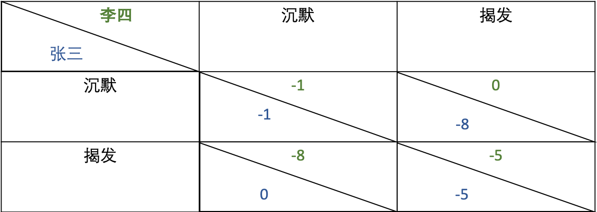
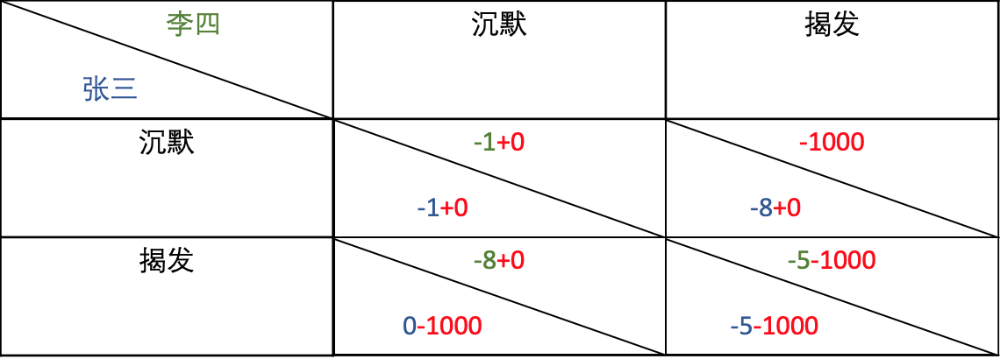
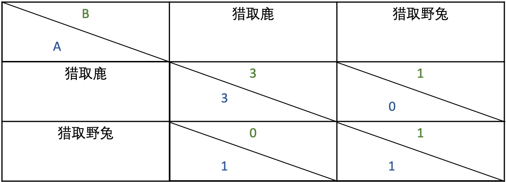
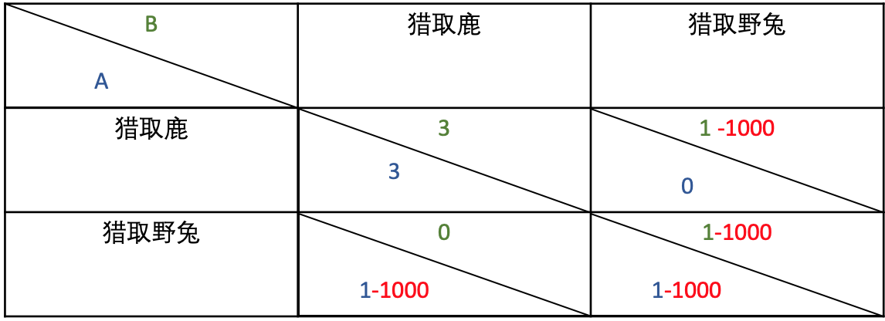
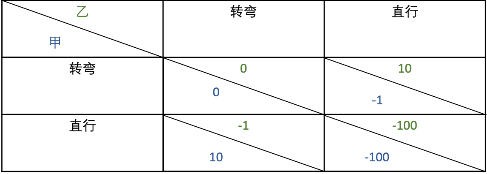
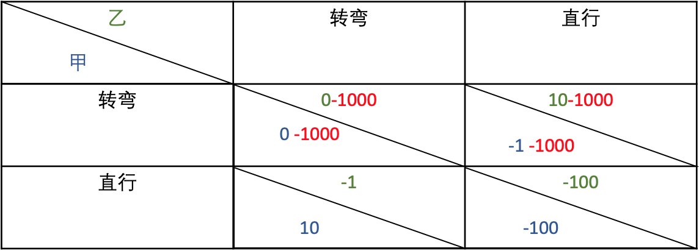
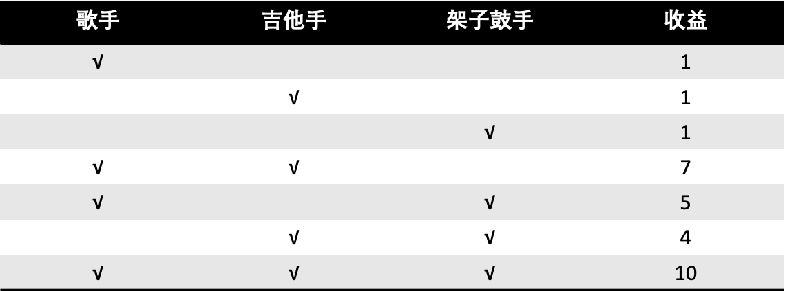

（本文由安比实验室&橙皮书联合出品）

**区块链到底有什么用？**

针对这个问题，以太坊基金会成员 Virgil Griffith 曾以以太坊为例，提出了一个让人眼前一亮的观点[1]：

*Ethereum is an unprecedented arena for playing cooperative games（以太坊是前所未有的合作博弈竞技场）。*

区块链和博弈论是两个不同的领域，乍一看似乎并没有太大的关联性，但事实并非如此。**几乎所有的博弈论经典案例都可以借助区块链构建出新的博弈关系**。Virgil Griffith 在他的文章中以以太坊为基础，借用博弈论中经典的案例解释了如何利用区块链来建立新的博弈关系。

### 两败俱伤？合作共赢？—— 建立非合作博弈转变为合作博弈的支点

**博弈论**（**Game Theory**）是经济学的一个分支，是研究博弈行为中斗争各方是否存在着最合理的行为方案，以及如何找到这个合理的行为方案的数学理论和方法[t2]。其中具有竞争或对抗性质的行为称为**博弈行为**[2]。

说到博弈论就不得不提到一个大家所熟知的经典案例——**囚徒困境**[3]。

有两个共谋犯罪的囚徒张三和李四被捕，他们之间不能互相交流。如果双方都不揭发对方，则每个人都只被关押 1 年；若他们双方有一方揭发，而另一方选择沉默，则揭发者将立即获释，沉默者则将被关押 8 年；若互相揭发，双方将同时被关押 5 年。

**很显然如果双方都保持沉默，是对他们最有利的选择。但实际上，最终双方在都会倾向于揭发对方。**

是什么导致了如此反直觉的结果呢？ 

我们用下图的矩阵来简单解释一下。

对于张三来说，若选择沉默，结果有两种：

* 被关押 1 年，此时李四选择沉默，同样被关押 1 年；
* 被关押 8 年，此时李四选择揭发，直接释放。

若张三选择揭发，其两种结果为：

* 直接释放，此时李四选择沉默，被关押 8 年；
* 被关押 5 年，此时李四选择揭发，同样被关押 5 年。

所以无论张三怎么选择，对李四较来说，揭发张三都是对他个人比较有利的选择。同样对张三来说亦然。

因而在双方未进行沟通协商的前提下，张三和李四只会做出对个人最有利的选择。囚徒双方的这种博弈关系被称为**非合作博弈**。这里囚徒双方的选择被称为基于**个体理性**的决策，与之相反的是基于**群体理性**做出的决策。这里双方在做出决策揭露对方后即达到了博弈的**纳什均衡点**。

> 博弈的分类根据不同的基准也有不同的分类。一般认为，博弈主要可以分为合作博弈和非合作博弈[t2] 。**合作博弈论**是指一些参与者以形成联盟、互相合作的方式所进行的博弈。合作博弈的相反是**非合作博弈**，指的是参与者不可能形成联盟或任何合作机制都必须为自我履约契约(例如，透过置信威胁的方式)[t4]。
>
> **纳什均衡点** 是指相互作用的经济主体在假定所有其他主体所选策略为既定的情况下选择他们自己最优策略的状态。如果某情况下无一参与者可以通过独自行动而增加收益，则此策略组合被称为纳什均衡点[5]。

在博弈论中，形成**合作博弈**需要满足两个基本条件[6]：

1. 对联盟来说，整体收益大于其每个成员单独经营时的收益之和。
2. 对联盟内部而言，每个成员都能获得比不加入联盟时多一些的收益。

囚徒困境的问题在于，在不知道对方选择的前提下，选择不合作将被关押的时间更短（即他们个人获得的收益更大），所以不满足合作博弈的基本条件。

Virgil Griffith  给出了一个实现合作博弈的解决方案——**借助区块链智能合约建立新的契约关系来创建新的规则。**

我们先将囚徒双方被关押的年数转换成其在以太坊上的收益（如收益为 -1ETH 即指的是被关押 1 年）来解释这个问题。在张三和李四被逮捕之前，他们在以太坊上部署一个合约，合约内容如下：两人同时抵押 1000 ETH，并且保证选择沉默。如果任意一方选择不遵守诺言，将烧掉其在合约中锁定的 1000 ETH，即他将损失 1000 ETH，这远远大于他们原本在选择沉默或是揭发时的损失，所以囚徒困境的纳什均衡被打破。

通过部署一个不可修改且自动执行的合约，就可以使囚徒之间达成一个具有约束力且强制执行的协议，原来基于**个人理性**而做的决策被相互**合作的决策**所替代，我们成功得将**非合作博弈关系转换成了合作博弈**。

不仅仅是囚徒困境，**几乎所有的非合作博弈都能借助智能合约构造新的博弈关系**。

我们再来看一个非合作博弈转化为合作博弈的例子 —— **猎鹿赛局**[7] 。

两名猎人 A 和 B一起去打猎，他们可以猎取鹿，也可以猎取野兔。鹿需要两个人合作才能获取，野兔一个人就可猎得，但猎鹿所得的收益大于猎野兔所得的收益。如下图所示，我们假定猎取野兔的收益为 1 ETH，猎取鹿的收益为 3 ETH。

虽然两名猎人同时选择猎取鹿的收益最大，但却需要承担对方不选择猎取鹿的后果。所以猎人们可能会更倾向于做出猎取野兔这种收益小但风险也小的选择。

与囚徒困境类似，这里我们同样可以利用区块链在猎人之间建立合作关系。猎人们先在以太坊上创建合约，双方各自向合约中抵押 1000 ETH，若任意一方最终猎取了野兔，则将其抵押的 1000 ETH烧掉，于是此时任何一名猎人此时都不会选择猎取野兔。

在上述例子中，我们将博弈方的收益和损失都转换为了以太坊上的价值符号表示，但在实际的应用场景中，能否以此来代替实际的收益还有待商榷；另外智能合约如何感知实际场景中的决策结果并自动触发合约执行也相对困难。因此**如何找到适合的机制让现实博弈的关键操作与链上合约绑定** 至关重要。

### 博弈革命——竞技场上的角逐新规则

其实区块链和智能合约并不是改变博弈的必要条件，但区块链智能合约在应用和部署博弈模型方面有着巨大的潜力。

由于真实情况下我们难以找到适合的可信第三方来做为公平的仲裁者，辅助执行博弈结果的利益裁定。而区块链及智能合约的出现让这一切变得十分容易，正如 Upgradeability is a bug[8] 这篇文章中所说的那样，**智能合约最大的价值恰恰是在于它的 Trustless**。

不仅仅是非合作博弈，几乎任意的博弈关系都可以与区块链结合，创造出新的规则。

#### 1. 懦夫博弈

**在非合作博弈中打造竞争优势。**

懦夫博弈也叫"胆小鬼博弈"，是指两名车手甲和乙相对驱车而行，最先转弯的一方被耻笑为“胆小鬼”（chicken），另一方胜出，但如果两人拒绝转弯，任由两车相撞，最终谁都无法受益[9]。

我们假定当两人同时转弯时记为收益为 0；当一方转弯，另一方直行时，转弯的一方记为收益 -1 ETH，另一方收益为 10 ETH；当两人同时直行时记为收益为 -100 ETH。

很显然，这个游戏只有当一方选择直行，另一方选择转弯收益最大，但是谁选择直行谁选择转弯却很难判定。

为了打破僵局获得最大收益，车手甲可以在游戏开始之前创建合约，抵押 1000 ETH ，并通知车手乙。若其选择转弯，合约将自动烧毁其抵押的 1000 ETH，这就使得车手甲必定选择直行，而乙就不得不选择转弯以将损失降到最低。

#### 2. 爵士乐队表演

**借助智能合约保障合作博弈中的利益公平分配**

爵士乐队表演是一个合作博弈的案例[10]。假设一个场景，某台晚会需要招募表演人员，可供选择的表演人员包括一名吉他手，一名架子鼓手和一名歌手。

* 若招募的结果是只招募到一个人（歌手，吉他手，架子鼓手任意一人），则仅支付 1 ETH；

* 若招募到一名歌手和一名吉他手，则共支付他们 7 ETH；
* 若招募到一名歌手和一名架子鼓手，则共支付他们 5 ETH；
* 若招募到一名吉他手和一名架子鼓手，则共支付他们 4 ETH；
* 若同时招募到歌手，吉他手和架子鼓手 3 人，则共支付他们 10 ETH。

在上述表演费用中，显然歌手，吉他手和架子鼓手组成一个乐队参与表演的收益是最大的，他们有很大的动力组成一个联盟去参加表演。三个人组成乐队得到10个以太币的报酬之后，每个人应该分配多少个以太币才合理呢？

我们可以简略分析一下乐队中每个成员的贡献：

有歌手参加的二人合作总收益为：7+5=12

有吉他手参与的二人合作总收益为：7+4=11

有架子鼓手参与的二人合作总收益为：5+4=9

在二人合作中，我们可以看到歌手的价值最高，吉他手的价值居中，架子鼓手的价值最低。

2012年诺贝尔经济学奖获得者夏普利曾提出一个Shapley值的概念，解决了在合作博弈中合理分配收益给参与者的问题[11]。如果依据他的理论进行分配，歌手应该得到 4，吉他手 3.5，架子鼓手 2.5。

举办方可以将分配的Shapley值计算公式写入智能合约，在演奏结束之后让合约自动转账给演奏参与者，从而保证分配的公平性。

#### 3. 从他人的博弈中套利

**空手套白狼：干扰他人博弈以套利**

假设在一个博弈关系中有两个参与者：A 和 B。A 可以执行两个动作，向上或者向下；B 也可以执行两个动作向左或者向右。

* 若 A 选择向上，B 选择向左，则双方均获得 10 ETH 的收益；

* 若 A 选择向上，B 选择向右，则双方没有收益；

* 若 A 选择向下，B 选择向左，A没有收益，B 获得 1 ETH的收益；
* 若 A 选择向下，B 选择向右，A获得 1 ETH的收益，B 没有收益。

显然这个时候 A 选择向上，B 选择向左是对双方最有利的选择。

在游戏开始之前，第三方 C 创建一个合约，A 需在游戏开始前向 C 转 5 ETH,

* 若 A 按照要求向 C 转 5 ETH，C将不再干预游戏，最终 A 获得 5ETH收益，B 获得 10 ETH的收益。

  

* 若 A 未按照要求向 C 转 5 ETH，C将干预游戏，游戏结束后若B选择向右，合约自动向 B 转 100 ETH，那么 A 最多获得 1ETH 的收益，B 则获得 100 ETH的收益。

  

对于 B 来说，他需要根据 A 是否事先向 C 转账来决定他的选择。而对于 A 来说，向 C 转 5 ETH最终他还能获得 5 ETH的收益，如果不转则最多只能获得 1 ETH 的收益。面对理性的 A 和 B，C 仅需要创建一个合约，不支付任何费用，就可以让 A 乖乖得将部分收益转让给他。

 *面对这种赤裸裸的 "**敲诈**" 行为，A 是否可以借助区块链来逆转局面呢？*

（聪明的小伙伴如果想到了解决的办法，欢迎添加小安的微信 secbit_xiaoanbi 来参与讨论）

### 道阻且长 —— 寻找链上链下的绑定机制

正如 Virgil Griffith 所说，

'*Ethereum enables powerful economic vehicles we don't yet understand.（以太坊支持我们不甚知晓的强大的经济学工具。）*' [1]

区块链作为一种去中心化，执行结果明确，不可篡改的"可信第三方"，打破了传统的思维，为打破博弈关系建立新的规则提供了非常有效的途径。作为一座全新的博弈竞技场，区块链和智能合约必定会为博弈的应用和改变注入更多的灵感。

但正如上文所提到的，如何找到适合的机制让现实博弈的关键操作与链上合约绑定，还需要更进一步的探索。

"或许距离这座"竞技场"真正运转起来还有很长的路要走。"

​																			— 郭宇(安比实验室创始人)

参考文献

[1] https://medium.com/@virgilgr/ethereum-is-game-changing-technology-literally-d67e01a01cf8

[2] https://en.wikipedia.org/wiki/Game_theory

[3] https://en.wikipedia.org/wiki/Prisoner%27s_dilemma

[4] https://en.wikipedia.org/wiki/Cooperative_game_theory

[5] https://en.wikipedia.org/wiki/Nash_equilibrium

[6] https://wiki.mbalib.com/wiki/%E5%90%88%E4%BD%9C%E5%8D%9A%E5%BC%88

[7]https://en.wikipedia.org/wiki/Stag_hunt

[8] Upgradeability Is a Bug https://medium.com/consensys-diligence/upgradeability-is-a-bug-dba0203152ce

[9] https://en.wikipedia.org/wiki/Chicken_(game)

[10] https://www.coursera.org/lecture/mathematical-game-theory/shapley-value-and-core-gWuz9

[11] https://en.wikipedia.org/wiki/Shapley_value

