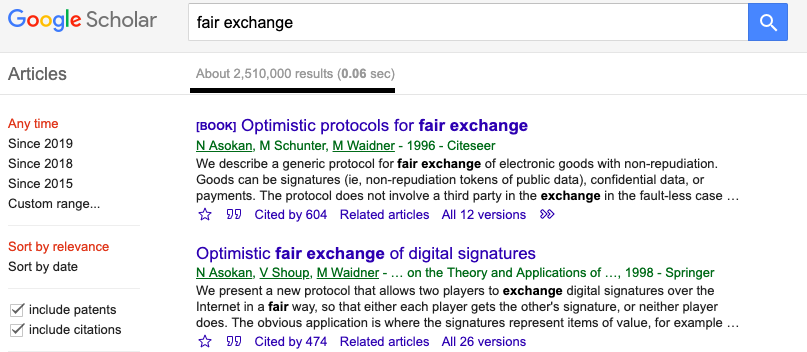
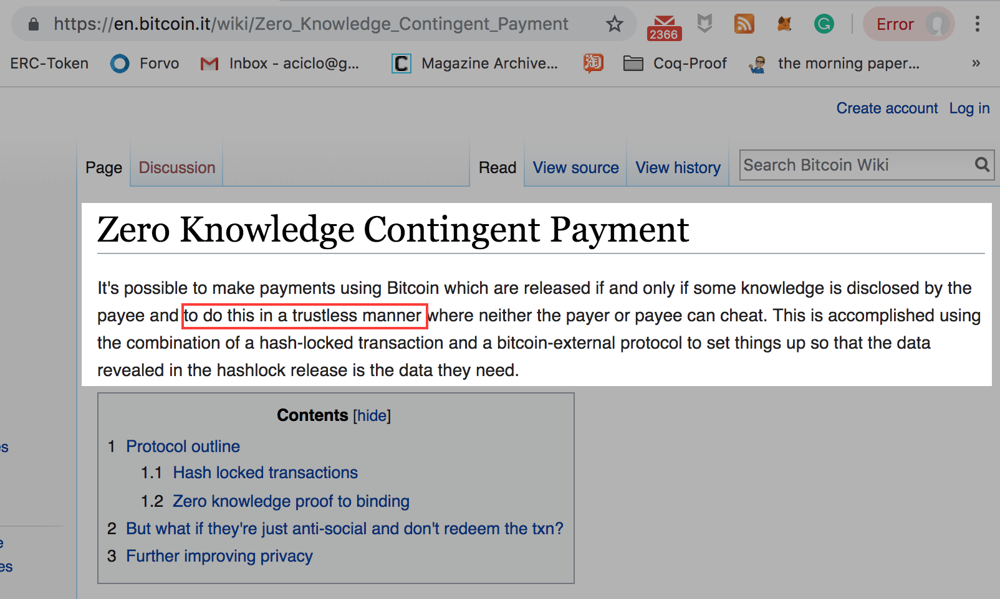
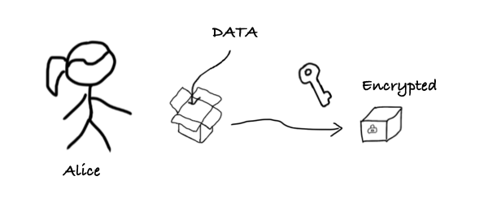
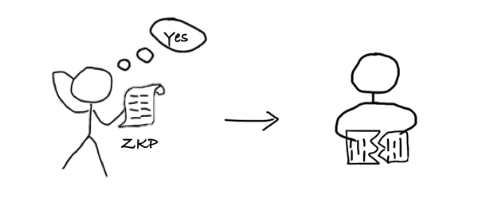
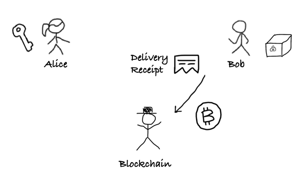
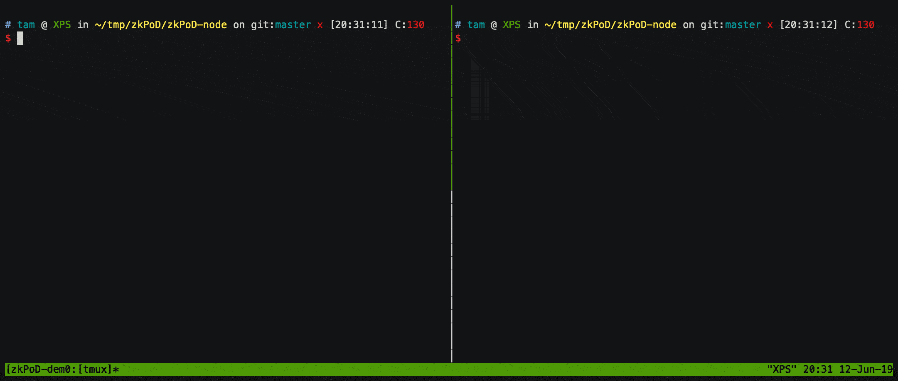

> 这篇文章解释利用ZKP(零知识证明)与区块链来实现去中介的交易协议的原理，讲讲我们是怎么把这个理论变成实用的代码的，这是一篇概述，希望了解更多的朋友请关注后续。

[注]：如果你相信未来区块链技术能改变世界，请留意看文末

## 没有第三⽅，能保证交易的公平性吗？

想象⼀下这样⼀个交易场景，⼀个买家拎着现⾦箱⼦，另⼀个卖家也拎着⼀个箱⼦，装着某种贵重货物。在电影中的情节⾥，买卖双⽅会坐在⼀个桌⼦两侧，双⽅倒数⼀、⼆、三，⼀起把箱⼦推给对⽅（很酷的姿势），当然双⽅最好都带武器，防⽌对⽅依然耍赖。除了买家卖家，没有任何第三⽅在场（可能是⼀个⿊市交易），这两⽅互不信任。可以想象，任何⼀⽅都不敢先出⼿，把⾃⼰的箱⼦交给对⽅，因为这样接下来很可能出现的场景是，对⽅拿到箱⼦会⽴即跑路，这样就导致钱货两空的结局。

在上世纪90年代，正值互联⽹早期，电⼦商务已然是⼤家普遍看好的互联⽹应⽤。但在这些早期的在线交易实验中，会出现上述的两⽅交易难题：到底是卖家先发货，还是买家先付款？ 当然，卖家收到钱款后拒绝交付商品；或买家收货之后拒绝付款的现象，难以避免。于是如何实现买卖双⽅在线上进行「公平交易」，即实现可靠的 「⼀⼿交钱，⼀⼿交货」 成了⼀个热门经典的学术问题。但是很不幸地是，科学家们早就证明了这样⼀个结论[1-2]：

> 在没有可信第三⽅的前提下，⽆法实现买卖两⽅的公平交易

所谓「公平交易」是指买卖双⽅在不相识（不互信）的情况下，能够放⼼进⾏交易⽽⽆需担⼼对⽅作弊。如果交易顺利完成，则买家得到商品，同时卖家得到钱款；若协议中途任何⼀⽅退出，或任何⼀⽅作弊，协议都会保证另⼀⽅的利益不会受损。

在 Google 论⽂搜索引擎⾥⾯搜「Fair Exchange」，我们能看到多达两百多万篇学术论⽂。假如我以一天看十篇的速度估算，这一辈子都看不完。

在过去近 30 年的研究⾥，公平交易⽅案中都必须要求存在⼀个绝对可信、可靠的第三⽅。⽀付宝正是起到这样⼀个关键作⽤，担任⼀个⼤家都信赖的第三⽅，⼀旦买卖双⽅发⽣纠纷，⽀付宝负责介⼊事务并解决问题。 当互联⽹电⼦商务蓬勃发展到今天，这⼀类的信任第三⽅已经变成了巨⽆霸。而大家所感受不到的事实是，第三⽅所引⼊的「信任成本」正在急速攀升。毫⽆疑问，对第三⽅的过度依赖会带来严重的「隐私泄露」、「单点失效」还有「个⼈信息滥⽤」的问题。当然有⼀些学术成果表明，这个条件可以放宽，也就是依靠⼀个“半可信第三⽅”（Semi-trusted Third Party）。但是请诸位思考，所谓 "半可信" 这并不解决根本问题，半可信第三方只是停留在理论层面的一种设想。

时间走到了 2008 年，⽐特币横空出世，中本聪给出了⼀种天才设计：在⼀个可以⽆任何准⼊许可的 P2P ⽹络中，采取「POW与最长链」共识协议，以⼀种⾮常公平的⽅式进⾏去中心化记账[3]。我们可以从另⼀个⻆度来理解中本聪的创新：

> Bitcoin 实现了⼀种分布式协议，它以去中⼼化的⽅式「模拟」出了⼀个「虚拟」的「可信第三⽅」

当我们在使⽤⽐特币时，可以完全想象存在着这么⼀个虚幻的可信第三⽅，它⾜够可靠，不会记错账。那么⼤家很容易联想到刚才的问题：⽐特币或者区块链能否也**模拟**出⼀个虚拟的可信第三⽅来实现经典的**公平交易**呢？这样⼀来，交易的买卖双⽅不就可以不再依赖⼀个实体第三⽅了吗？这样交易的效率会惊⼈地⼤幅提升，中介成本会降到极低。

如果区块链技术真的可以做到这⼀点，那么实际上就可以实现：「零信任公平交易」。设想下，我们可以随意在⽹络上与完全不互信的另⼀⽅进⾏「数字化商品」交易，⽽且不⽤担⼼他会作弊，因为有区块链在旁边担任⼀个协助者，或者仲裁者的⻆⾊。这会将交易、商品流通或贸易的效率提升到一个无法想象的高度。

## 实现零信任的两方公平交易的先驱——简述 ZKCP

⽐特币开发者 Greg Maxwell 早在 2011 年就在⽐特币维基⽹站上提出了 「零知识有条件⽀付」（ZKCP）的构想[4]。采用比特币这个被 **模拟** 出来的第三方来充当 **交易支付** 中的可信第三方。由于比特币网络是去中心化，因而这个第三方将会是一个 **零信任第三方**。

通过这个⽅案，买卖双⽅可以通过 BTC 进⾏数据的交易，并且可以做到所谓的「原子交换」，卖家在收款的瞬间，买家拿到数据。这个原理其实⾮常简单，下面来讲述下整个过程：

#### 主角

+ 卖家：Alice
+ 买家：Bob

第一步： Alice 将「数据」⽤⼀个「钥匙」 加密，锁在箱子里面。

第二步：Alice 将箱子发送给 Bob，Alice 还将附加⼀个「零知识证明」，证明两个事实：(1)箱子可以用钥匙打开，(2) 钥匙的哈希等于一个值 「h」

第三步：Bob 检查零知识证明，确认上述事实为真。然后 Bob 将零知识证明中的一部分撕下来作为「收货收据」。这个收据上写着钥匙的哈希，也就是「h」

第四步：Bob 创建⼀个智能合约，锁定 1BTC，写⼊「h」。⽀付脚本要求：凡是可以提供「h」的哈希原象的⼈可以提⾛这枚 BTC

第五步：Alice 向智能合约出示钥匙

第六步：智能合约检查「钥匙」是否和「收货收据」匹配

第七步：如果智能合约通过检查，则它把 1BTC 付给 Alice，同时把钥匙交给 Bob。

第八步：Bob 用「钥匙」打开「箱子」，取出数据。至此，双方完成交易

所谓原⼦交换是指，⼤家要么交换，要么不交换，这个交换动作不能再分割，像⼀个物理世界的原⼦⼀样。在第六到第八步，这个三个步骤是不可分割的。Alice ⽤「钥匙」提⾛ 1BTC，同时「钥匙」也就暴露在了区块链上，Bob 就可以拿⾛「钥匙」解密数据，同时得到了数据。「原⼦交换」是公平性的⼀个体现，保证买家卖家的交换能完成。好了，其实只有「原⼦交换」还不够。思考⼀下，这整个流程中，还有两个技术难点同样关键：

+ **问题(1)**：数据 D 确实是 Bob 想要的数据
+ **问题(2)**：Alice 出示的密钥必须是正确的密钥

2016年 G. Maxwell 和 S. Bowe 等⼈实现了第⼀个基于区块链技术的「完美公平」交易案例[5]。这是一个了不起的实验，人类历史上第一次做到了，无需可信第三方的公平交易。实验完成了两笔数独答案的公平交易。他们采⽤ zkSNARK 技术来产⽣零知识证明，来同时解决上⾯的问题(1)与问题(2)。

## 信任的产生：零知识证明技术

零知识证明是如何解决 问题（1）与问题（2）。接下来我插播一下科普，零知识证明是什么呢？可能大家都听说过这个概念，特别是在一些匿名加密数字货币中。零知识证明的英文是

> Zero-Knowledge Proof 

这里面的每一个单词背后的深意，能值得好好聊聊（这里空间太小，写不下 :P）。但是这里我打算用大白话来尝试解释下。零知识证明是 1984 年由 Goldwasser、Micali 与 Rackoff 三个人提出，他们当时写了一篇文章，题目叫做《The Knowledge Complextiy of Interactive Proof Systems》，中文名翻译过来叫《交互式证明系统中的知识复杂性》。

大家仔细看这张图的左上角，可以看到这篇论文其实发表在 1989 年。由于这篇文章的思想太过超前，太过震撼，以至于从他们 1984 年写出初稿到 1989 年正式被采纳发表，经历了整整五年时间。正是这篇文章提出来了 **零知识证明** 这个伟大概念，这个概念也逐步成为了现代密码学理论的根基之一。后来大家都知道在 2012 年，Goldwasser 和 Micali 两人因为这个开创性工作而分享了 **图灵奖** 。

【注】我们通常理解的零知识证明技术是特指狭义的`如何高效构造通用零知识证明` 的理论和技术，而广义的「零知识」是密码学的核心理论根基。

我想引用这篇文章的一句话：

> 一般来说，在协议的设计中经常会遇到这种问题：A 想让 B 相信某件事情。我们知道，如果此刻有一个「天使」（或者 B信赖的某个人）能够让 B 确信 A 说的是实话，那么这个协议是安全的。我们想让「零知识证明」这个概念能够在这里发挥作用，而不是依赖可信第三方，让这个协议仍然是安全的。 ——[GMR89]

这段话是不是有点绕，但是用一句话就可以说明白：

> 零知识证明提供的「信任」，能够代替一个「可信第三方」

听上去很玄幻，不是吗？零知识证明怎么「凭空产生了信任」？我们怎么信任零知识证明？零知识证明的信任基础是什么呢？这些问题不难回答，其实它的信任基于比较客观的理论，一类是基础理论，包括「数论与代数」，「数理逻辑」，还有「计算理论」。还有一类是一些安全假设，比如「离散对数难题」，「Knowledge of Exponent」等等。如果我们信任数学，信任逻辑，信任这些安全假设没有被攻破，那么我们可以得出下面的结论：

> 零知识证明实现了一类密码学理论技术，它基于一些安全假设「模拟」出了⼀个虚拟的**可信第三⽅**

听上去很耳熟对不对？我在前面说了类似的话，拷贝过来:

> Bitcoin 实现了⼀种分布式协议，它以去中⼼化的⽅式「模拟」出了⼀个虚拟的**可信第三⽅**

很巧合是不是？自从 2016年 《经济学人》提出来的「区块链是信任机器」的说法，我就在一直思考这个问题：「信任机器」如何体现。自从深入思考零知识证明以后，我慢慢发现他们殊途同归，只是各自的维度不一样，区块链解决的是「分布式计算的信任」，零知识证明解决的是「数据的信任」。如果再加上形式化验证，就可以解决「逻辑的信任」。

这三个点：**逻辑 <-> 计算 <-> 数据** 才真正构成了一个闭环，也许才能真正实现「信任机器」这一构想。而我们正在践行的 zkPoD 项目正是从这三个不同的维度出发，摸黑前进。

【思考】三个维度缺一不可，这个观点是否能解决区块链在现实场景难以落地的问题呢？

## ZKCP的“局限性”与零知识证明漏洞

ZKCP 的构想虽然 2011 年就被提出，但是好事多磨，这个构想⼀直到 2016年2月才正式实现。ZKCP基于当时最前沿的零知识证明技术 ——— zkSNARK [5]。来自 ZCash 团队的 Sean Bowe 编写了 ZKCP 的代码，并且 Gregory Maxwell 从 Sean Bowe 手里购买了 一个 16x16 的数独答案，花费了 0.1 BTC。

但是 ZKCP ⽅案还只是一个玩具，难以⽀持稍微⼤⼀点的数据（比如⼤于 1MB ），因为这会为买家带来⽆法承受的计算量（计算量主要是为了产⽣ zkSNARK 零知识证明）。虽然这个⽅案还⽆法实际应⽤，但是它却显现出了区块链技术真正的威⼒：

> 总体上我认为像这些 “Trustless” 的智能合约具有非常大的价值，不管是低价值但高频的自动交易——传统交易中的冲突开销（开销过大，而交易价值过低）剥夺了寻求严肃公正的参与度，亦或是高价值交易中的低速，不可靠(特别是需要诉诸司法)，或者传统交易冲突仲裁中的隐私保护缺失，都将会变得无法接受。
>
> 当这个技术变得越来越实用时，我期待会出现非常激动人心的应用。
>
> ————— Gregory Maxwell 

然而在 2017年，M. Campanelli 等⼈发布在 ACM CCS 安全顶会上的一篇文章揭示了 ZKCP ⽅案中的一个安全漏洞[6]，ZKCP的实验对于卖家不公平，买家可以通过特定手段，使得零知识证明不再零知识，从而在不付钱的情况下拿走（部分）数独答案。他们在ZKCP的基础上进⾏改进，提出了 ZKCSP ⽅案，但是仍然没有解决实⽤性问题。2018年，S. Dziembowski 等⼈在朝着使用方向努力，在 ACM CCS 的论文里讲解了一个新思路—— FairSwap[7]。它可以⽀持多达数 GB 的数据⽂件交易。Fairswap 通过虚拟电路的⽅式来解决上⾯的问题(1)，对于问题(2)，Fairswap 采⽤了⼀种 “恶意⾏为举报” 的⽅式来应对。这个思路类似闪电⽹络 ， Plasma 等区块链⼆层协议，卖家 Alice ⾸先交付密钥，但是这时候买家 Bob 需要在⼀定时间内（⽐如说三个⼩时），检查密钥的正确性，如果不正确就赶紧举报，并且向区块链（或合约）提供证据，证明密钥或数据存在问题。这种⽅案要求买家必须能够在规定时间内完成举报动作。虽然从理论上，这种交易⽅案没有做到「⼀⼿交钱，⼀⼿交货」，但是仍然是零信任公平交易。只是对卖家 Alice ⽽⾔，她需要等到三个⼩时以后才能拿到货款。

##  什么是 zkPoD

零信任公平交易是很多行业中普遍存在的需求，也是电子商务技术的未来。是我们**安比实验室**推出的⼀个实⽤的，⽤以交易⼤批量数据（可数字化商品）的零信任公平交易系统。

zk表示「零知识」，PoD是 底层安全协议的名字，是一种（非）交互式证明系统（PoD 代表 Proof of Delivery），用来实现可验证的数据交付（Verifiable data delivery，也可以理解成可验证的数据传输）。

zkPoD 基于零知识证明[8-13]（包括GROTH09, Bulletproof, zkSNARK-Groth16等技术），结合区块链实现交易的零信任，既解决了 ZKCP ⽆法交易⼤数据⽂件的问题，也⽀持⽀付/交付动作的原⼦性，实现真正意义上的 “完美公平” 。与 FairSwap 相⽐，zkPoD 协议更加⾼效，⽹络通讯量更⼩，智能合约更轻量级，⽀持各种类型的区块链架构。任何的可数字化商品（Digitalized Commodities）都可以在链下完成商品交付，在链上同时完成⽀付。

或者更直白点：zkPoD 是一个实用的「零知识有条件支付」 ZKCP 系统。其实，zkPoD 不仅实现ZKCP 中「原⼦交换」，也就是「⼀⼿交钱，⼀⼿交货」⾼效交易流程，同时也⽀持类似 Fairswap 的投诉⽅式证明。后者具有更高的数据吞吐量。

zkPoD 在试图解决这样一些问题：

> 如何在做到完美公平的前提下，达到实用，所谓实用不是交易几个字节的信息，而是上GB，甚至达到TB级别。
>
> 如何有效融合并优化最前沿的零知识证明技术，使得我们可以使用手机和移动网络就可以参与。
>
> 如何保证底层的协议与基础算法牢不可摧，这是在区块链这种开放式环境中保证安全的「唯一途径」。

做一个安全并且实用的系统，相比纸上理论而言，要处理更多的现实问题：比如协议的设计要考虑以太坊平台的各种安全隐患，比如「Front-running Attack」，比如去年我们发现的针对FOMO3D游戏的「堵塞攻击」；比如协议要考虑各种交易方的恶意行为；比如协议要让各方成本达到一个可接受的水平；比如大计算量算法未来能否支持硬件加速；密码学安全强度是否合适等等。

## zkPoD 如何解决两方交易中的公平性问题

我们再重复下上面提到的有关「公平性」两个关键问题：

+ **关键问题(1)**：被加密的数据确实是你想要的数据
+ **关键问题(2)**：而我出示给你的密钥必须是正确的密钥

首先我们分析下问题(1)，zkPoD 如何保证买家在掏钱之前就知道数据的真实性？其实数据的真实性是一个可以很主观，也可以很客观的标准。比如，我买的音乐，mp3好听不好听，这是一个非常主观的判断。或者再退一步，我买的一首歌是不是某个明星真唱的？这是一个半主观的判断。再退一步，我想付费观看一部动作片，没想到买到的是喜羊羊，那么这个判断可以是很客观的吗？可以是，但是写一个算法来检验一部电影是否是恐怖片，还是动画片，并不简单。最后还有一种情况，那就是数据的真实度能够非常客观地来判定，比如 ZKCP 实验中，数据是一个数独游戏的答案。这是可以写一个算法来客观检验的。因此如果数据是存在一个算法，或者说可以通过写一个程序来自动判定真实性，那么这里可以直接构造一个「零知识证明」来向买家出示，这好比是「模拟出一个天使」，告诉用户虽然数据是加密的，但是数据的真实性是可信的。但是如果是另外几种情况呢？这个程序太复杂了，不好写，或者说根本判断是很主观的。为了应对这种情况，zkPoD 采用的是最简单粗暴的方案，用户可以先购买一点点数据，进行验货。确保数据无误后，再大批量购买。「试吃方案」无疑是在现实世界中最简单有效的方法。但是与普通的「试吃」不一样的是， zkPoD 可以额外保证：

+ 验货数据可以让用户来随机挑选
+ 验货次数不做任何限制
+ 多次验货，与大批量购买的数据必须来自于同一个数据集

为了保证上面这三点，zkPoD 也是采用了零知识证明技术来做到。更详细点，任何购买的数据都必须携带一个证明：证明该数据片段是来自于某一个「唯一确定」的数据集合。为了解决问题（1），zkPoD 当前版本采⽤ Pedersen Commitments 来实现隐藏和半同态计算，并且利⽤扩展的 Schnorr 认证协议来传输加密数据，并采用 J. Groth 等人的方法来构造零知识证明[8-13]，从而保证数据的真实性。

我们再分析下问题（2），区块链在 zkPoD中的核心作用是检查这样一件事情：卖家出示的密钥必须是正确的密钥。这个问题我们可以想象一下，我把密钥出示给「智能合约」，它在完全不接触数据或者加密数据的情况下，如何来保证我出示的密钥，真的能解密？这听上去很难做到。其实，这里我们也可以用零知识证明「模拟出一个天使」，来告诉买家用户还有智能合约：我给你们出示的这个密钥是正确的密钥。这里的原理涉及到PoD安全协议，我在这篇文章里就不展开讲解原理了，只是讲一个大概的思路。首先，我（作为卖家）给你（买家）出示一个关于密钥的零知识证明，还有一把锁（并不锁任何东西，单纯锁起来的一把锁）。关于密钥的零知识证明了这样一个事实：凡是能打开这把锁的密钥一定能解密刚发给你的数据。而在交易的最后一步，你把这把锁交给智能合约，而我交出钥匙，而智能合约负责检查钥匙能不能打开这把锁。如果能正常打开，那么你就可以把钥匙拿走去解密数据了。如果打不开，那么说明我交出来的钥匙是假的，那么我拿不到付款。我们可以这么理解，通过零知识证明，我们把密钥有效性的检查「归结」（Reduce）到一个钥匙开锁问题。而这个问题是一个智能合约容易解决的问题。（zkPoD充分考虑了现有智能合约平台上进行计算的代价和实用性）。对于问题(2)，zkPoD 利⽤了安全哈希函数，并结合零知识证明技术来保证对于密钥的校验。zkPoD ⽬前仅支持以太坊，并且经过数次协议优化，⽬前在以太坊上的 Gas 消耗量已基本达到实⽤。

## 「零信任」、形式化验证与安全性证明

我们前面谈了区块链，谈了零知识证明，下面继续来谈谈「形式化验证」。在 zkPoD 里面，不管是零知识证明，还是智能合约，还是底层的椭圆曲线算法，这些都是 zkPoD 公平性的基础。我经常会被问到这样的问题：

>  那么这些底层玩意儿可信么？

我想你也会有同样的疑问，尤其在这个群魔乱舞的区块链行业。凭什么我能相信你的零知识证明技术没问题，凭什么我相信区块链没问题？这篇文章的标题是「零信任」，其实这个说法并不准确。

> 任何「信任」都需要基于某些信任基础（Trusted Computing Base），任何「安全」都有安全性假设

zkPoD 也不例外，它的可信度仍然要基于许多「可能没问题」的部件，甚至是很多「说不清楚」的东西。

补上信任的最后一环正是「形式化验证」。这里不深入细节，我只简单讨论下「形式化验证」到底在 zkPoD 场景下能做到哪些，能解决什么问题。形式化验证实际上是为逻辑，流程或者业务进行形式化建模，你可以理解为用一种数学语言进行描述，模型就是一些数学概念（或数学对象），比如集合、代数、范畴等等。然后所有的形式化验证都在用「显式」的或「隐式」的方式「严格证明」某个结论（或者叫做定理）。一旦当某个部件的可靠性论点被「证明」了，那么他就可以被移出 Trusted Computing Base。

【注】没有产生证明（包括隐式证明）的分析过程，不能称为形式化验证，因为这些分析过程没有客观的检验标准。

上面我们提到了两个「模拟」，一个是区块链，另一个是零知识证明。他们之所以可信，是因为他们能够「模拟出可信第三方」。这个模拟过程是如何模拟的？首先下个结论：**这两个模拟过程都是可以形式化的，并且是可证明的。**

在 Goldwasser 和 Micali 的论文中，他们就阐述了如何证明「零知识」，如何证明「模拟」这个操作。到如今，模拟（Simulation）和安全性证明已是密码学界的共识，也是基本的形式化工具，没有经过证明/验证的模拟是无法让大家接受的。证明零知识的过程恰好就是一个直觉主义构造性证明：构造一个概率图灵机，他能够模拟出各种第三方，还有各种有趣的概念。我看过的绝大多数零知识证明科普文章中，鲜有提到「模拟」这个概念，更不会提到安全性证明。这导致再怎么解释零知识证明，读者理解起来就如同雾里看花一样，始终抓不住那个关键点，模模糊糊好像懂了，但是似乎又说不清楚。因为我研究了十几年的逻辑证明，在啃了一些论文和证明之后，慢慢从那些密码学安全性证明中体会到了「模拟」与「零知识」中所表达出的神奇理念。这些理念与当年我们验证操作系统、验证编译器工作中的理念非常吻合。另外一方面，学术界已经开始在对「区块链模拟」，也就是共识协议的信任进行非常严格的数学建模与证明[14-16]。

形式化验证在 zkPoD 中解决「区块链」，「零知识证明」这些技术依赖的那些「信任基础」的可信度问题。理论上，所有客观标准都能进行验证，大到一个安全协议，小到一行代码，凡是经过形式化验证的部件，将会变成「零信任」。这是一个渐进的过程。我们正在对 PoD 安全协议进行形式化验证，对「零知识证明」相关的理论进行证明，我们正在对 zkPoD 中的以太坊智能合约（零信任第三方）进行形式化建模与验证。未来我们会利用形式化方法对交易协议进行更细致的建模与验证。

## zkPoD 的演进

zkPoD 这个项⽬源于去年国庆节，团队⽼胡说有个好玩的想法，⼤家听了很兴奋，于是很快搞出来⼀个⼩ Demo，但是令人沮丧的是，不久我们就发现了其中的理论漏洞。然后接下来是漫⻓的啃密码学，补理论的过程，那酸爽。请教过各路⼤神，也曾⽆⽐迷茫，每⼀次⼩突破却又能偷偷开⼼好⼀阵⼦。

这⾥给⼤家讲⼏个测试数据。拿⼀个 1GB 的数据⽂件为例，卖家初始化这个数据，需要花 90 秒 ，也就是⼀分钟多⼀点，喝口水的时间。然后如果买卖双方要采用最慢的原子交易协议（zkPoD提供三种不同的协议），对接低 TPS 公链（比如 Ethereum），卖家需要计算产⽣较多的零知识证明，⼤概需要花费 9 个⼩时（普通PC，6核CPU），平均在 20KB/s 这个速度，这个速度已经⽐⼆⼗年前 Modem 拨号上⽹时代的下载速度快不少。单笔交易的以太坊消耗 Gas ⼤概在15万单位左右，相当于十美分，折合RMB 7毛钱。⽽如果是采⽤「投诉证明」方式的交易协议，卖家只需要花费 124秒 就可完成零知识证明的产⽣，⽽买家也基本以相同的时间 120秒 来接收并校验数据。请注意，在这种模式下，⽹络的通讯量要翻倍，也就是需要传输2GB 多的数据，以太坊 Gas 消耗⼩于 20万单位。总体上，传输速率可达 3MB/s，这已经接近⼆⼗年前普通局域⽹⽂件传输的速度。针对高TPS公链，或者联盟链，zkPoD 还提供了性能更好的协议模式。虽然 zkPoD 的核⼼性能已经可以达到⽀撑⽂本、⾳频、甚⾄视频的效果，但是系统还需要对协议做进⼀步的完善、改进和优化，才能⽀持丰富的上层应⽤。现在系统还只有⼀个粗陋的命令⾏界⾯：

好奇的同学请点击这⾥观看一个完整的演示：

> https://asciinema.org/a/251240?autoplay=1&speed=2.71828182846

更多的关于 zkPoD 的技术细节、系统架构、代码结构，测试结果，还有一个技术白皮书请参考我们的代码仓库：

> https://github.com/sec-bit/zkPoD-node

也可以下载代码编译试运⾏，默认 zkPoD 将会链接我们部署在以太坊测试⽹络上的合约

> Ropsten：0x07d04D5912383F8523208b978C73D4786a5b1e86

虽然 zkPoD 已可以达到 Demo 演示的状态，但是还是个半成品。周边各种协议⽀持，⼯具链还有客户端等都还待完善。zkPoD 还有许许多多好玩的扩展功能在路上，也有⼀些创意功能还没来得及实现。zkPoD 也将会对接更多的优秀公链。

我们的想法是能不能把这么好玩的项⽬做成⼀个⾃由开源开放的社区项⽬，希望能有各种技能的⼩伙伴们加⼊一起协作。后续社区会整理⼀些技术⽂档包括经验分享，还有在这个过程中所了解到的各种有趣的知识，还请大家持续关注。

> zkPoD 的⽬标？我还没想清楚，也许是成为下⼀代互联⽹的基础协议，实现数据与价值的双向流动

## 零知识证明再述

零知识证明是我近年来⻅过的最有趣的理论和技术。零知识证明的学术理论确实有些深度。但是它的概念和应⽤却也没那么难懂，虽然⻔槛略⾼。⽆论中⽂还是英⽂，这⽅⾯的资料都极度缺乏，⼯程实践更是少之⼜少。

我想通过⼏个简单例⼦来解释，假如我数学考试考了61分，爸妈问起来，我只要出示⼀个零知识证明，这个证明是⼀串数字，但是可以让爸妈确信这个分数确实及格了，但是具体多少分呢？对不起，⽼爸是⽆论如何都没办法从这串数字中推算出，甚⾄也⽆法知道到底是80分以上，还是80分以下。这类零知识证明被称为「范围证明」（Range Proof）。当然我还要再出示一个数字签名的零知识证明，「可验证计算证明」（Verifiable Computation Proof），向老爸证明，这个分数曾被老师签过名（我们这里假设是采用的BLS短数字签名）。可验证计算证明，你可以想象成我把老师签名的过程用手机拍了下来，但是镜头里出现分数的地方，我都把它马赛克了。

又假如，我保存了⼀个你的秘密，⽐如说⽐特币的助记词，我可以向所有⼈出示⼀串数字，证明我没有忘记你的助记词，但是任何⼈都不能从这个证明中得到这个助记词的任何⽚段。这类零知识证明又被称为「知识证明」（Proof of Knowledge）。因为任何⼈都不能从这个证明中分析出更多关于助记词秘密的内容，因此这个证明是零知识的。换句话说，这个证明是⼀串数字，看起来就和随机数⼀样，没有信息量。（这里有个小问题留给读者：我如何向你的朋友们证明，这个助记词对应比特币地址上的钱没有被我花掉。有想法请后台留言）

零知识证明的⽤处⾮常⼴泛，⼤家可以各种开脑洞，其中⼀个最直接也⾮常重要的⽤处就是敏感数据的保护。不管是成绩单、病历、账本、密码、等等等，你都可以把其中任何部分扣掉，换成⼀个很像随机数的零知识证明，它能证明被扣掉的敏感数据仍然是可信的，真实的。（这⾥请⼤家开脑洞，还有哪些好玩的场景。）

在 zkPoD 中，零知识证明扮演了⾮常重要的⻆⾊，数据的交付过程是以零知识证明的⽅式交付，买家先拿到的是⼀堆的零知识证明，当然数据隐藏在这些数据中，但是从外部整体上看，这些看似⾮常随机的数据中，是没有任何办法去得到关于原始数据的哪怕⼀个bit。（这⼀点可以证明，请原谅我忍不住插⼀点学术术语：基于离散对数难题假设的「完美零知识」，Perfect Zero-Knowledge）理解零知识证明理论的核心是理解我上面反复提到的「模拟」这个暗黑并有趣的概念。这个我们以后再展开讲。

## 如何加⼊我们

zkPoD 刚刚出⽣，还只是个⼩玩意儿，我们希望它能健康成长，现在 zkPoD 项⽬召集不超过 5 名⼩伙伴参与搞事情，如果感兴趣请附上你的技能科技树，来和我们⼀起开脑洞，啃论文，撸代码，练技术。报名请扫描后⾯⼆维码（接头暗号：Simulator 开⻔）。

> 「零信任」并不等于什么都可以不用信任。零信任的根基是数学。「In Math We Trust」，这是我脑海中迅速闪过的⼀句话，现在回头看，这中间的每⼀个字⺟都闪烁着⼈类理性智慧的光辉 
>
> ———— 郭宇（安⽐实验室创始⼈）

### 参考文献

+ [1] Pagnia, Henning, and Felix C. Gärtner. On the impossibility of fair exchange without a trusted third party. Technical Report TUD-BS-1999-02, Darmstadt University of Technology, Department of Computer Science, Darmstadt, Germany, 1999.
+ [2] Garbinato, Benoît, and Ian Rickebusch. "Impossibility results on fair exchange." 10th International Conferenceon Innovative Internet Community Systems (I2CS)–Jubilee Edition 2010– (2010).
+ [3] Nakamoto, Satoshi. "Bitcoin: A peer-to-peer electronic cash system." (2008).
+ [4] Maxwell, G. "Zero knowledge contingent payment. 2011." URl: https://en.bitcoin.it/wiki/Zero_Knowledge_Contingent_Payment (visited on 05/01/2016) (2016).
+ [5] Greg Maxwell. “The first successful Zero-Knowledge Contingent Payment.”
https://bitcoincore.org/en/2016/02/26/zero-knowledge-contingent-payments-announcement/
+ [6] Campanelli, Matteo, Rosario Gennaro, Steven Goldfeder, and Luca Nizzardo. "Zero-knowledge contingent payments revisited: Attacks and payments for services." In Proceedings of the 2017 ACM SIGSAC Conference on Computer and Communications Security, pp. 229-243. ACM, 2017.
+ [7] Dziembowski, Stefan, Lisa Eckey, and Sebastian Faust. "FairSwap: How to fairly exchange digital
goods." Proceedings of the 2018 ACM SIGSAC Conference on Computer and Communications
Security. ACM, 2018.
+ [8] Groth, Jens. "Linear algebra with sub-linear zero-knowledge arguments." Annual International
Cryptology Conference. Springer, Berlin, Heidelberg, 2009.
+ [9] Bootle, J., Cerulli, A., Chaidos, P., Groth, J., & Petit, C. (2016, May). Efficient zero-knowledge
arguments for arithmetic circuits in the discrete log setting. In Annual International Conference on the
Theory and Applications of Cryptographic Techniques (pp. 327-357). Springer, Berlin, Heidelberg.
+ [10] Bünz, Benedikt, et al. "Bulletproofs: Short proofs for confidential transactions and more." 2018
IEEE Symposium on Security and Privacy (SP). IEEE, 2018.
+ [11] Gennaro, Rosario, et al. "Quadratic span programs and succinct NIZKs without PCPs." Annual
International Conference on the Theory and Applications of Cryptographic Techniques. Springer Berlin, Heidelberg, 2013.
+ [12] Parno, Bryan, et al. "Pinocchio: Nearly practical verifiable computation." 2013 IEEE Symposium
on Security and Privacy. IEEE, 2013.
+ [13] Groth, Jens. "On the size of pairing-based non-interactive arguments." Annual International
Conference on the Theory and Applications of Cryptographic Techniques. Springer, Berlin, Heidelberg, 2016.
+ [14] Doug Woos, James R. Wilcox, Steve Anton, Zachary Tatlock, Michael D. Ernst, and Thomas Anderson. Planning for Change in a Formal Verification of the Raft Consensus Protocol. CPP 2016, St. Petersburg, FL, January 2016.
+ [15] Pîrlea, George, and Ilya Sergey. "Mechanising blockchain consensus." Proceedings of the 7th ACM SIGPLAN International Conference on Certified Programs and Proofs. ACM, 2018.
+ [16] Palmskog, Karl, et al. Verification of Casper in the Coq Proof Assistant. 2018.