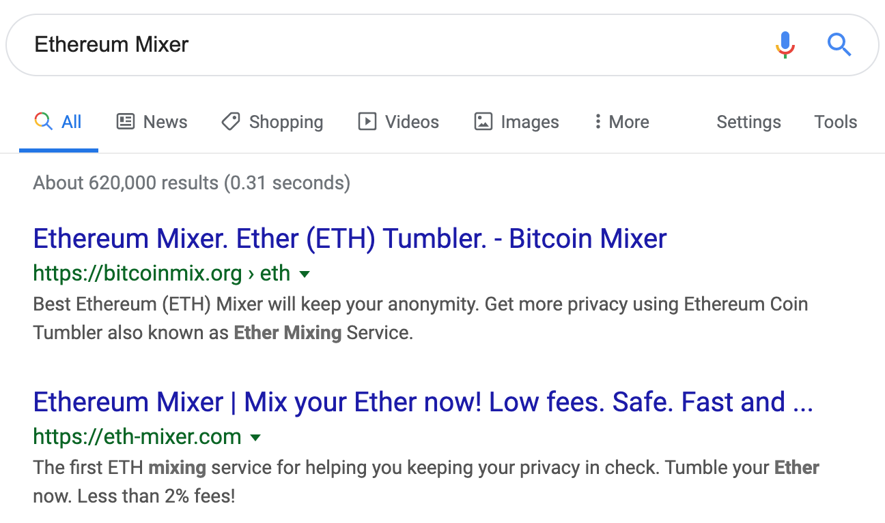
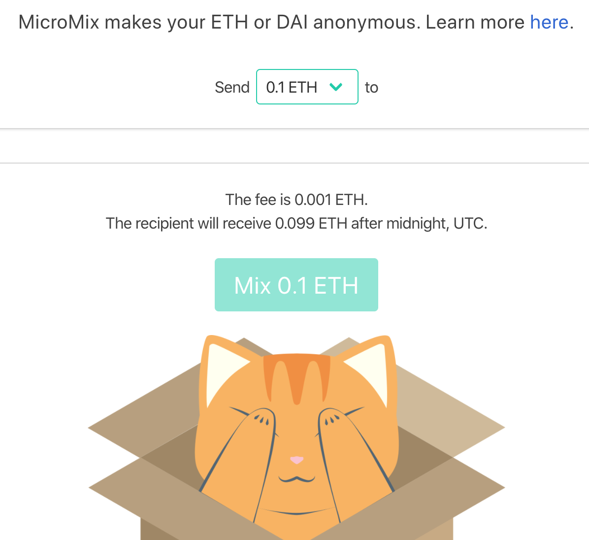
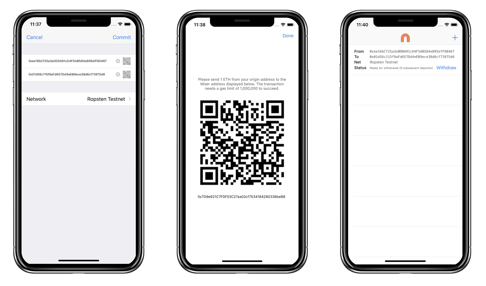
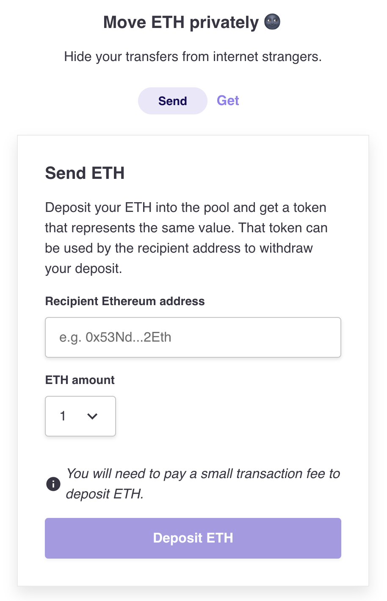
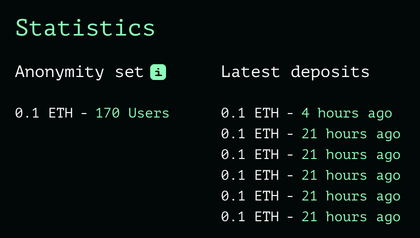
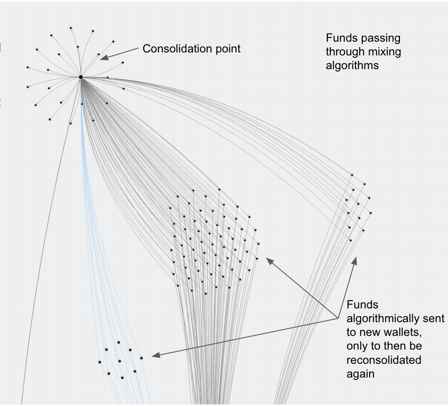

> 一篇文章让我彻底暴露了。什么能拯救，零知识证明？！

最近有人说，谁掌握了区块链技术就掌握了财富。

好吧我摊牌了，我就是一个这样的「链上富人」。

10 月底，在最爱的《橙皮书📙》公众号里看到了自己，心里却不是滋味，背后甚至有些发凉。Bowen 的一篇文章——「Top 10 DeFi 大户的链上人生」让我彻底暴露了。

我被描绘成了大户。我可不喜欢这个词，在我的字典里这就是土豪的近义词啊。严正声明，我不是大户，而是「链上富人」。

更要命的是，一举一动都被别人分析记录下来。区块链前人人平等，链上富人真是一点面子都没有。谁都能看穿我如何发家致富，现在又在干些什么。这还仅仅是很简单的人肉分析，倘若配合上更高级的工具，相信不久就会有更深入的扒皮文章出炉。

面子事小，关键这让我很没有安全感。上一次有类似的感觉还是 The DAO 那件事儿，我都不愿意多提，真的是过山车般的经历。

这次关于「隐私」的不安全感也很好理解。尽管以太坊/区块链通常被认为有**匿名性（Anonymity）**，但实际仅仅只提供了一个**假名（Pseudonymity）级别**的保护，并不是真正的**隐私保护**。账户地址上的交易记录永久公开保存，任何人从这些数据中能分析出大量有价值的信息。这与传统支付宝或银行卡账户很不一样（Satoshi Has No Clothes）。

比如作为「链上富人」，我都不敢用账户去超市买一瓶快乐水。只要交易发出的那一瞬间，对方就可能立马知道我所有用过的地址，以及资产总额（怕被抢）。

再比如，我也不敢用账户在网上购物，因为所有的消费历史会被全网一览无余（怕被扒）。

这种链上「隐私」的缺失，显然也阻碍了区块链的落地，导致链无法与真实世界发生大规模交互。**所谓的“资产上链”都成为了空谈，什么样的资产会愿意上这样的链呢？**

哎，以太坊，这个让我又爱又恨的平台。有好几个瞬间，我甚至都想抛售。

我的酒肉朋友聪哥跟我说，做人要低调，他们王家就从来不愿意碰区块链这玩意儿，至于原因自己品。

不冲动，为了信仰，我决定自己去寻找安全感。

---

> Mr 4242 是一个十分低调注重隐私的用户 ，不想让其他人通过链上数据跟踪。

《橙皮书📙》文章里提到用户 Mr 4242 “使用过 Coin Mixer 很难追踪之前的交易记录”。

Mixer 这我了解，俗称「混币器」，而原理也一句话就能说明白：把自己的资产和其他很多人的混合到一起，再转移到新的地址，从而抹去与原来地址的直接联系。

举个例子，聪哥、贾哥、罗哥三个哥都转给我 100 块钱，然后再经由我转给另外三个人。那么，其他人根据转账记录就不能够分辨出究竟谁想转账给谁，新的三个人与最初的三个哥并没有直接联系。“我”在这个例子里充当的就是一个 Mixer 的角色。

知名的 Monero、CoinJoin、Mimblewimble 都是基于这个极简单的逻辑来实现转账的隐私保护。

既然 Mixer 技术似乎说得通，我便以 "Ethereum Mixer" 为关键词搜索，看看究竟有没有好用的产品👇。

搜索结果不多。不过排名靠前的俩网站还都挺精美，各种介绍和保证。致命问题在于他们是中心化服务，这种咱们当然不会用。

关于中心化 Mixer 的问题，让我继续用前面举的例子来说明：

1. 聪、贾、罗三个哥都转账给我，我完全能够私吞了这些钱
2. 我实际知道他们每个人的真实转账意图，可以进行出卖

所以不管这些 Mixer 如何宣传自己，使用他们不仅无法达到目的，反而有损失全部本金的风险。他们都是需要资产托管的 Mixer。一句老话：他们看中的可能是你的本金！

区块链世界里，在资产安全面前，不得不先假设所有「中心化的第三方」都是邪恶😈的，都是会跑路的，然后慎重考虑自己的资产是否愿意承受这种风险。

不难想到，智能合约在这个场景里可以完美取代中心化网站，成为无需信任的第三方。于是，我将目光投向了智能合约。各式各样的隐私方案和项目还真不少，为了聚焦，我先定下一个足够明确的小目标——**寻找基于智能合约的去中心化 Mixer 可用方案**。

---

很快，我发现了一份很有价值的资料👇。

https://github.com/tvanepps/State-of-the-Mixers-Summer-2019

这是一篇被分散式自治组织先锋 Moloch DAO 👹资助的调查报告，由 Trent Van Epps 总结了截止到 2019 年以太坊生态内 Mixer 项目的现状。如果你像我一样想详细了解 Mixer 的历史背景和最新进展，这篇必读。

众所周知，以太坊和绝大部分区块链项目一样，账本都是公开的（Satoshi Has No Clothes Again）。这意味着几乎每笔交易都可被追溯，都有交易发起者和接受者。这里说“几乎”是因为存在一个例外——挖矿奖励可以被认为是“干净”无法追溯的。但很显然，目前的以太坊，普通人很难直接参与挖矿得到奖励，因此唯一一个获得干净资产的机会并不存在。

**顺着交易链条能挖掘出非常多有用的信息**。无论你有多少地址，只要这些地址相互关联，理论上都能通过分析被发现。因此链上几乎毫无隐私可言。一次普通的付款，暴露一次地址，都可能让你链上所有的行为都无处遁藏。

鉴于这种背景，Mixer 技术显得尤为重要，一定程度上可以保护链上隐私。

---

上面这篇报告很详细地列举出了所有知名的 Mixer 项目👇。

如获至宝，我决定从这个列表中找出适合的产品。

Mixer 项目其实还真不少，可认为有两大类的 Mixer，一种基于零知识证明技术（主要是 zk-SNARKs），另一种基于环签名技术（Ring Signature）。

很快，我发现很多项目作者已经弃坑了。这倒让我轻松不少，我只需关注还在活跃开发和有实际产品可试用的即可。

**这是我初步觉得比较靠谱的四个开源 Mixer 项目**👇。

- MicroMix https://github.com/weijiekoh/mixer
- Hopper https://github.com/argentlabs/hopper
- Tornado Mixer https://github.com/tornadocash/tornado-core
- Heiswap https://github.com/kendricktan/heiswap-dapp

其实不难发现，几乎所有还在活跃开发的 Mixer 项目都不约而同地选择了**零知识证明技术**。

正如安比实验室郭宇所言：

> 零知识证明是打通链上数据与链下计算的关键技术，也是实现链上数据隐私保护的重要途径。

关于「零知识证明」技术的更多思考，可以关注安比实验室「探索零知识证明系列」，特别是《初识「零知识」与「证明」》👇。

https://sec-bit.github.io/blog/2019/07/31/zero-knowledge-and-proof/

---

MicroMix 原名 Semaphore Mixer，由以太坊社区中的 Barry Whitehat, Kobi, Wei Jie 等大 V 自行组队开发，基于 Semaphore （一个零知识匿名暗号系统）扩展而来。MicroMix 利用了 zk-SNARKs 方案，已部署在 Kovan 测试网络。目前支持的金额为 0.1 ETH 或 20 DAI 。

---

Hopper 是一个移动端优先/友好的 Mixer，由 Argent Wallet 团队开发，基于 HarryR 的 ethsnarks-miximus 开发而来。Hopper 是目前唯一有移动客户端的 Mixer，但暂时只支持 iOS。Hopper 利用 zk-SNARKs，已经部署至以太坊主网和 Ropsten 测试网络。可惜的是，目前还无法很方便地安装客户端，只能由用户自行编译安装。可能是安装过程不够友好的缘故，Hopper 在以太坊主网和测试网络上的 Mixer 合约近几个月内都没有任何交易。因此现在的 iOS 版本更像是一个 POC 产品，核心意义在于拓宽了 Mixer 客户端种类。从另一个角度考虑，移动客户端的使用范围和匿名性可能都略逊于桌面应用。好消息是 MolochDAO 👹目前正资助另一个团队 BlockX 为 Hopper 开发一个 Web UI。Hopper 的终极目标是有尽可能多的客户端支持，从而扩大 Mixer 的参与人数。

---

Tornado Mixer 由 Peppersec 团队开发，同样基于零知识证明，利用 zk-SNARKs 技术，在主网和 Kovan 测试网均已部署。Peppersec 本身为一个安全咨询公司，该项目由团队独立开发，之后又受到 MolochDAO 👹的两笔资助。当前支持的金额为 0.1 ETH，后期会开放更大的金额。Tornado 团队开发相当活跃，最近还完成了电路代码和智能合约的第三方安全审计。这可能是第一个完成完整外部安全审计的 Mixer 项目。

值得一提的是，Tornado 团队在开发 Mixer 过程中，还发现了影响很多零知识证明项目（包括很多 Mixer）的“双花漏洞”。具体讨论可以参考安比实验室此前的分析文章👇。

https://sec-bit.github.io/blog/2019/07/29/the-input-aliasing-bug-caused-by-a-contract-library-of-zksnarks/

---

Heiswap (黑 swap) 由 Kendrick Tan 开发，是四个中唯一基于环签名和隐身地址技术的 Mixer，而这两个技术是 CryptoNote 协议的关键部分，也是 Monero 能够实现匿名的重要原因。Kendrick Tan 认为，从成熟的技术和产品中借鉴而不是非要使用最新的技术（比如 zk-SNARKs），有时候反而能够事半功倍。Heiswap 目前在 Ropsten 测试网上线，支持的可选金额最高到 64 ETH。

---

经过仔细研究上面几个项目的设计和实现，不难发现智能合约 Mixer 的核心思想都很类似。**通过混合多人的等额资金到同一个智能合约，构造出一个匿名集合，之后再提供证据证明自己在合约中有一笔资金未提现，合约验证通过就转账给新的提款地址。通过引入匿名集合，来抹去原始转账发起人和收款人之间的直接关联。**智能合约负责的就是保存用户存款记录、校验用户是否真的在合约中存过款，以及校验某笔存款是否已经被提现过。

原理类似，各项目的侧重点和技术路线略有不同。

零知识证明技术能够让证明者在不泄露知识（秘密）的前提下向验证者证明一个命题成立。对应到 Mixer 中就是证明用户在智能合约中存入了一笔资产（所有权）而且从来没有被提现过，并且最妙的是证明过程不会暴露具体是哪笔资产。这就让零知识证明技术天生特别适合 Mixer。

基于零知识证明技术的项目都依赖 Merkle Tree 来保存 Commitment（用户存款记录），因此 Merkle Tree 的算法选择与实现、Tree 层数的设定、Hash 算法的选择都会影响 Mixer 上限和性能，具体就是树的最大数量、电路中的约束数量、链下证明生成时间以及链上 Gas 消耗。zk-SNARKs 电路代码编写上也有不同的可选项，开发者会根据各自在性能、编写难度、跨平台支持等方面的需求，选择适合自己的技术栈。比如 MicroMix 和 Tornado 都选择了 Circom 电路语言和 snarkjs（zkSNARKs Javascript 实现），优点则是开发维护成本低并且特别适合 Web 应用；而 Hopper 则选用了基于更成熟的 libsnark 开发的 ethsnarks，性能更好并且更容易移植至其他平台。此外，SNARKs 方案需要 trusted setup，这增加了此类 mixer 的正式上线成本。

基于环签名技术的项目本质上可以认为采用了更成熟的密码学方案，也无需 trusted setup，并且证明（也就是签名）生成耗时会短很多。缺点则是链上验证消耗与匿名集合中的用户数量成正比。另外匿名集合大小依赖 Ring 大小的设置，为了用户体验通常会比 SNARKs 方案中的匿名集合更小。

---

Mixer 核心原理都类似，实现也都不算复杂，技术层面看，完全已经到了可以正式产品化的临界点了。但为什么迟迟没有大规模应用呢？实际上，以太坊去中心化的 Mixer 也都面临着共同的问题。

**首当其冲的一个问题**是，目前社区参与人数较少。决定 Mixer 效果的一个关键因素就是匿名集合的大小，参与的人越多保护效果越好。

正如 Vitalik 所说，匿名集合总是会比想象中小的多，最终会让隐私模型变得不可靠。只有越来越多的人了解到区块链上的隐私问题，并且意识到 Mixer 是一个简易可行的解决方案，Mixer 的参与人数才能越来越多，才会越来越安全。

> If your privacy model has a medium anonymity set, it really has a small anonymity set. If your privacy model has a small anonymity set, it has an anonymity set of 1. Only global anonymity sets (eg. as done with ZK-SNARKs) are truly robustly secure.

**第二个问题**也是由 Mixer 的特性所决定，也就是只能处理固定金额的资产，并且可以预见较长一段时间内这个金额都很难大幅提升。目前以太坊上的 Mixer 可以做到隐藏转账路径，但是无法做到隐藏转账金额。而如果跟 Mixer 交互的金额可以任意由用户自定义，则对外暴露了太多信息，很容易被用于分析。比如某用户转入 Mixer 1.71158 个 Ether，过了段时间又有人从 Mixer 合约中提走相同金额，那么很容易被看出来原始的转账意图。

虽然 Mixer 合约很容易支持任意多个固定金额，但是从匿名集合大小角度考虑，Mixer 运营者往往只会选择开启使用人数最多的几个选项。所以在 Mixer 产品尚没有大规模流行之前，只会开启小额选项试运行（这倒不一定完全是坏事:P）。

**第三个问题**在于 Mixer 的使用相对于普通转账还有较高门槛。普通用户从挑选适合自己的 Mixer 产品，到真正能够安全使用，还有挺多的新概念要去学。更需要注意的是并不是使用了 Mixer，就能完全保护转账隐私安全。比如用户直接向 Mixer 转入了一笔，两分钟后又使用新地址直接提出来。倘若这段时间内 Mixer 合约恰好又没有其他人调用过，则很容易被识别出来。

对于这一点，主要的几个 Mixer 都在页面进行强调，提醒用户注意规避。处理细节也提现了各家产品思路的差异。

比如 Tornado 比较极客风，直接显示当前匿名集合的大小具体是多少，以及最近几笔转入的时间是什么时候。

而 MicroMix 则更贴心，默认设置就是要求用户至少过了午夜零点之后再进行提款，页面有倒计时，提醒用户保持页面开启，到时间后自动提示用户。

MicroMix 的这个处理，也可以防止「匿名集合伪装攻击」的问题，**即假设最近一段时间内虽然一直有不同地址在使用 Mixer，实际控制人是同一人**。这种攻击方式下，匿名集合虽然对于外部观察者看起来还比较大，还对于攻击者却很小，很有助于攻击者进行数据关联分析。

**第四个问题**与 Mixer 中的一个核心角色 Relayer 有关。由于与合约的交互必须消耗 Gas，而用户从 Mixer 中提现时正常应该使用一个**全新地址**，这个地址的 Gas 从哪儿来就成了问题。Relayer 的引入则是为了解决这一「鸡生蛋蛋生鸡」的问题，由 Relayer 替用户出 Gas 费用来调合约，相应的获得一定报酬。用户需要把 Proof 发送给 Relayer，由 Relayer 负责发送交易。这个过程用户 IP 和新的收款地址可能会向 Relayer 暴露（用户需要自行隐藏）。目前各 Mixer 产品都在尝试不同的 Relayer 方案，来降低对单个 Relayer 的依赖，并试图往形成 Relayer 生态的方向在发展。

---

可以看到，对于小额场景，Mixer 技术已经相对成熟，同时也存在不少难点。

尽管很多技术团队都已经进行过 POC，但真正投入运营的项目还不多，而且社区关注度还不够。

不过，很高兴看到 Tornado 和 MicroMix 这些项目正在发力，持续地打磨产品。以太坊短期内并不会在底层提供隐私保护（这让孙老师的 Tron “又”领先了），而 Mixer 作为提高链上隐私最直接有效的方案，只有吸引更多的人参与进来，才能发挥其真正的威力。**百闻不如一见，大家不妨体验一下？**

对了，提到 Mixer 还有两个很重要问题也别忘记：一个是所在地的资产合规问题，另一个是技术是把双刃剑，既可用来保护自己也可能被用来伤害别人。

著名区块链分析公司 Chainalysis 最新报告中就提到 PlusToken 诈骗团伙大规模使用地下私人混币服务或 OTC 来洗钱。由于数额巨大，居然也被识别出来了。这么看来，本文讨论的去中心化开源 Mixer 支持金额固定且较小倒真不是坏事，至少让这些 Trustless Mixer 更适合普通人，而不是有“大额特殊非法需求”的人。 

👆上图出处 https://blog.chainalysis.com/reports/plustoken-scam-bitcoin-price。

精神上作为「链上富人」，我还是真心希望能看到以太坊本身有更多隐私保护的特性，能让我们无痛地使用各种 DeFi 和 DApp 而不用再担心隐私安全问题。随着以太坊伊斯坦布尔升级中 EIP-152、EIP-1108、EIP-1344、EIP-2028 这几个重要提案被激活，不久的未来我们应该会看到更多基于零知识证明技术的隐私项目上线，甚至可以期待看到以太坊和 ZCash 的互通。要知道，Mixer 仅是零知识证明小试牛刀的试验场，零知识证明技术真正的威力还远没有发挥出来。我们不妨一起期待，一起寻找，一起探索。

（PS：不光如此，零知识证明也给以太坊扩容带来了新的希望。不由地感慨一句：零知识证明拯救以太坊，ZKP saves the world.）

这可能是关键的第一步，先保护区块链（以太坊）本身的隐私，再去谈利用区块链技术解决传统世界中数据泄漏和隐私保护的问题。

> 本系列纯属虚构，如有雷同，都是编的。

题图：Richard testifying on US Congress, Silicon Valley S06E01