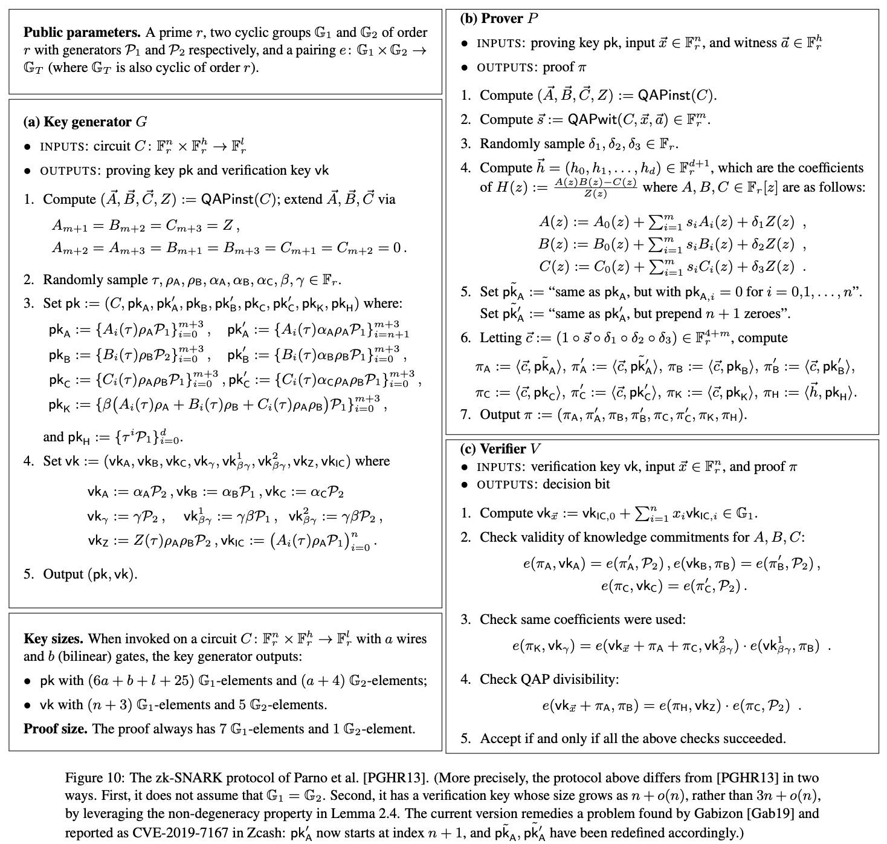
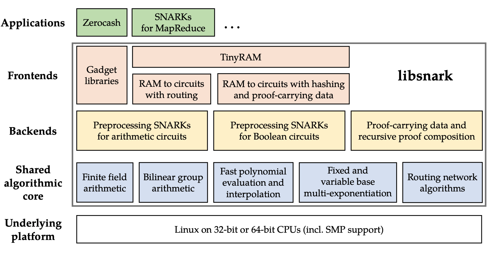
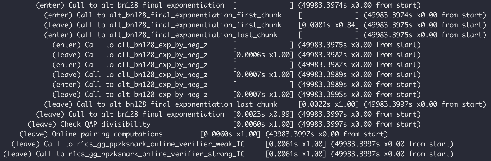
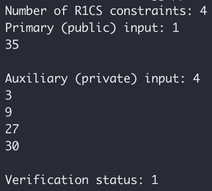

libsnark 是目前实现 zk-SNARKs 电路最重要的框架，在众多私密交易或隐私计算相关项目间广泛应用，其中最著名当然要数 Zcash。Zcash 在 Sapling 版本升级前一直使用 libsnark 来实现电路（之后才替换为 bellman）。毫不夸张地说，libsnark 支撑并促进了 zk-SNARKs 技术的**首次大规模应用**，填补了零知识证明技术从最新理论到工程实现间的空缺。

希望通过本系列文章，所有开发者都能亲自上手实践，在短时间内迅速入门 libsnark，一步步了解 libsnark 的基本概念，学会如何开发 zk-SNARKs 电路，完成证明的生成和验证，最终将零知识证明应用到真实业务中去。

## 1. zk-SNARKs 和 libsnark 背景简介

零知识证明，可能是目前最具应用前景和想象力的密码学黑科技。而 zk-SNARKs 正是一类零知识证明方案的简称，全称为 Zero-Knowledge Succinct Non-interactive Arguments of Knowledge。这一名字几乎包含了其所有技术特征，即可以在不泄露任何其他信息的前提下证明一个命题的正确性，并且最终生成的证明具有简洁性（Succinct），也就是说最终生成的证明足够小，并且与计算量大小无关，是一个常数。用白话说就是，你理论上可以在不暴露任何隐私的情况下向其他所有人证明某件事，并且生成的证明体积很小，校验成本很低，与需要证明的内容计算量无关。听起来简直太美好了！

zk-SNARKs 能应用到很多场景，比如隐私保护、区块链扩容、可验证计算等。本文不介绍 zk-SNARKS 和零知识证明的理论细节，不熟悉或想深入了解的同学可阅读其他文章或论文。

如 Vitalik 写的关于 zk-SNARKs 著名的三篇博文。 

- https://medium.com/@VitalikButerin/quadratic-arithmetic-programs-from-zero-to-hero-f6d558cea649
- https://medium.com/@VitalikButerin/exploring-elliptic-curve-pairings-c73c1864e627
- https://medium.com/@VitalikButerin/zk-snarks-under-the-hood-b33151a013f6

或者阅读**向程@HUST**写的[「深入浅出零知识证明之zk-SNARKs」](https://www.yuque.com/u428635/scg32w/edmn74)，还有**东泽**写的[「浅谈零知识证明之二：简短无交互证明（SNARK）」](https://mp.weixin.qq.com/s/623bceLkCjgtFHB6W3D0oA)。

当然也欢迎关注安比实验室[「探索零知识证明」系列](https://sec-bit.github.io/blog/2019/07/31/zero-knowledge-and-proof/)和[「从零开始学习 zk-SNARK」系列](https://sec-bit.github.io/blog/2019/12/25/learn-zk-snark-from-zero-part-one/)，以及从安比实验室维护的[「零知识证明学习资源汇总」](https://sec-bit.github.io/blog/2019/11/07/zkp-learning-resources/)中查找更多资料。

本文主角 libsnark 是用于开发 zk-SNARKs 应用的 C++ 代码库，由 SCIPR Lab 开发并维护。libsnark 工程实现背后的理论基础是近年来（尤其是 2013 年以来）零知识证明特别是 zk-SNARKs 方向的一系列重要论文。如以下最著名的数篇：

- [GGPR13] Quadratic span programs and succinct NIZKs without PCPs , Rosario Gennaro, Craig Gentry, Bryan Parno, Mariana Raykova, EUROCRYPT 2013

- [PGHR13] Pinocchio: Nearly Practical Verifiable Computation , Bryan Parno, Craig Gentry, Jon Howell, Mariana Raykova, IEEE Symposium on Security and Privacy (Oakland) 2013

- [BCGTV13] SNARKs for C: Verifying Program Executions Succinctly and in Zero Knowledge , Eli Ben-Sasson, Alessandro Chiesa, Daniel Genkin, Eran Tromer, Madars Virza, CRYPTO 2013

- [BCIOP13] Succinct non-interactive arguments via linear interactive Proofs , Nir Bitansky, Alessandro Chiesa, Yuval Ishai, Rafail Ostrovsky, Omer Paneth, Theory of Cryptography Conference 2013

- [BCTV14a] Succinct non-interactive zero knowledge for a von Neumann architecture , Eli Ben-Sasson, Alessandro Chiesa, Eran Tromer, Madars Virza, USENIX Security 2014

- [BCTV14b] Scalable succinct non-interactive arguments via cycles of elliptic curves , Eli Ben-Sasson, Alessandro Chiesa, Eran Tromer, Madars Virza, CRYPTO 2014

- [Groth16] On the Size of Pairing-based Non-interactive Arguments , Jens Groth, EUROCRYPT 2016

libsnark 的开发者们亦是这个领域内顶尖的学者或研究牛人，如 Eran Tromer 更是以上多篇论文的共同作者。


扎实的理论基础和工程能力，让 libsnark 的作者们能够化繁为简，将形如下图的高深理论和复杂公式逐一实现，高度工程化地抽象出简洁的接口供广大开发者方便地调用。向这些将非凡的理论研究推广至更大规模应用的先锋们致敬。



下图是 libsnark 的模块总览图，摘自 libsnark 代码贡献量第一作者 Madars Virza 在 MIT 的[博士论文](https://madars.org/phd-thesis/)。 

)

libsnark 框架提供了多个通用证明系统的实现，其中使用较多的是 BCTV14a 和 Groth16。

查看 `libsnark/libsnark/zk_proof_systems` 路径，就能发现 libsnark 对各种证明系统的具体实现，并且均按不同类别进行了分类，还附上了实现依照的具体论文。

其中：

- `zk_proof_systems/ppzksnark/r1cs_ppzksnark` 对应的是 `BCTV14a`
- `zk_proof_systems/ppzksnark/r1cs_gg_ppzksnark` 对应的是 `Groth16`

如果想研究这两个协议的实现细节可直接从这两个目录入手。`ppzksnark` 是指 *preprocessing zkSNARK*。这里的 `pp/preprocessing` 其实就是指我们常说的 trusted setup，即在证明生成和验证之前，需要通过一个生成算法来创建相关的公共参数（proving key 和 verification key）。我们也把这个提前生成的参数称为 「公共参考串」（Common Reference String），或简称为 [CRS](https://sec-bit.github.io/blog/2019/11/01/from-interactive-zkp-to-non-interactive-zkp)。


## 2. 基本原理与步骤

利用 libsnark 库开发 zk-SNARKs 应用从原理上可简要概括为以下四个步骤：

1. 将待证明的命题表达为 R1CS (Rank One Constraint System)
2. 使用生成算法（***G***）为该命题生成公共参数
3. 使用证明算法（***P***）生成 R1CS 可满足性的证明
4. 使用验证算法（***V***）来验证证明

不妨用一个十分简短（简化）的例子，来对照上面四个步骤。该例子模仿自[这篇文章](https://media.consensys.net/introduction-to-zksnarks-with-examples-3283b554fc3b)。

有这样一个函数 `C(x, out)`，用于判断秘密 `x` 是否满足等式 `x^3 + x + 5 == out`，若满足则返回 `true`。 

```js
function C(x, out) {
  return ( x^3 + x + 5 == out );
}
```

**第一步**，我们需要将函数 `C(x, out)` 在 libsnark 中进行表达。此处先省略，后面介绍详细过程。

**第二步**，对应下面的 Generator 函数（***G***），`lambda` 为随机产生，也就是常说的 trusted setup 过程中产生的 "toxic waste"。人们喜欢称它为“有毒废物”，是因为它必须被妥善处理（如必须销毁，不能让任何人知道），否则会影响证明协议安全。

```js
lambda <- random()

(pk, vk) = G(C, lambda)
```

最终生成 proving key (`pk`) 和 verification key (`vk`)。

**第三步**，对应使用 Prove 函数（***P***）生成证明。这里想证明的是 prover 知道一个秘密值 `x` 和计算结果 `out` 可使等式满足。因此将 `x`、`out` 还有 `pk` 作为输入一起传给 ***P***，最终生成证明 `proof`。

```js
proof = P(pk, out, x)
```

**第四步**，对应使用 Verify 函数（***V***）验证证明，将 `proof`、`out` 还有 `vk` 传给 ***G***，即可在不暴露秘密的情况下证明存在一个秘密值可使等式满足。

```js
V(vk, out, proof) ?= true
```

而**开发者主要工作量就集中在第一步**，需要按照 libsnark 的接口规则手写 C++ 电路代码来描述命题，由代码构造 R1CS 约束。整个过程也即对应下图的 Computation -> Arithmetic Circuit -> R1CS。


## 3. 搭建 zk-SNARKs 应用开发环境

下面进入动手环节，快速上手 libsnark，跑通例子。

先下载本文对应的 libsnark 最小可用例子代码库 `libsnark_abc`。

```shell
git clone https://github.com/sec-bit/libsnark_abc.git
```


通过 git submodule 拉取 libsnark 代码。

```shell
cd libsnark_abc
git submodule update --init --recursive
```

参考 libsnark [项目文档](https://github.com/scipr-lab/libsnark#dependencies)完成相关依赖安装。以 Ubuntu 16.04 LTS 为例，需安装以下组件：

```shell
sudo apt-get install build-essential cmake git libgmp3-dev libprocps4-dev python-markdown libboost-all-dev libssl-dev
```

初始化 `build` 文件夹。

```shell
mkdir build && cd build && cmake ..
```

这步在 macOS 系统可能会遇到问题，参考[这个 issue](https://github.com/scipr-lab/libsnark/issues/99#issuecomment-367677834) 处理。或尝试使用以下命令：

```shell
mkdir build && cd build && CPPFLAGS=-I/usr/local/opt/openssl/include LDFLAGS=-L/usr/local/opt/openssl/lib PKG_CONFIG_PATH=/usr/local/opt/openssl/lib/pkgconfig cmake -DWITH_PROCPS=OFF -DWITH_SUPERCOP=OFF ..
```

成功后，依旧在 `build` 目录进行编译。

```shell
make
```

编译成功后，在 `build/src` 目录中可看到 3 个二进制文件。

```shell
main
range
test
```

到这儿，你就以及完成示例项目的编译啦。尝试运行示例代码吧。

```
./src/main
```

最终出现如下日志，则说明一切正常。**你已顺利拥有了 zkSNARK 应用开发环境，并成功跑了第一个 zk-SNARKs 的 demo**。



---

## 4. 理解示例代码

下面我们一起来仔细瞅瞅代码。示例项目包含了 3 份代码（也可查看文末附录）。

**不妨先看看 `src/main.cpp`**。这个例子来自 Howard Wu 的 [libsnark_tutorial](https://github.com/howardwu/libsnark-tutorial)，他也是 libsnark 作者之一哦。本文 `libsnark_abc` 的项目结构就是依照他的 `libsnark_tutorial` 搭建，属于“官方推荐风格” ，请放心食用 😆。

只有区区几十行代码，其中 `run_r1cs_gg_ppzksnark()` 是主要部分。很容易发现，真正起作用的实质代码只有下面 5 行。

```c++
r1cs_gg_ppzksnark_keypair<ppT> keypair = r1cs_gg_ppzksnark_generator<ppT>(example.constraint_system);

r1cs_gg_ppzksnark_processed_verification_key<ppT> pvk = r1cs_gg_ppzksnark_verifier_process_vk<ppT>(keypair.vk);

r1cs_gg_ppzksnark_proof<ppT> proof = r1cs_gg_ppzksnark_prover<ppT>(keypair.pk, example.primary_input, example.auxiliary_input);

const bool ans = r1cs_gg_ppzksnark_verifier_strong_IC<ppT>(keypair.vk, example.primary_input, proof);

const bool ans2 = r1cs_gg_ppzksnark_online_verifier_strong_IC<ppT>(pvk, example.primary_input, proof);
```

仅从“超长”的函数名就能看出来每步是在做什么，但是却看不到如何构造电路的细节。实际上这里仅仅是调用了自带的 `r1cs_example`，隐去了实现细节。

既然如此，**那让我们通过一个更直观的例子来学习电路细节**。研究 `src/test.cpp`，这个例子改编自 Christian Lundkvist 的 [libsnark-tutorial](https://github.com/christianlundkvist/libsnark-tutorial)。

代码开头仅引用了三个头文件，分别是：

```c++
#include <libsnark/common/default_types/r1cs_gg_ppzksnark_pp.hpp>
#include <libsnark/zk_proof_systems/ppzksnark/r1cs_gg_ppzksnark/r1cs_gg_ppzksnark.hpp>
#include <libsnark/gadgetlib1/pb_variable.hpp>
```

前面提到 `r1cs_gg_ppzksnark` 对应的是 Groth16 方案。这里加了 `gg` 是为了区别 `r1cs_ppzksnark`（也就是 BCTV14a 方案），表示 Generic Group Model（通用群模型）。Groth16 安全性证明依赖 Generic Group Model，以更强的安全假设换得了更好的性能和更短的证明。

第一个头文件是为了引入 `default_r1cs_gg_ppzksnark_pp` 类型，第二个则为了引入证明相关的各个接口。`pb_variable` 则是用来定义电路相关的变量。

下面需要进行一些初始化，定义使用的有限域，并初始化曲线参数。这是相当于每次的准备工作。

```c++
typedef libff::Fr<default_r1cs_gg_ppzksnark_pp> FieldT;
default_r1cs_gg_ppzksnark_pp::init_public_params();
```

接下来就需要明确「待证命题」是什么。这里不妨沿用之前的例子，证明秘密 `x` 满足等式 `x^3 + x + 5 == out`。这实际也是 Vitalik 博文 ["Quadratic Arithmetic Programs: from Zero to Hero"](https://medium.com/@VitalikButerin/quadratic-arithmetic-programs-from-zero-to-hero-f6d558cea649) 中用的例子。如果对下面的变化陌生，可尝试阅读该博文。

通过引入中间变量 `sym_1`、`y`、`sym_2` 将 `x^3 + x + 5 = out` 扁平化为若干个二次方程式，几个只涉及简单乘法或加法的式子，**对应到算术电路中就是乘法门和加法门**。你可以很容易地在纸上画出对应的电路。

```
x * x = sym_1
sym_1 * x = y
y + x = sym_2
sym_2 + 5 = out
```

通常文章到这里便会顺着介绍如何按照 R1CS 的形式编排上面的几个等式，并一步步推导出具体对应的向量。这对理解如何把 Gate 转换为 R1CS 有帮助，然而却不是本文的核心目的。所以此处省略一百字。

下面定义与命题相关的变量。首先创建的 `protoboard` 是 libsnark 中的一个重要概念，顾名思义就是**原型板**或者**面包板**，用来快速搭建电路，在 zk-SNARKs 电路中则是用来关联所有变量、组件和约束。接下来的代码定义了所有需要外部输入的变量以及中间变量。

```C++
// Create protoboard
protoboard<FieldT> pb;

// Define variables
pb_variable<FieldT> x;
pb_variable<FieldT> sym_1;
pb_variable<FieldT> y;
pb_variable<FieldT> sym_2;
pb_variable<FieldT> out;
```

下面将各个变量与 `protoboard` 连接，相当于把各个元器件插到“面包板”上。`allocate()` 函数的第二个 string 类型变量仅是用来方便 DEBUG 时的注释，方便 DEBUG 时查看日志。

```C++
out.allocate(pb, "out");
x.allocate(pb, "x");
sym_1.allocate(pb, "sym_1");
y.allocate(pb, "y");
sym_2.allocate(pb, "sym_2");
pb.set_input_sizes(1);
```

注意，**此处第一个与 `pb` 连接的是 `out` 变量**。我们知道 zk-SNARKs 中有 public input 和 private witness 的概念，分别对应 libsnark 中的 primary 和 auxiliary 变量。那么如何在代码中进行区分呢？我们需要借助 `set_input_sizes(n)` 来声明与 protoboard 连接的 public/primary 变量的个数 `n`。在这里 `n = 1`，表明与 `pb` 连接的**前 `n = 1` 个变量**是 public 的，其余都是 private 的。

至此， 所有变量都已经顺利与 protoboard 相连，下面需要确定的是这些变量间的约束关系。这个也很好理解，类似元器件插至面包板后，需要根据电路需求确定他们之间的关系再连线焊接。如下调用 protoboard 的 `add_r1cs_constraint()` 函数，为 `pb` 添加形如 `a * b = c` 的 `r1cs_constraint`。即 `r1cs_constraint<FieldT>(a, b, c)` 中参数应该满足 `a * b = c`。根据注释不难理解每个等式和约束之间的关系。

```C++
// x*x = sym_1
pb.add_r1cs_constraint(r1cs_constraint<FieldT>(x, x, sym_1));
// sym_1 * x = y
pb.add_r1cs_constraint(r1cs_constraint<FieldT>(sym_1, x, y));
// y + x = sym_2
pb.add_r1cs_constraint(r1cs_constraint<FieldT>(y + x, 1, sym_2));
// sym_2 + 5 = ~out
pb.add_r1cs_constraint(r1cs_constraint<FieldT>(sym_2 + 5, 1, out));
```

至此，变量间的约束也已添加完成，针对命题的电路已构建完毕。下面进入前文提到的“四个步骤”中的**第二步**：使用生成算法（***G***）为该命题生成公共参数（`pk` 和 `vk`），即 trusted setup。生成出来的 proving key 和 verification key 分别可以通过 `keypair.pk` 和 `keypair.vk` 获得。

```
const r1cs_constraint_system<FieldT> constraint_system = pb.get_constraint_system();
const r1cs_gg_ppzksnark_keypair<default_r1cs_gg_ppzksnark_pp> keypair = r1cs_gg_ppzksnark_generator<default_r1cs_gg_ppzksnark_pp>(constraint_system);
```

进入**第三步**，生成证明。先为 public input 以及 witness 提供具体数值。不难发现，`x = 3, out = 35` 是原始方程的一个解。则依次为 `x`、`out` 以及各个中间变量赋值。

```
pb.val(out) = 35;

pb.val(x) = 3;
pb.val(sym_1) = 9;
pb.val(y) = 27;
pb.val(sym_2) = 30;
```

再把 public input 以及 witness 的数值传给 prover 函数进行证明，可分别通过 `pb.primary_input()` 和 `pb.auxiliary_input()` 访问。生成的证明用 `proof` 变量保存。

```
const r1cs_gg_ppzksnark_proof<default_r1cs_gg_ppzksnark_pp> proof = r1cs_gg_ppzksnark_prover<default_r1cs_gg_ppzksnark_pp>(keypair.pk, pb.primary_input(), pb.auxiliary_input());
```

最后我们使用 verifier 函数校验证明。如果 `verified = true` 则说明证明验证成功。

```
bool verified = r1cs_gg_ppzksnark_verifier_strong_IC<default_r1cs_gg_ppzksnark_pp>(keypair.vk, pb.primary_input(), proof);
```

从日志输出中可以看出验证结果为 `true`，R1CS 约束数量为 4，public input 和 private input 数量分别为 1 和 4。日志输出符合预期。



实际应用中，trusted setup、prove、verify 会由不同角色分别开展，最终实现的效果就是 `prover` 给 `verifier` 一段简短的 `proof` 和 `public input`，`verifier` 可以自行校验某命题是否成立。对于前面的例子，就是能在不知道方程的解 `x` 具体是多少的情况下，验证 `prover` 知道一个秘密的 `x` 可以使得 `x^3 + x + 5 = out` 成立。

通过短短的几十行代码，你就可以很轻易地操控学术界 zk-SNARKs 最新研究成果。

## 5. 再次上手实践

经过上面的例子，我们已经了解了利用 libsnark 库开发 zk-SNARKs 电路的所有重要步骤。

现在不妨用新的例子来巩固一下：**在不泄露秘密数字大小的前提下，证明数字小于 `60`**。

这个在常规程序里用一个运算符就能完成的事情，在 libsnark 下面应该如何表示呢？

zk-SNARKs 电路开发的主要工作量和难点在于如何用代码“精确”地描述命题中的所有约束。一旦描述不“精确”，则要么是漏掉约束、要么是写错约束，最终电路想要证明的内容则会与原命题相差甚远。上一节的例子只涉及简单的乘法和加法，与 `r1cs_constraint` 最基本的形式一致，因此约束的表达相对容易。除此之外几乎所有的约束都不是很直观，作为初学者很难正确地描述约束细节。

幸好 libsnark 已经为我们实现了大量基础电路小组件。`gadgetlib1` 和 `gadgetlib2` 下提供了许多可以直接使用的 gadget。其中 `gadgetlib1` 更常用一些，里面收集了包括 `sha256` 在内的 hash 计算、merkle tree、pairing 等电路实现。

*DangDangDang*，`gadgetlib1/gadgets/basic_gadgets.hpp` 中的 `comparison_gadget` 正是我们所需。

```
comparison_gadget(protoboard<FieldT>& pb,
                    const size_t n,
                    const pb_linear_combination<FieldT> &A,
                    const pb_linear_combination<FieldT> &B,
                    const pb_variable<FieldT> &less,
                    const pb_variable<FieldT> &less_or_eq,
                    const std::string &annotation_prefix="")
```

该 gadget 需要传入的参数较多：`n` 表示位数，`A` 和 `B` 分别为需要比较的两个数，`less` 和 `less_or_eq` 用来标记两个数的关系是「小于」还是「小于或等于」。该 gadget 实现的原理简单来讲是把 `A` 和 `B` 的比较，转化为 `2^n + B - A` 按位表示。具体实现还用到了其余多个基础 gadget，可以通过 `comparison_gadget<FieldT>::generate_r1cs_constraints()` 研究。

这里需要创建以下变量，并将 `x` 和 `max` 与 `pb` 相连，把 `max` 值设为 `60`，代表数值上限。

```
protoboard<FieldT> pb;

pb_variable<FieldT> x, max;
pb_variable<FieldT> less, less_or_eq;

x.allocate(pb, "x");
max.allocate(pb, "max");

pb.val(max)= 60;
```

使用 `comparison_gadget` 创建 `cmp`，并把前面的参数填入，并调用 gadget 自带的 `generate_r1cs_constraints()` 方法。同时另外添加一个约束，要求 `less * 1 = 1`，也就是 `less` 必须为 `true`。

```
comparison_gadget<FieldT> cmp(pb, 10, x, max, less, less_or_eq, "cmp");
cmp.generate_r1cs_constraints();
pb.add_r1cs_constraint(r1cs_constraint<FieldT>(less, 1, FieldT::one()));
```

输入 witness（秘密值 x），比如让 `x = 18`。这里还需要调用 `comparison_gadget` 的 `generate_r1cs_witness` 方法。

```
// Add witness values
pb.val(x) = 18; // secret
cmp.generate_r1cs_witness();
```

其余部分和上一个例子一致，即可在不泄露秘密数字大小的前提下，证明某数字小于 `60`。同理，就实现一个对数值作最大和最小值限定的 “range proof”。

在强大基础库的帮助下，我们又用更短的代码实现了证明需求。

## 6. What's NEXT?

读到这里，相信大家都对 libsnark 的使用方法和 zk-SNARKs 电路开发有了一个初步的了解。

你或许已经发现，libsnark 的使用方法较简单，而真正的重点在于 zk-SNARKs 电路开发。正如前面提过的，必须用代码“精确”描述待证命题中的所有约束，“漏掉”或“写错”约束都会让证明内容与原本意图大相径庭，从而导致证明无意义。

如何正确高效地把真实业务逻辑转化为 zk-SNARKs 电路代码，这正是我们开发者需要不断研究和练习的。

好在我们已经有了一个 libsnark 试验场，可以很方便地自由修改、添加代码来尝试。

不论多复杂的电路实现，都是通过一个个更简单地「电路组件」组合封装而形成。因此 libsnark 自带的基础库是一个非常重要的学习资料——既要学习它们的使用方法，又要研究其实现原理。

我们也能通过阅读其他项目的电路实现来了解如何将 ZKP 应用到实际业务中，如 HarryR 的 [ethsnarks-miximus](https://github.com/HarryR/ethsnarks-miximus) 和 Loopring 的 [protocol3-circuits](https://github.com/Loopring/protocol3-circuits)。从这些项目中可以学习到如何工程化地开发更大规模的电路，以及与电路性能相关的各种设计优化细节，同时对电路约束规模会有更深刻的理解。

同时也欢迎大家继续关注安比实验室「零知识证明 Learn by Coding：libsnark 系列」后续文章，下次我们将尝试从 zk-SNARKs 与智能合约的结合、电路模块化开发、更复杂的 libsnark 实现案例、电路开发过程中容易踩的坑等角度来进一步讨论。


## 7. 附录

### `main.cpp`

第一个例子 `main.cpp`，调用 libsnark 官方 example 的示例代码。通过该例子可了解 libsnark 的基本使用流程和主要函数。

```
#include <libff/common/default_types/ec_pp.hpp>
#include <libsnark/common/default_types/r1cs_gg_ppzksnark_pp.hpp>
#include <libsnark/relations/constraint_satisfaction_problems/r1cs/examples/r1cs_examples.hpp>
#include <libsnark/zk_proof_systems/ppzksnark/r1cs_gg_ppzksnark/r1cs_gg_ppzksnark.hpp>

using namespace libsnark;

/**
 * The code below provides an example of all stages of running a R1CS GG-ppzkSNARK.
 *
 * Of course, in a real-life scenario, we would have three distinct entities,
 * mangled into one in the demonstration below. The three entities are as follows.
 * (1) The "generator", which runs the ppzkSNARK generator on input a given
 *     constraint system CS to create a proving and a verification key for CS.
 * (2) The "prover", which runs the ppzkSNARK prover on input the proving key,
 *     a primary input for CS, and an auxiliary input for CS.
 * (3) The "verifier", which runs the ppzkSNARK verifier on input the verification key,
 *     a primary input for CS, and a proof.
 */
template<typename ppT>
bool run_r1cs_gg_ppzksnark(const r1cs_example<libff::Fr<ppT> > &example)
{
    libff::print_header("R1CS GG-ppzkSNARK Generator");
    r1cs_gg_ppzksnark_keypair<ppT> keypair = r1cs_gg_ppzksnark_generator<ppT>(example.constraint_system);
    printf("\n"); libff::print_indent(); libff::print_mem("after generator");

    libff::print_header("Preprocess verification key");
    r1cs_gg_ppzksnark_processed_verification_key<ppT> pvk = r1cs_gg_ppzksnark_verifier_process_vk<ppT>(keypair.vk);

    libff::print_header("R1CS GG-ppzkSNARK Prover");
    r1cs_gg_ppzksnark_proof<ppT> proof = r1cs_gg_ppzksnark_prover<ppT>(keypair.pk, example.primary_input, example.auxiliary_input);
    printf("\n"); libff::print_indent(); libff::print_mem("after prover");

    libff::print_header("R1CS GG-ppzkSNARK Verifier");
    const bool ans = r1cs_gg_ppzksnark_verifier_strong_IC<ppT>(keypair.vk, example.primary_input, proof);
    printf("\n"); libff::print_indent(); libff::print_mem("after verifier");
    printf("* The verification result is: %s\n", (ans ? "PASS" : "FAIL"));

    libff::print_header("R1CS GG-ppzkSNARK Online Verifier");
    const bool ans2 = r1cs_gg_ppzksnark_online_verifier_strong_IC<ppT>(pvk, example.primary_input, proof);
    assert(ans == ans2);

    return ans;
}

template<typename ppT>
void test_r1cs_gg_ppzksnark(size_t num_constraints, size_t input_size)
{
    r1cs_example<libff::Fr<ppT> > example = generate_r1cs_example_with_binary_input<libff::Fr<ppT> >(num_constraints, input_size);
    const bool bit = run_r1cs_gg_ppzksnark<ppT>(example);
    assert(bit);
}

int main () {
    default_r1cs_gg_ppzksnark_pp::init_public_params();
    test_r1cs_gg_ppzksnark<default_r1cs_gg_ppzksnark_pp>(1000, 100);

    return 0;
}
```

### `test.cpp`

第二个例子 `test.cpp`。这个例子具体展示了如何利用 libsnark 构建一个最简单的电路。

```
#include <libsnark/common/default_types/r1cs_gg_ppzksnark_pp.hpp>
#include <libsnark/zk_proof_systems/ppzksnark/r1cs_gg_ppzksnark/r1cs_gg_ppzksnark.hpp>
#include <libsnark/gadgetlib1/pb_variable.hpp>

using namespace libsnark;
using namespace std;

int main () {
    typedef libff::Fr<default_r1cs_gg_ppzksnark_pp> FieldT;

    // Initialize the curve parameters
    default_r1cs_gg_ppzksnark_pp::init_public_params();
  
    // Create protoboard
    protoboard<FieldT> pb;

    // Define variables
    pb_variable<FieldT> x;
    pb_variable<FieldT> sym_1;
    pb_variable<FieldT> y;
    pb_variable<FieldT> sym_2;
    pb_variable<FieldT> out;

    // Allocate variables to protoboard
    // The strings (like "x") are only for debugging purposes    
    out.allocate(pb, "out");
    x.allocate(pb, "x");
    sym_1.allocate(pb, "sym_1");
    y.allocate(pb, "y");
    sym_2.allocate(pb, "sym_2");

    // This sets up the protoboard variables
    // so that the first one (out) represents the public
    // input and the rest is private input
    pb.set_input_sizes(1);

    // Add R1CS constraints to protoboard

    // x*x = sym_1
    pb.add_r1cs_constraint(r1cs_constraint<FieldT>(x, x, sym_1));

    // sym_1 * x = y
    pb.add_r1cs_constraint(r1cs_constraint<FieldT>(sym_1, x, y));

    // y + x = sym_2
    pb.add_r1cs_constraint(r1cs_constraint<FieldT>(y + x, 1, sym_2));

    // sym_2 + 5 = ~out
    pb.add_r1cs_constraint(r1cs_constraint<FieldT>(sym_2 + 5, 1, out));
    
    const r1cs_constraint_system<FieldT> constraint_system = pb.get_constraint_system();

    // generate keypair
    const r1cs_gg_ppzksnark_keypair<default_r1cs_gg_ppzksnark_pp> keypair = r1cs_gg_ppzksnark_generator<default_r1cs_gg_ppzksnark_pp>(constraint_system);

    // Add public input and witness values
    pb.val(out) = 35;

    pb.val(x) = 3;
    pb.val(sym_1) = 9;
    pb.val(y) = 27;
    pb.val(sym_2) = 30;

    // generate proof
    const r1cs_gg_ppzksnark_proof<default_r1cs_gg_ppzksnark_pp> proof = r1cs_gg_ppzksnark_prover<default_r1cs_gg_ppzksnark_pp>(keypair.pk, pb.primary_input(), pb.auxiliary_input());

    // verify
    bool verified = r1cs_gg_ppzksnark_verifier_strong_IC<default_r1cs_gg_ppzksnark_pp>(keypair.vk, pb.primary_input(), proof);

    cout << "Number of R1CS constraints: " << constraint_system.num_constraints() << endl;
    cout << "Primary (public) input: " << pb.primary_input() << endl;
    cout << "Auxiliary (private) input: " << pb.auxiliary_input() << endl;
    cout << "Verification status: " << verified << endl;
}
```

### `range.cpp`

第三个例子 `range.cpp`。该例子利用了 libsnark 自带的 `comparison_gadget` 来实现取值范围证明。

```
#include <libsnark/common/default_types/r1cs_gg_ppzksnark_pp.hpp>
#include <libsnark/zk_proof_systems/ppzksnark/r1cs_gg_ppzksnark/r1cs_gg_ppzksnark.hpp>
#include <libsnark/gadgetlib1/pb_variable.hpp>
#include <libsnark/gadgetlib1/gadgets/basic_gadgets.hpp>

using namespace libsnark;
using namespace std;

int main () {
    typedef libff::Fr<default_r1cs_gg_ppzksnark_pp> FieldT;

    // Initialize the curve parameters
    default_r1cs_gg_ppzksnark_pp::init_public_params();
  
    // Create protoboard
    protoboard<FieldT> pb;

    pb_variable<FieldT> x, max;
    pb_variable<FieldT> less, less_or_eq;

    x.allocate(pb, "x");
    max.allocate(pb, "max");
    
    pb.val(max)= 60;

    comparison_gadget<FieldT> cmp(pb, 10, x, max, less, less_or_eq, "cmp");
    cmp.generate_r1cs_constraints();
    pb.add_r1cs_constraint(r1cs_constraint<FieldT>(less, 1, FieldT::one()));

    const r1cs_constraint_system<FieldT> constraint_system = pb.get_constraint_system();

    // generate keypair
    const r1cs_gg_ppzksnark_keypair<default_r1cs_gg_ppzksnark_pp> keypair = r1cs_gg_ppzksnark_generator<default_r1cs_gg_ppzksnark_pp>(constraint_system);

    // Add witness values
    pb.val(x) = 18; // secret
    cmp.generate_r1cs_witness();

    // generate proof
    const r1cs_gg_ppzksnark_proof<default_r1cs_gg_ppzksnark_pp> proof = r1cs_gg_ppzksnark_prover<default_r1cs_gg_ppzksnark_pp>(keypair.pk, pb.primary_input(), pb.auxiliary_input());

    // verify
    bool verified = r1cs_gg_ppzksnark_verifier_strong_IC<default_r1cs_gg_ppzksnark_pp>(keypair.vk, pb.primary_input(), proof);

    cout << "Number of R1CS constraints: " << constraint_system.num_constraints() << endl;
    cout << "Primary (public) input: " << pb.primary_input() << endl;
    cout << "Auxiliary (private) input: " << pb.auxiliary_input() << endl;
    cout << "Verification status: " << verified << endl;
}
```