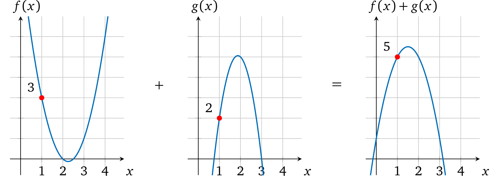
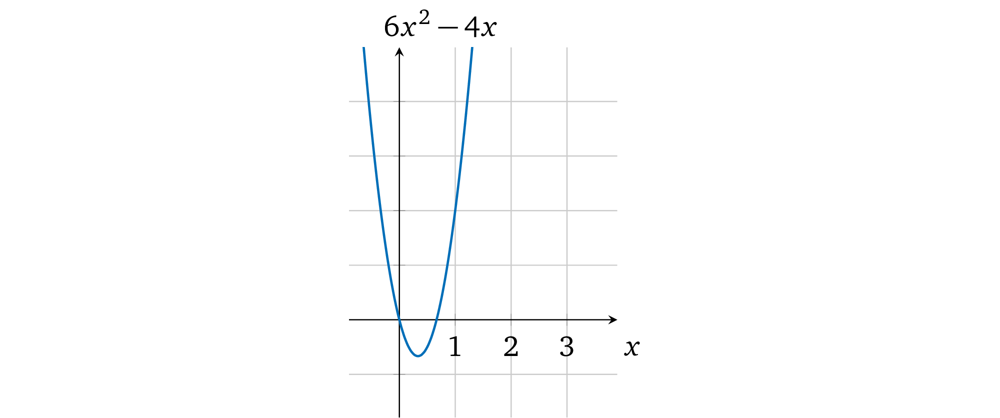
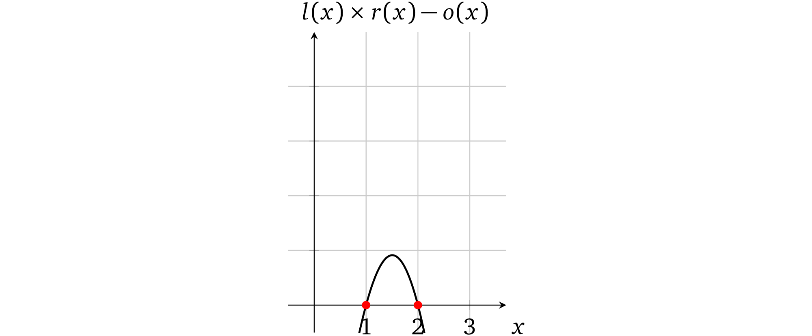
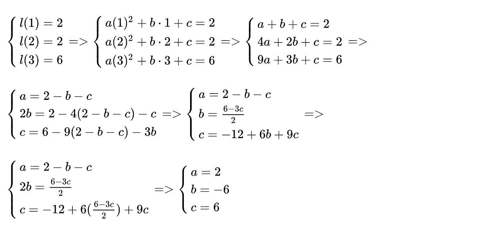
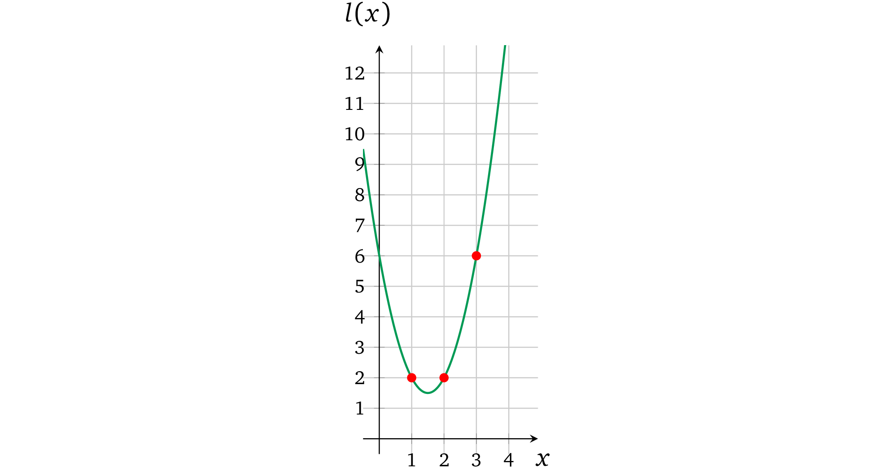
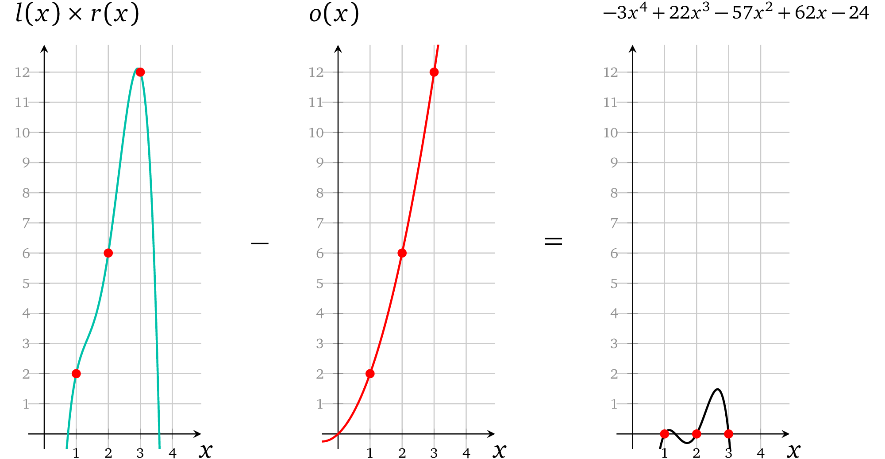
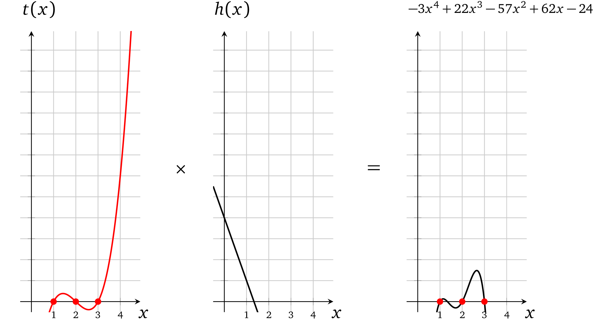
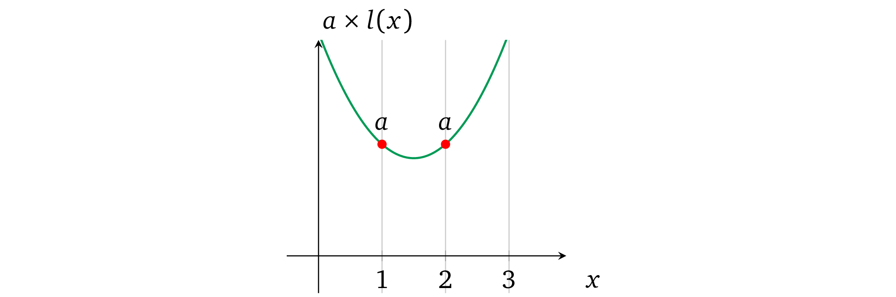
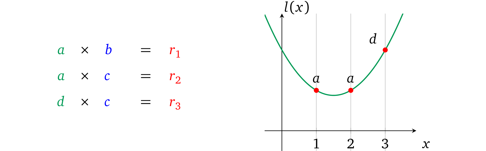

> even@安比实验室：前文主要介绍了如何构造多项式的零知识证明协议，现在将开始探讨如何构造更通用的协议。本节主要是讲如何将一组计算的证明转换为多项式进行证明。本文重点主要包括：多项式的算术性质，多项式插值等。


作者：Maksym Petkus

翻译 & 注解：even@安比实验室（even@secbit.io）

校对：valuka@安比实验室

本系列文章已获作者中文翻译授权。


前面我们已经理顺了一个zk-SNARK 简单方案的思路，它包含了 zk-SNARK 大部分内在机制，现在我们继续完善方案，使它能执行零知识程序。

## 计算

来看一段用伪代码写的简单程序

```pseudocode
Algorithm 1: Operation depends on an input
————————————————————————————————————————————————————————————————————

function calc(w, a, b)       
    if w then      
        return a × b       
    else       
        return a + b       
    end if      
end function
```

从高处看，这段程序和我们协议里面的多项式并没有什么关系。我们现在就需要找到一种方式来将程序转换成多项式。第一步是将程序转换成数学语言，这个相对简单一些，声明可以表达成下面的形式（假定 *w* 是 0 或 1）：

*f(w,a,b) = w(a · b)+(1-w)(a+b)​*

执行 `calc(1, 4, 2)` 和对 *f (1, 4, 2)*  求值都可以得到相同的结果：8。如果执行 `calc(0, 4, 2)` 和 *f(0,4,2)* 也都能够得到 6。**其实我们可以用这种方法表达任何形式的有限程序**。

接下来（上面的例子）需要我们证明的是,对于表达式 *f(w,a,b)* ，输入为 (*1*, *4*, *2*)  时输出为 8，换句话说，我们要校验多项式：

*w(a · b)+(1-w)(a+b) = 8​*

> even@安比实验室: 猜想一下，是否只要是能够用多项式表示的程序都可以做证明？   


## 单个基本计算

尽管已经将程序转换成了由数学语言表达的一般计算形式，我们还是需要再把它翻译成多项式。我们先来仔细研究一下计算的本质。任何计算的内核都是由以下形式的基本运算组成的：

$左操作数 \quad 运算操作符 \quad 右操作数 \quad = 输出$

两个操作数（即值）与一个运算符（即+,*–,*×*,*÷）放在一起执行运算。例如操作数是 2 和 3，运算符为乘，那么运算出来就是 2 × 3 = 6。由于任何复杂的计算（或者程序）都是由一系列这样的基本运算组成的，所以首先我们需要知道在多项式中单个运算是怎么表示的。

### 多项式的算术性质

我们先来看一下如何将多项式和算术运算关联起来。例如有两个多项式 *f(x)* 和 *g(x)*，尝试将他们相乘使得 *h*(*x*) = *f*(*x*) × *g*(*x*)，在任意一个 *x*= *r* 处 *h(x)* 的计算结果都是 *f(r)* 和 *g(r)* 的乘积。再看一下如下两个多项式 *f(x) = 2x<sup>2</sup> – 9x+ 10*  和  *g(x) = – 4x<sup>2</sup> + 15x – 9*。以图形的形式展示：


当 x = 1 时 *f(1) = 2 – 9 + 10 = 3*, *g(1) = – 4 + 15 – 9 = 2*。把两个多项式相乘： *h(x) = f(x) × g(x) = – 8x<sup>4</sup> + 66x<sup>3</sup> – 193x<sup>2</sup> + 231x– 90*。从图中可以看出相乘的结果：


*x* = 1 时，计算  *f(x) × g(x)*  结果为：*h(1) = – 8 + 66 – 193 + 231 – 90 = 6*，也就是说当 *x* = 1时，*h(x)* 就是 *f*(*x*) 和 *g*(*x*) 相乘的结果 ，在 *x* 取其它值的时候也一样。

同样的如果我们将 *f*(*x*) 和 *g*(*x*) 相加，在 *x*=1 处的计算结果就是 5。



*注意：在其它的 x<sub>s</sub> 取值处，多项式相加的计算结果也是将两者多项式的值加在一起的结果，例如你可以验证一下 x=2， x=3 处的结果。* 

**如果我们可以将操作数的值表示为多项式(我们也确实可以这么做)，那么利用算术属性，我们就能够得到操作数的计算结果了。**

> even@安比实验室: 回忆一下，在本系列的第一篇——多项式的性质与证明中，我们曾经说过“任何多项式在任意点的计算结果都可以看做是其唯一身份的表示。”
>
> 反过来当我们知道某个多项式的时候，是不是也就意味着我们知道多项式上某个点的取值。这就是借助多项式来完成证明的依据。

## 限制运算

如果一个 prover 声称某两个数字的乘积，verifier 要怎样去验证呢？为了证明单个计算的正确性，我们就必须首先确保所提供的操作数的输出（结果）的正确性。我们再来看一下运算的形式：

*左操作数   运算符   右操作数    输出​*

类似得我们也可以将其表示为一个运算多项式

*l(x)  运算符   r(x) = o(x)​*

在一些选定的取值 *a* 处的运算:

- *l*(*x*) — 表示（运算结果为）左操作数
- *r*(*x*) — 表示（运算结果为）右操作数
- *o*(*x*) — 表示运算结果（输出）

因而在计算过程中如果操作数和结果都可以用多项式的形式正确地表示出来，那么  *l(a)  **operator** r(a) = o(a)*  就能够成立。也就是说假如*输出多项式* *o(x)* 所代表的值是由*运算符* 在*操作数多项式*  *l(x)* 和 *r(x)* 上进行**乘法**运算得出的正确结果，那么我们把*输出多项式* *o(x)* 放到等式的左边就能够得到： *l(a)  **operator**  r(a) – o(a) = 0*，这也就表明了当取值为 *a* 时*多项式*  *l(x) **operator** r(x) – o(x)* 计算结果为 0 。那么只要多项式是有效的，*运算多项式* 就一定有一个根 *a*。因此，根据前面的基础这个多项式里面一定包含因式*(x-a)* （可以看**因式分解**一节），这就是我们要证明的*目标多项式*，即 *t*(*x*) = *x – a*。

例如，我们来看一个运算：3×2=6

可以用一个简单的多项式表示它： *l*(*x*) = 3*x*,  *r*(*x*) = 2*x*,  *o*(*x*) = 6*x*，取 *a=1* 进行计算，即 *l*(1) = 3；*r*(1) = 2；*o*(1) = 6。


这个运算多项式就变成了：

*l(x) × r(x) = o(x)*

*3x × 2x =6x*

*6x² -6x =0*

在图上表示为：


注意，这个多项式有一个因子 *(x = 1)* ：

*6x² -6x = 6x(x-1)*

因而如果 prover 用 *l*(*x*)*, r*(*x*)*, o*(*x*) 这些多项式来代替 *p*(*x*) ，因为它们依然可以被 *t(x)* 整除，所以 verifier 就可以认为它们是有效的。相反，如果 prover 尝试用 4 来代替输出值去欺骗 verifier ，即 *o*(*x*) = 4*x*，那么运算多项式就变成了 *6x<sup>2</sup> – 4x= 0*：



图中这个多项式并没有 *x*=1 的解，因而 *l*(*x*) × *r*(*x*) – *o*(*x*)  就不能被 *t(x)* 整除：


因而 verifier 不能接受这个*不一致的计算结果*（就像**因式分解**这一章描述的那样）

> even@安比实验室: 在前面的协议中，我们要证明的多项式是 p(x) = t(x)h(x)，这里我们修改 p(x)，使得 p(x) = l(x)r(x)-o(x)。这里t(x)目标多项式的根就是对应能够计算出数学表达式的值的 x。
>
> 上面例子里面取 x=1 这个特殊值作为运算编码的位置。当然这里的 1 可以换成任何别的值，比如说换成 x=2，3，或101 等等。在[GGPR]与[PHGR]论文中，这个取值是一个随机值，被称为 “root”。

## 运算的证明

现在我们来修改一下最新协议使它支持单个乘法计算的证明。回到前面**多项式的 SNARK**一章，我们已经能够证明多项式 *p(x)* 的知识了，只不过现在要计算的是三个多项式 *l*(*x*)*, r*(*x*)*, o*(*x*)的知识。我们可以定义 *p*(*x*) = *l*(*x*) × *r*(*x*) – *o*(*x*)，但这里存在两个争议点。首先，在我们的协议中证明阶段是不能做加密值乘法计算的（即， *l*(*s*) × *r*(*s*)），因为配对只能用一次，这个要用在校验多项式的约束上。第二，这里给证明者留下了一个可以修改多项式结构但依然保留有效因式 *t(x)* 的机会，例如可以令 *p*(*x*) = *l*(*x*) 或者  *p*(*x*) = *l*(*x*) – *r*(*x*) 甚至是 *p*(*x*) = *l*(*x*) × *r*(*x*) + *o*(*x*)，只要这里的 *p(x)* 还保留着根 *a* 就可以了。这个修改本质上是让证明的内容变成了别的声明，所以这样是不行的。

所以  prover  必须要分别提供多项式 *l*(*s*), *r*(*s*), *o*(*s*) 值的证明，即协议必须修改要证明的*多项式的知识*。verifier 在加密空间中要验证的是  *l*(*s*) × *r*(*s*) – *o*(*s*) = *t*(*s*)*h*(*s*)。verifier 可以使用密码学配对来执行乘法，但还有一个小问题就是做减法(– *o*(*x*))是非常昂贵的计算（这需要去找到一个 *gᵒ⁽ˢ⁾* 的逆向转换），这里我们可以把 *o*(*x*) 移到等式右边来： *l*(*x*)*r*(*x*) = *t*(*x*)*h*(*x*) + *o*(*x*)。在加密空间中，verifier 的验证就可以转换成：

*e(g<sup>l(s)</sup>, g<sup>r(s)</sup>) = e(g<sup>t(s)</sup>,g<sup>h(s)</sup>) · e(g<sup>o(s)</sup>,g)*

*e(g,g)<sup>l(s)r(s)</sup> =e(g,g)<sup>t(s)h(s)</sup> ·e(g,g)<sup>o(s)</sup>*

*e(g,g)<sup>l(s)r(s)</sup> =e(g,g)<sup>t(s)h(s)+o(s)</sup>*

*注意：回忆一下加密配对的结果是支持通过乘法实现加密值的相加的，参见 **加密值相乘** 这一章节*

保持 *setup* 阶段不变，协议更新为：

* 证明

  * 分配对应的系数给 $l(x)$，$r(x)$，$o(x)$
  * 计算多项式 $h(x) = \frac{l(x) \times r(x)-o(x)}{t(x)}$
  * 使用 $\{g^{s^i}\}_{i\in[d]}$ 计算加密多项式 $g^{l(s)},g^{r(s)},g^{o(s)}$ 和 $g^{h(s)}$
  * 使用 $\{g^{\alpha s^i}\}_{i\in{0,…,d}}$ 计算加密多项式 $g^{αl(s)},g^{αr(s)},g^{αo(s)}$
  * 设置证明 $π = (g^{l(s)},g^{r(s)},g^{o(s)},g^{h(s)},g^{αl(s)},g^{αr(s)},g^{αo(s)})$

* 验证

  * 定义证明 $π$ 为 $(g^l,g^r,g^o,g^h,g^{l'},g^{r'},g^{o'})$

  * 检查多项式约束

    $e(g^{l'},g) = e(g^l,g^α)$

    $e(g^{r'},g) = e(g^r,g^α)$

    $e(g^{o'},g) = e(g^o,g^α)$

  * 检查运算的有效性 $e(g^l,g^r) = e(g^{t(s)},g^h) \cdot e(g^o,g)$

这个协议就能够证明两个值相乘的计算结果是正确的了。

你可能注意到了在这个新的协议中我们放弃了*零知识* 部分。这么做是为了简化协议的变换。后面的章节我们会再变回零知识。

> even@安比实验室：上面例子里面取 x=1 这个特殊值作为运算编码的位置。当然这里的 1 可以换成任何别的值，比如说换成 x=2，3，或101 等等。在[GGPR]与[PHGR]论文中，这个取值是一个随机值，被称为 “root”。

## 多个运算

现在我们已经能够证明单个算术运算了，但是要怎么扩展到多个运算上呢（这是我们的最终目标）？我们来尝试一下增加一个基本运算。想一想计算 *a* × *b* × *c* 乘积的需求，在元素操作模型中，这代表着两个操作：

*<font style="color:green">a</font> × <font style="color:blue">b</font> = <font style="color:red">r<sub>1</sub></font>*

*<font style="color:green">r<sub>1</sub></font> × <font style="color:blue">c</font> = <font style="color:red">r<sub>2</sub></font>*

前面的讨论中我们通过对运算符多项式在任意取值 x 处 ，例如1，计算一个对应值，来表示一个操作数或者结果。有了这个性质的多项式并不会约束我们在不同 x 取值处用多项式来表示其他值。如示例中的 2，即：


这种独立性允许我们一次同时*执行* 两个运算并且又不会把这两者搞乱，即相互之间不会妨碍。这个多项式算术的结果就变成了：



可以看出这个多项式有两个根 *x*=1 和 *x*=2。因而也就是两次计算都被正确执行了。

> even@安比实验室：这里的示例为了理解方便，选择了 x=1, x=2 两个位置。记住在完整的 zkSNARK 方案中，这些 “root” 值必须为有限域内的随机数，否则就会引入安全漏洞。

我们再来看一个有三个乘法运算的例子 2 × 1 × 3 × 2，它按照下面的步骤执行：

*<font style="color:green">2</font> × <font style="color:blue">1</font> = <font style="color:red">2</font>*

*<font style="color:green">2</font> × <font style="color:blue">3</font> = <font style="color:red">6</font>*

*<font style="color:green">6</font> × <font style="color:blue">2</font> = <font style="color:red">12</font>*

我们要把它们表示为操作数多项式，对于由 *x* *∈ {1*, *2*, *3*}  所表示的计算， *l*(*x*) 相应的要等于 2，2 和 6。即通过点 (*1*, *2)*, *(2*, *2)*, *(3*, *6*)，同样的 *r*(*x*) ∋ (*1*, *1)*,*(2*, *3)*,*(3*,*2*) ，*o*(*x*) ∋ (*1*, *2)*, *(2*, *6)*, *(3*, *12*)。

但是，我们要怎么找到经过这些点的多项式呢？对于任何包含超过一个点的例子，就必须要使用特定的数学方法了。

### 多项式插值

为了构造*操作数* 和 *输出多项式*，我们需要一种方法来用给定的一组点去构造一个能经过所有这些点的*弯曲* 多项式，这叫*插值*。有几种不同的方法可以算出这个多项式：

* 一组未知方程
* 牛顿多项式
* 内维尔算法
* 拉格朗日多项式
* 快速傅里叶变换

我们以第一个方法为例。这个方法的思路是存在一个*系数未知* ，阶数至多为 *n* 的特定的多项式 *p(x)* 能够经过给定的 *n*+1 个点，对于每个点 {(*xᵢ*, *yᵢ*)}, *i* ∈ [n+1]来说，多项式在 *xᵢ* 处的计算结果都等于 *yᵢ*，即对于所有的 i，*p(xᵢ) = yᵢ* 。在我们的例子中，三个点就可以变成一个用以下形式所表示的阶数为 2 的多项式：*ax<sup>2</sup> + bx +c =y*。

我们令*左运算多项式*（绿色标出的）在每个点处与多项式结果值相等，然后对每个系数用其它术语表示出来再计算等式：



因而 *左操作数多项式* 就是：

*<font style="color:green">l(x)</font>* *= 2x<sup>2</sup>-6x+6*

它和下面的图对应：



我们用相同的方式再计算 *r*(*x*) 和 *o*(*x*)：

$\textcolor{blue}{r(x)}=\frac{-3x^2+13x-8}{2}; \quad \textcolor{red}{o(x)}=x^2+x$


### 含有多个运算的多项式

现在我们有了代表三个运算的操作数多项式，再进一步看一下怎么去校验每个计算的正确性。回到 verifier 寻找等式 *l*(*x*) · *r*(*x*) – *o*(*x*) = *t*(*x*)*h*(*x*) 的过程。在这个例子中，因为计算是在点 *x* *∈ {1*, *2*, *3*} 处被表示出来的，所以目标多项式在这些  *x<sub>s</sub>​* 点处的计算结果必须为 0，换句话说， *t*(*x*)的根必须是 1，2 和 3，它的基本形式就是：


第一步将 *l(x)* 和 *r(x)* 相乘得到结果：


第二步：从 *l*(*x*) × *r*(*x*) 的结果中将 *o*(*x*)  减去：



这里就已经可以看出每一个操作数相乘都对应了正确的结果。最后一步 prover 要算出一个有效因式：

$h(x) = \frac{l(x) \times r(x) -o(x)}{t(x)} = \frac{-3x^4 +22x^3 -57x^2 +63x -24}{(x-1)(x-2)(x-3)}$

通过长除法可以算出：


代入*h*(*x*) = – 3*x*+ 4*a*，verifier 可以计算 *t*(*x*)*h*(*x*)：



现在显然 *l*(*x*) × *r*(*x*) – *o*(*x*) = *t*(*x*)*h*(*x*) ，这就是我们要证明的内容。

> even@安比实验室: 这里只需要一组多项式 *l*(*x*)，*r*(*x*)， *o*(*x*) 就可以将所有计算的约束关系表示出来了，有几个计算也就对应着目标多项式 t(x) 有几个根。
>
> 当前的协议似乎存在一些缺陷，多项式只能证明 prover 拥有一组多项式 *l*(*x*)，*r*(*x*)， *o*(*x*) ，在 t(x) 的几个根的取值处 *l*(*x*)·*r*(*x*)= *o*(*x*)，无法证明这组多项式符合我们要证明的数学表达式：
>
> 1）多个计算关系之间也是分开表示的，这些算式之间的关系也同样无法进行约束
>
> 2）由于 prover 生成的证明中只有计算结果，左操作数，右操作数，输出在计算中混用也不会被发现
>
> 3）由于左操作数，右操作数，输出是分开表示的，互相之间的关系无法进行约束

## 变量多项式

有了前文介绍的方法来解决证明多个计算多项式的问题，我们就可以一次证明多个运算（如上百万个甚至更多）了，但是这个方案还有一个关键的缺点。

**如果证明中执行的“程序”在不同运算中使用了相同的变量作为操作数或输出**，例如：

*<font style="color:green">a</font> × <font style="color:blue">b</font> = <font style="color:red">r<sub>1</sub></font>*

*<font style="color:green">a</font> × <font style="color:blue">c</font> = <font style="color:red">r<sub>2</sub></font>*

这里 *a* 代表两个运算中的左操作符多项式，如：


然而，因为我们的协议中是允许 prover 为多项式设置任何系数的，所以他可以不受限制得为不同计算（即，用一些 *x* 表示的多项式）中的 *a* 设置不同的值，即：


**这个自由打破了一致性**，有空间允许 prover 能去证明了一些并非 verifier 感兴趣的其它无关的程序执行。因而我们必须要确保每一个变量在所有运算中出现的地方都只有一个取值。

*注意：文中的变量与常规的计算机科学中变量的定义不同，这里的变量是不可改变的而且每次执行都只赋值一次。*

> even@安比实验室：请务必注意“变量”的定义，它是程序中的变量，但是却又不能改，这不是很矛盾吗？其实，这里变量是指本文开头的示例伪代码中的那些不会被修改的变量。在 zkSNARK 论文中，这个「变量」其实有一个对应的名词叫做 assignment，是算术电路的「赋值」。而所有的assignments 是一个算术电路可满足性问题的解，包含了算术电路的输入值以及电路运算过程中输出的中间结果值。


### 单个变量的操作数多项式

我们来看一个简单的例子（就是当前的例子），在*左操作符多项式 l(x)* 表示的所有左操作数中只包含一个变量（即 *a*）。我们要找出是否有可以确保这个多项式在每一个运算中 *a* 都相同的方法。prover 可以设置不同值是因为他可以任意控制 *x* 的每个次幂的系数。因而如果这些系数是固定的，就可以解决问题了。

我们来仔细看看包含相等值的多项式。例如检查一下下面两个多项式，他们分别都表示了有两个相等值对应的运算（即在 x=1 和 x=2 处），这里第一个多项式的值为 1，第二个多项式的值为 2：


注意每个多项式中相应的系数是成比例的，也就是第二个多项式的系数是第一个的两倍大，即：

*2x<sup>2</sup>-6x+6=2×(x<sup>2</sup> -3x+3)*

那么由于多项式的算术性质，如果我们想要同时地改变多项式中所有的值我们就需要改变它的比例，如果我们用一个数字乘以多项式，那么在每一个可能的 *x* 处的计算结果也要和相同的数字相乘（即，等比例变换）。为了验证这一点，我们尝试用 3 或者其它数字来乘第一个多项式。

因此，**如果 verifier 需要在所有计算中强制 prover 设置相同的值，他就要限制 prover 只能修改比例而不是单个系数**。

所以怎么保持系数比例不变呢？对于这个问题我们可以先思考一下在*左运算多项式* 中我们提供的证明是什么。是 *l(x)* 在一些秘密值 *s* 处的加密值：*g<sup>l(s)</sup>*，即，一个被加密了的数。我们已经从 **限制多项式** 这一节中知道了怎样通过一个*α*-变换去限制 prover 只能使用 verifier 提供的 s 的幂做计算，来使得单个运算能够满足同态乘法。

和限制单个求幂值相似，verfier 可以一次限制完整的多项式。而不只是提供单独的加密及其 α-移位 *g<sup>s<sup>1</sup></sup>*,*g<sup>s<sup>2</sup></sup>*,…,*g<sup>s<sup>d</sup></sup>*,*g<sup>αs<sup>1</sup></sup>*,*g<sup>αs<sup>2</sup></sup>*,…,*g<sup>αs<sup>d</sup></sup>*。

那么协议的过程就是：

* Setup
  * 使用对应的系数构造相应的*操作符多项式 l(x)*
  * 选择随机数 *α* 和 *s*
  * 使用加密的 *l(s)* 和它的”转换“：$(g^{l(s)},g^{αl(s)})$ 来设置 *proving key*
  * 设置 *verification key*：$(g^α)$
* proving
  * 对于操作数值 *v*
    * 乘以操作数多项式：$(g^{l(s)})^v$
    * 乘以变换后的操作数多项式：$(g^{αl(s)})^v$
  * 提供 *操作数多项式* 的乘法证明： $(g^{vl(s)},g^{vαl(s)})$
* verification
  * 解析证明为 $(g^l,g^{l'})$
  * 验证比例：$e(g^{l'},g) = e(g^l,g^α)$

prover 需要返回同样的*α*-转换关系，因为无法从 proving key 中恢复出 *α* 所以保持这个变换的唯一方法就是用同一个值去分别乘以这两个加密值：*g<sup>l(s)</sup>* 和 *g<sup>αl(s)</sup>*。这个 prover 就无法修改 *l(x)* 的单个系数了，例如如果多项式为 l(x) = ax<sup>2</sup> + *bx*+ c ，prover 只可以用一个值 *v* 去修改整个多项式： v⋅(ax<sup>2</sup> + *bx*+ *c*) = v⋅ax<sup>2</sup> + *v⋅bx*+ v⋅c。*配对* 使其不能与另一个多项式做乘法，所以也就无法提供 *s* 的单个求幂值的 *α-*变换。 prover 不能做加法或者减法因为：

$g^{α(l(x)+a'x^2+c')} \not= g^{αl(x)} \cdot g^{a'x^2} \cdot g^{c'}$ 这里也同样需要未加密的 *α* 的知识。

现在有了这个协议，不过怎么去构造*操作数多项式 l(x)* 呢？由于任何整数都可以通过乘以 1 得到它本身，所以多项式中对应的每个计算结果都应该为 1，即：


然后再让 prover 在其上”分配“一个值 a ：



**Remark 4.1** *由于 verification key 包含了加密了的 α，所以可以用多项式加（或者减）任意一个值 v'，即：*

$g^{vl(s)} \cdot g^{v'} = g^{vl(s)+v'}$

$g^{αvl(s)} \cdot (g^α)^{v'} = g^{α(vl(s)+v')}$

$e(g^{α(vl(s)+v')},g) = e(g^{vl(s)+v'},g^α)$

*因而可以修改多项式使其超出 verifier 的预期以及证明一个不同的声明，后面的章节我们将会解决掉这个问题。*

> @even@安比实验室：这一小节是解决这样一个问题，算术电路中一个 input wire 或者 output wire可能同时会作为多个门的输入wire，如何确保约束这些公用wire的问题。
>
> 由于要证明的数学表达式是公开的，那么各个算式之间的约束关系也就是公开的，那么我们就可以把构造多项式的工作交给 setup 环节，这样 prover 只要填上对应的数值就可以了。 
>
> 上文这个方法就限制了在同一个操作数多项式上，不同的计算式中使用的同一个值的约束关系；同样若一个操作数多项式中用到了多个值，也可以将这些值全都加起来，如下文所述。


### 多变量的操作数多项式

因为只有当所有的左操作数使用同一个变量的时候我们才可以设置一个值。但是如果左操作数中再多一个值 *d* 要怎么做呢：



假如我们还使用相同的方法，我们无法分别得为每一个变量设置值，并且让这些变量乘到一起去。也就是说这个受限的多项式只能支持一个变量的情况。我们可以把*操作数多项式 l(x)* 分成*操作数的变量多项式*

$l_a(x)$ 和 $l_d(x)$*（注意下标）*

这与上一节的方法一致，*变量 a* 和 *b* 可以被*赋值* 并分别进行约束，然后加在一起就可以表示所有的左操作数变量了。因为我们将*操作数的变量多项式* 加在了一起，所以我们就要能够确保在每次计算中相加后的结果只表示所有*操作符多项式* 中的一个。

有了这个算术性质我们就可以逐一构造*操作数变量多项式* 了，这样如果*变量* 多项式在一个对应运算中被用做操作数，那么这一项就置为 1，否则就置为 0。0 跟任何值相乘结果都是零，当把他们相加在一起的时候也就可以忽略掉这一项。在我们的例子中这些变量多项式必须满足以下计算：

*l<sub>a</sub>(1) =1,  l<sub>a</sub>(2)=1,  l<sub>a</sub>(3)=0*

*l<sub>d</sub>(x)=0,  l<sub>d</sub>(2)=0,  l<sub>d</sub>(3)=1*

图中表示为：


于是我们就可以将每个变量分开设置值，然后把他们加在一起来计算出操作数多项式，例如当 *a = 3* 和 *d= 2* 时：


*注意：我们在一个值的后面使用下标表示它代表的变量，如, 3<sub>a</sub> 是一个用 3 实例化的变量 a。*

现在起我们用大写字母来表示这个复杂的 *操作符多项式*，即

*L(x) = al<sub>a</sub>(x) + dl<sub>d</sub>(x)*

计算结果为 *L*，也就是 *L=L(s)*。仅当每一个*操作数的变量多项式* 是由 verifier 约束的，结果才有效，与左多项式相关的交互应该相应得更改为：

* Setup

  * 构造 $l_a(x)$，$l_b(x)$ 使得它能够在对应的 “计算 x” 处为 1，在其他地方为 0。
  * 选择随机数 $s$，$α$
  * 计算并加密 *未赋值的变量多项式*： $g^{l_a(s)}$，$g^{l_d(s)}$
  * 计算变换后的这些多项式： $g^{αl_a(s)}$，$g^{αl_d(s)}$
  * 设置 *proving key*：$(g^{l_a(s)},g^{l_d(s)},g^{αl_a(s)},g^{αl_d(s)})$
  * 设置 *verification key*：$(g^α)$

* Proving

  * 为变量多项式赋值 a 和 d：$（g^{l_a(s)}）^a$，$(g^{l_d(s)})^d$
  * 对变换后的变量多项式做同样的赋值： $(g^{αl_a(s)})^a$，$(g^{αl_d(s)})^d$
  * 把所有赋值好的变量多项式加起来变成操作数多项式的形式：$g^{L(s)}=g^{al_a(s)} \cdot g^{dl_d(s)} = g^{al_a(s)+dl_d(s)}$
  * 提供左操作数的有效证明：$(g^{L(s)},g^{αL(s)})$

* Verification

  * 解析证明为 $（g^L,g^{L’}）$

  * 验证提供的多项式是否是最初提供的多个*未赋值的变量多项式* 的和：

    $e(g^{L'},g) = e(g^L,g^α)$ 这里也就是验证了 $αal_a(s) + αdl_d(s) = α \times (al_a(s) + dl_d(s))$

*注意：L(s) 和 αL(s) 代表所有的变量多项式并且由于 α 只用在计算变量多项式中，所以 prover 没有别的选择只能在 setup 提供的原始加密值和变换后的加密值上赋予相同的系数做计算。*

结果，prover ：

* 除了“分配”值外，不能再修改它们的系数进而来修改*变量多项式* 了，因为 prover 只拿到了这些多项式的加密值，也因为 s 必要次幂的加密值不能与它们的 α 变换值一起使用
* 不能通过另一个多项式相加去提供一个结果因为这样 *α*-比例关系将会被破坏掉
* 不能通过与其他的一些多项式 *u(x)* 相乘来修改操作数多项式，这样可能会使得修改后的值不成比例因为在预配对空间中无法进行加密乘法

*注意：如果我们加（或者减）一个多项式，如 l<sub>a</sub>(x)，就变成了另一个的多项式，即*

*l'<sub>d</sub>(x) = c<sub>d</sub>·l<sub>d</sub>(x)+c'<sub>a</sub>·l<sub>a</sub>(x)*

*这并非是多项式 l<sub>d</sub>(x)  的修改，而是 l<sub>a</sub>(x) 结果系数的变化，因为他们最终会被加到一起：*

*L(x)=c<sub>a</sub>·l<sub>a</sub>(x)+l'<sub>d</sub>(x) =(c<sub>a</sub>+c'<sub>a</sub>)·l<sub>a</sub>(x)+c<sub>d</sub>·l<sub>d</sub>(x)*

不过尽管 prover 被限制了多项式的使用，他还有拥有一些可允许范围内的自由度：

* 当 prover 决定不加入一些变量多项式 *lᵢ*(*x*) 来构造操作符多项式 *L(x)* 时依然是可以接受的，因为这和为它分配值为 0 是一样的：

  g<sup>al<sub>a</sub>(x)</sup> = g<sup>al<sub>a</sub>(x)+0l<sub>d</sub>(x)</sup>

* 如果 prover 添加同一个变量多项式多次也是可以接受的因为这和一次分配多个值的和是一样的：

  g<sup>al<sub>a</sub>(x)</sup> · g<sup>al<sub>a</sub>(x)</sup> · g<sup>al<sub>a</sub>(x)</sup>= g<sup>3al<sub>a</sub>(x)</sup>

这些方法在右操作数和输出操作数 *R(x)* ，*O(x)* 上也同样适用。

> even@安比实验室: 总结一下本文证明协议的大致思路为：
>
> 1. 将要证明的程序转换为数学语言表达的形式（即加减乘除的计算）
> 2. 用多项式在某处的取值来进行计算以此表示数学计算，进而进行证明
> 3. 用多项式在多处的取值来进行计算表示多个数学运算，进而加以证明
> 4. 对证明的“程序”在不同计算中使用的相同的变量进行约束
>
> 当前的协议约束只解决了部分问题，还有诸多可以改进的地方，在下一节我们将对这些改进项展开讨论并给证明协议进行优化。


**原文链接**

https://arxiv.org/pdf/1906.07221.pdf

https://medium.com/@imolfar/why-and-how-zk-snark-works-4-general-purpose-computation-dcdc8081ee42

https://medium.com/@imolfar/why-and-how-zk-snark-works-5-variable-polynomials-3b4e06859e30

