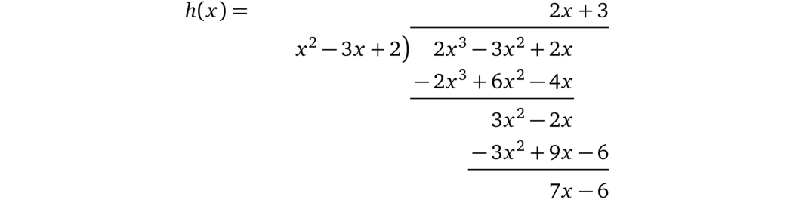

# 因式分解

代数的基本定理表明了任意的一个多项式只要有解，就可以将它分解成线性多项式（即一个阶数为 1 的多项式代表一条线），因此，我们可以把任意有效的多项式看成是其因式的乘积：

$$(x - a_0)(x - a_1)...(x - a_n) = 0$$

也就是说如果任意一个因式为零，那么整个等式都为零，式子中所有的 \\(a\\) 就是多项式的所有解。

事实上，我们的例子可以分解为以下多项式：

$$x^3 - 3x^2 + 2x = (x - 0)(x - 1)(x - 2)$$

所以这个多项式的解（\\(x\\) 的值）就是：\\(0, 1, 2\\)，在任何形式下多项式的解都可以很轻松地被验证，只不过因式的形式可以让我们一眼就看出这些解（也称为根）。

我们再回到前面的问题，证明者宣称他知道一个阶数为 3，其中两个根分别为 1 和 2 的多项式，也就是说这个多项式的形式为：

$$(x - 1)(x - 2) \cdot \ldots$$

换句话说 \\((x - 1)\\) 和 \\((x - 2)\\) 是问题中多项式的两个因式。因而如果证明者想要在不揭示多项式的前提下证明他的多项式确实有这两个根，那么他就需要去证明他的多项式 \\(p(x)\\) 是 \\(t(x) = (x - 1)(x - 2)\\)（也称为目标多项式）和一些任意多项式 \\(h(x)\\)（也就是我们的例子里面的 \\((x - 0)\\)）的乘积，即：

$$p(x) = t(x) \cdot h(x)$$

换句话说，存在一些多项式 \\(h(x)\\) 能够使得 \\(t(x)\\) 与之相乘后等于 \\(p(x)\\)，由此得出，\\(p(x)\\) 中包含 \\(t(x)\\)，所以 \\(p(x)\\) 的根中也包含 \\(t(x)\\) 的所有根，这也就是我们要证明的东西。

自然地算出 \\(h(x)\\) 的方式就是直接相除：\\(h(x) = \frac{p(x)}{t(x)}\\)。如果一个证明者不能找到这样一个 \\(h(x)\\) 也就意味着 \\(p(x)\\) 中不包含因式 \\(t(x)\\)，那么多项式相除就会有余数。

例如我们用 \\(p(x) = x^3 - 3x^2 + 2x\\) 除以 \\(t(x) = (x - 1)(x - 2) = x^2 - 3x + 2\\)：

> 注：左边的式子是分母，右上角的是计算结果。底部是余数（多项式相除的解释及示例可以参考 [[Pik14](./references.md#Pik14)]）。

我们算出结果 \\(h(x) = x\\)，没有余数。

> 注：为了简化起见，后面我们会用多项式的字母变量来代替计算结果值，例如：\\(p = p(r)\\)。

> 译者注：多项式可以被因式分解成它的根的因式的乘积。这个性质就意味着，如果一个多项式有某些解，那么它被因式分解后的式子中一定包含这些解的因式。
>
> 有了这个性质，我们就可以进行一些证明了。

利用多项式一致性检查协议我们就可以比较多项式 \\(p(x)\\) 和 \\(t(x) \cdot h(x)\\)：

* 验证者挑选一个随机值 \\(r\\), 计算 \\(t = t(r)\\)（也就是求值），然后将 \\(r\\) 发送给证明者
* 证明者计算 \\(h(x) = \frac{p(x)}{t(x)}\\)，并对 \\(p(r)\\) 和 \\(h(r)\\) 进行求值，将计算结果 \\(p, h\\) 提供给验证者
* 验证者验证 \\(p = t \cdot h\\) ，如果多项式相等，就意味着 \\(t(x)\\) 是 \\(p(x)\\) 的因式

实践一下，用下面的例子来执行这个协议：

$$p(x) = x^3 - 3x^2 + 2x$$

$$t(x) = (x - 1)(x - 2)$$

* 验证者选一个随机数 23，并计算 \\(t = t(23) = (23 - 1)(23 - 2) = 462\\)，然后将 23 发送给证明者
* 证明者计算 \\(h(x) = \frac{p(x)}{t(x)} = x\\), 并对 \\(p(r)\\) 和 \\(h(r)\\) 进行求值，\\(p = p(23) = 10626\\)，\\(h = h(23) = 23\\)，将 \\(p, h\\) 提供给验证者
* 验证者再验证 \\(p = t \cdot h\\)：\\(10626 = 462 \cdot 23\\) 是正确的，这样陈述就被证明了

相反，如果证明者使用一个并不包含必要因式的不同 \\(p'(x)\\)，例如 \\(p'(x) = {\color{red}2}x^3 - 3x^2 + 2x\\), 那么：

我们算出结果 \\(2x + 3\\) 和余数 \\(7x - 6\\)，即：\\(p(x) = t(x) \times (2x + 3) + 7x - 6\\)。这就意味着验证者为了计算出结果不得不用余数除以 \\(t(x)\\)，\\(h(x) = 2x + 3 + \frac{7x - 6}{t(x)}\\)。不过由于 \\(x\\) 是验证者随机选择的，所以余数 \\(7x - 6\\) 最终可以被 \\(t(x)\\) 整除的概率非常低（但仍然不可忽略）。如果后面验证者要另外再检查 \\(p\\) 和 \\(h\\) 必须是整数的话，这个证明就会被拒绝。

不过这个校验同时也要求多项式系数也是整数，这对协议产生了极大的限制。

这就是为什么接下来我们要介绍能够使余数不被整除的密码学原理的原因，尽管这个原始值是有可能被整除的。

> 注：虽然为了简化而尽可能少地使用数学符号，但如果忽视这个无处不在的基本符号「\\('\\)（上撇）」的话将不利于理解。这个符号的目的是为了强调一个经过初始变量变换或者推导得到的新变量。例如，如果我们想要将 \\(v\\) 乘以 \\(2\\) 并给将它赋值给一个新的变量，我们可以使用：\\(v' = 2 \cdot v\\)。

**备注 3.1** 现在我们就可以在不知道多项式的前提下根据特定的性质来检查多项式了，这就已经给了我们一些零知识和简明性的特性。但是，这个结构中还存在很多问题：

* 证明者可能并不知道他所声称的 \\(p(x)\\)，他可以计算 \\(t = t(r)\\)，然后选择一个随机值 \\(h\\)，由此计算出 \\(p = t \cdot h\\)。因为等式是成立的，所以也能通过验证者的校验。
* 因为证明者知道随机点 \\(x = r\\) ，所以他可以构造出一个任意的多项式，这个任意多项式与 \\(t(r) \cdot h(r)\\) 在 \\(r\\) 处有共同点。
* 在前面的陈述中，证明者声称他知道一个特定阶数的多项式，但现在的协议对阶数并没有明确的要求。因而证明者完全可以用一个满足因式校验的更高阶数的多项式来欺骗验证者。

下面我们就要逐一解决这些问题。

> 译者注：利用因式的性质构造出了一个证明协议，但这个协议存在一些缺陷，主要是由于：
>
> 1. 证明者知道了 \\(t(r)\\)，他就可以反过来任意构造一个可以整除 \\(t(r)\\) 的 \\(p(r)\\)
> 2. 证明者知道了点 \\((r,\ t(r) \cdot h(r))\\) 的值，就可以构造经过这一点的任意多项式，同样满足校验
> 3. 协议并没有对证明者的多项式阶数进行约束
