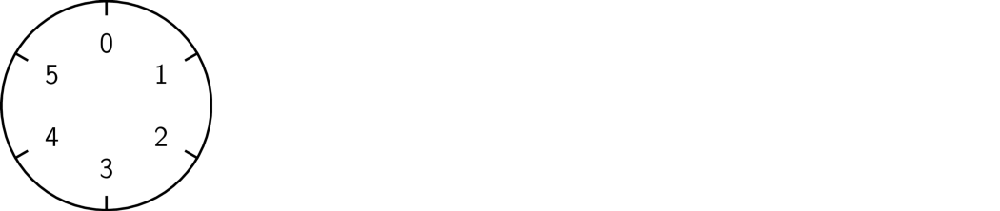
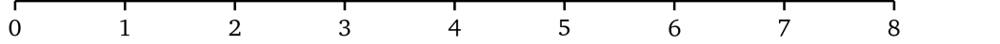
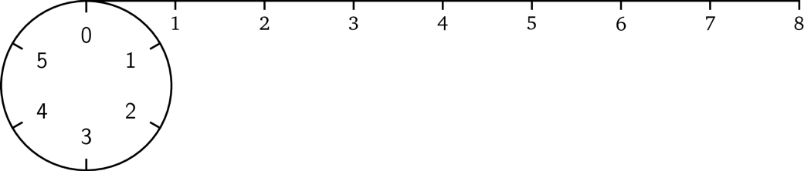
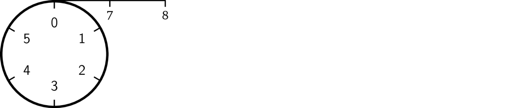
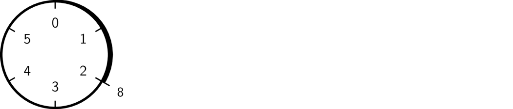

# 模运算

这里就到了模运算发挥作用的地方了。模运算的思路如下：除了我们所选择的组成有限集合的前 \\(n\\) 个自然数（即 \\(0, 1, \ldots, n - 1\\)）以外，任何超出此范围的给定整数，我们就将它「缠绕」起来。例如，我们选择前六个数。为了说明这一点，可以把它看作一个有六个单位大小相等刻度的圆；这就是我们所说的范围（通常指的是有限域）。

现在我们看一下数字八应该在哪里。打个比方，我们可以把它看成一条长度为八的绳子：

如果我们将绳子固定在圆圈的开头

然后用绳子缠绕圆圈，我们在缠完一圈后还剩下一部分的绳子：

然后我们继续缠绕，这根绳子将在刻度 \#2 的地方终止。

这就是模运算的结果。无论这根绳子多长，它最终都会在圆圈一个刻度处终止。因而模运算结果将保持在一定范围内（例子中是 0 到 5）。长度为 15 的绳子将会在刻度 3 的地方终止，即 6 + 6 + 3（缠两个完整的圈并剩下 3 个单位长的部分）。负数运算类似，唯一不同的地方就是它是沿相反方向缠绕的，如 -8 的取模结果是 4。

我们执行算术运算，结果都将落在这个 \\(n\\) 的范围内。现在开始我们将用符号「\\(\mathrm{mod}\ n\\)」来表示数字的范围。

$$3 \times 5 = 3 \ (\mathrm{mod}\ {6})$$

$$5 + 2 = 1 \ (\mathrm{mod}\ {6})$$

另外，模运算最重要的性质就是运算顺序无所谓。例如，我们可以先做完所有的运算，然后再取模，或者每运算完一步都去取模。例如 \\((2 \times 4 - 1) \times 3 = 3 \ (\mathrm{mod}\ {6})\\) 就等于：

$$2 \times 4 = 2 \ (\mathrm{mod}\ {6})$$

$$2 - 1 = 1 \ (\mathrm{mod}\ {6})$$

$$1 \times 3 = 3 \ (\mathrm{mod}\ {6})$$

那么模运算到底有什么用呢？如果我们使用模运算，从运算结果再回到原始值并不容易，因为很多不同的组合会产生同样的运算结果：

$$5 \times 4 = 2 \ (\mathrm{mod}\ {6})$$

$$4 \times 2 = 2 \ (\mathrm{mod}\ {6})$$

$$2 \times 1 = 2 \ (\mathrm{mod}\ {6})$$

$$\ldots$$

没有模运算的话，计算结果的大小会给找出原始值提供一些线索。模运算既能把这一信息隐藏起来，又可以保留常见的算术属性。
