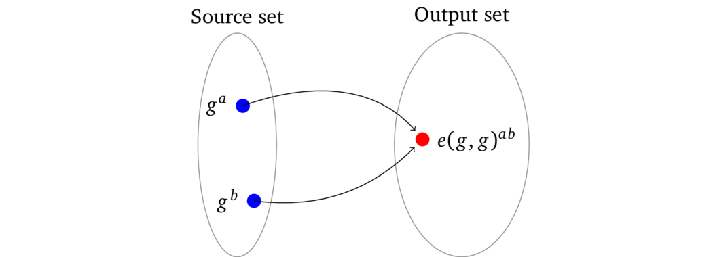

# 加密值的乘法

密码学配对（双线性映射）是一种数学结构，表示为函数 \\(e(g^\*, g^\*)\\)，给定一个数集中的两个加密的输入（例如 \\(g^a, g^b\\)），可以将他们确定性地映射到另一组不同的输出数集上的它们的乘积，即 \\(e(g^a, g^b) = e(g,g)^{ab}\\)：

因为源数集和输出数集（通常被称为一个群）是不同的，所以一个配对的结果不能用作其他配对计算的输入。我们可以将输出集（也称为「目标集」）视为「不同的宇宙」。因而我们不能用另一个加密值乘以结果，而且「配对」这个名称本身也表明了，我们一次只能将两个加密值相乘。

> 译者注：换句话说，配对只支持 \\(x \cdot y\\) 这种两个值的乘法，不支持三个或以上的值相乘，例如不支持 \\(x \cdot y \cdot z\\)。

在某种意义上，它类似于一个散列函数，将所有可能的输入值映射到可能的输出值的集合中的一个元素上，通常情况下这个过程是不可逆的。

> 注：乍一看这个限制可能会阻碍相关功能的实现，但在 zk-SNARK 中这反而是保证安全模式的最重要性质，参见备注 3.3。

配对函数 \\(e(g^\*, g^\*)\\) 可以初步（严格来说并不正确）地类比成「交换」每一个输入的基数和指数，使得基数 \\(g\\) 在被转换成指数形式的过程中被修改，即 \\(g^a \rightarrow a^{\mathbf{g}}\\)。接下来将两个被「交换」的输入相乘，这样原始值 \\(a\\) 和 \\(b\\) 就在同一个指数下相乘了，即：

$$e(g^a, g^b) = a^{\mathbf{g}} \cdot b^{\mathbf{g}} = \left( ab \right)^{\mathbf{g}}$$

由于基数在「交换」中被修改了，所以在另一个配对中不能再使用这个结果 \\(\left( ab \right)^{\mathbf{g}}\\)（例如：\\(e\left(\left( ab \right)^{\mathbf{g}}, g^c\right)\\)）构造出想要的加密乘积 \\(abc\\) 了。

配对的核心性质可以表示成下面的等式：

$$e(g^a, g^b) = e(g^b, g^a) = e(g^{ab}, g^1) = e(g^1, g^{ab}) = {e(g^1, g^a)}^b = {e(g^1, g^1)}^{ab} = \ldots$$

严格来讲一个配对的结果是在目标集的一个不同生成元 \\(\mathbf{g}\\) 下对原始值乘积的加密，即 \\(e(g^a, g^b) = \mathbf{g}^{ab}\\)。因而它具备同态加密的性质，也就是说我们可以把乘法配对的加密乘积加在一起：

$$e(g^a, g^b) \cdot e(g^c, g^d) = \mathbf{g}^{ab} \cdot \mathbf{g}^{cd} = \mathbf{g}^{ab + cd} = e(g, g)^{ab + cd}$$

> 注意：密码学配对是利用椭圆曲线来实现这些性质的，从现在开始我们用的符号 \\(g^n\\) 就代表曲线上一个由生成元自相加了 \\(n\\) 次的点，而不是我们前面用到的乘法群生成元。

[[DBS04](./references.md#DBS04)] 提供了学习密码学配对的起点。
