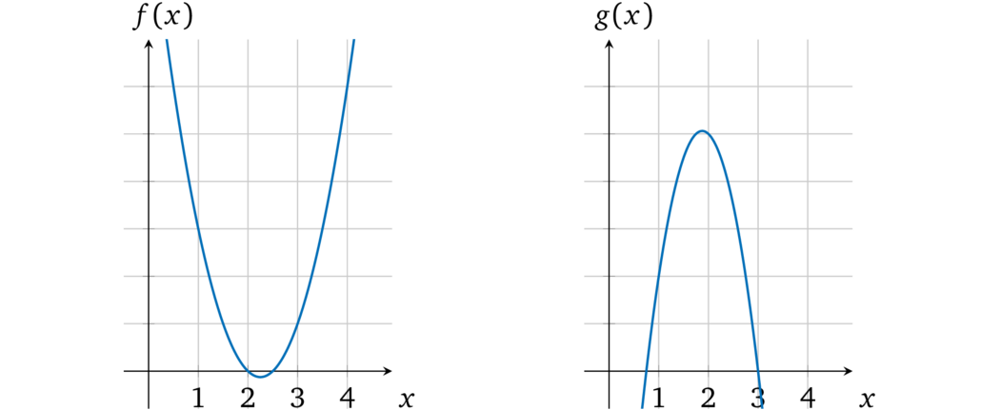
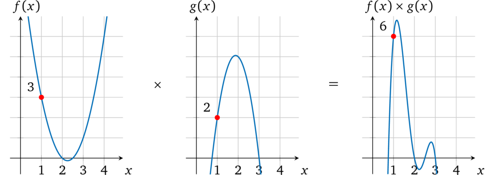
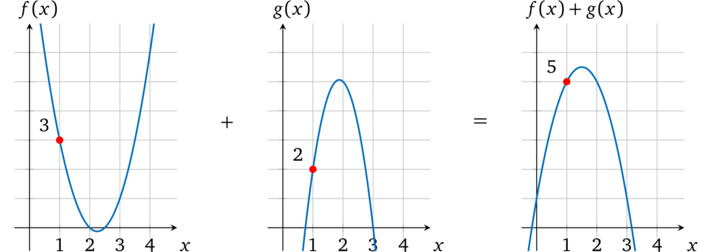

# 多项式的算术性质

我们先来看一下如何将多项式和算术运算关联起来。例如，有两个多项式 \\(f(x)\\) 和 \\(g(x)\\)，尝试将他们相乘得到 \\(h(x) = f(x) \times g(x)\\)，在任意一个 \\(x = r\\) 处 \\(h(x)\\) 的计算结果都是 \\(f(r)\\) 和 \\(g(r)\\) 的乘积。考虑下面两个多项式 \\(f(x) = 2x^2 - 9x + 10\\) 和 \\(g(x) = -4x^2 + 15 x -9\\)。以图形的形式可视化：

当 \\(x = 1\\) 时 \\(f(1) = 2 -9 + 10 = 3\\)，\\(g(1) = -4 + 15 -9 = 2\\)。

把两个多项式相乘：\\(h(x) = f(x) \times g(x) =-8 x^4 + 66 x^3 - 193 x^2 + 231 x -90\\)。从图中可以看出相乘的结果：

\\(x = 1\\) 时，计算 \\(f(x) \times g(x)\\) 结果为：\\(h(1) = -8 + 66 -193 + 231 - 90 = 6\\)，也就是说当 \\(x = 1\\) 时，\\(h(x)\\) 就是 \\(f(x)\\) 和 \\(g(x)\\) 相乘的结果 ，在 \\(x\\) 取其他值的时候也一样。

同样，如果我们将 \\(f(x)\\) 和 \\(g(x)\\) 相加，会得到 \\(-2x^2 + 6x + 1\\)，在 \\(x = 1\\) 处的计算结果就是 5。

> 注：在其他 \\(x\\) 的取值处，多项式相加的计算结果也是将两个多项式的值加在一起的结果，例如可以验证一下 \\(x = 2\\)、\\(x = 3\\) 处的结果。
>
> 如果我们可以将操作数的值表示为多项式（我们也确实可以这么做），那么利用算术属性，我们就能够得到操作数的计算结果了。

> 译者注：回忆一下，在「证明的媒介」一节中，我们曾提到过：任何多项式在任意点的计算结果都可以看做是其唯一身份的标识。
>
> 反过来，当我们知道某个多项式的时候，也就意味着我们知道多项式上某个点的取值了。这就是借助多项式来完成证明的依据。
