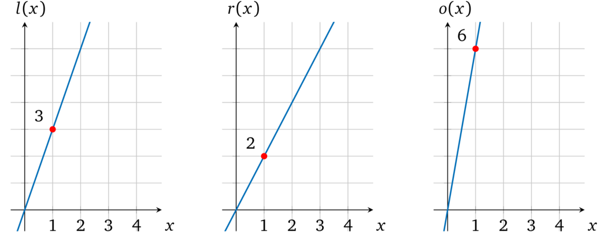
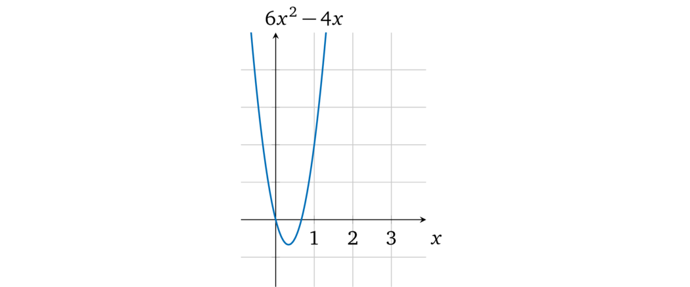
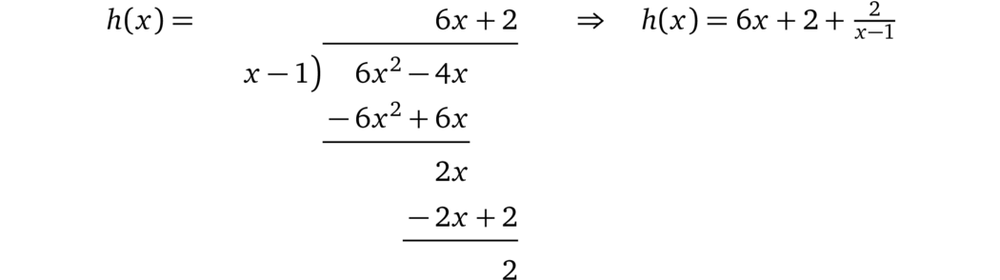

# 执行运算

如果一个证明者声称拥有某两个数字的乘积，验证者要怎样去验证呢？为了证明单个计算的正确性，我们必须确保提供的操作数的输出（结果）的正确性。我们再来看一下运算的形式：

$$\mathsf{左操作数}\quad \mathbf{运算符}\quad \mathsf{右操作数}\quad =\quad \mathsf{输出}$$

类似地，我们也可以将其表示为一个*运算多项式*：

$$ l(x) \ \mathbf{运算符} \ r(x) = o(x) $$

对于选定的值 \\(a\\):

- \\(l(x)\\) - 在 \\(a\\) 处表示（求值为）左操作数的值
- \\(r(x)\\) - 在 \\(a\\) 处表示右操作数的值
- \\(o(x)\\) - 在 \\(a\\) 处表示运算的结果（输出）

因此，如果这些多项式的运算正确地表示了操作数和输出，那么 \\(l(a) \ \mathbf{运算符} \ r(a) = o(a)\\) 就应该成立。将*输出多项式* \\(o(x)\\) 移动到等式的左侧 \\(l(a) \ \mathbf{运算符} \ r(a) - o(a) = 0\\)，如果*输出多项式* \\(o(x)\\) 表示的值是 \\(\mathbf{运算符}\\) 对*操作数多项式* \\(l(x)\\) 和 \\(r(x)\\) 表示的值产生的正确结果，这表示*运算多项式* \\(l(x) \ \mathbf{运算符} \ r(x) - o(x) = 0\\) 必须在 \\(a\\) 处计算为 0。那么只要*运算多项式*有效，就一定有一个根 \\(a\\)，因此，根据前面的基础（参见 3.2 节的因式分解），它必须包含辅因子 \\((x - a)\\)，这也就是我们要证明的*目标多项式*，即 \\(t(x) = x - a\\)。

例如，我们来看一个运算：\\(3 \times 2 = 6\\)

可以用一个简单的多项式表示它：\\(l(x) = 3x\\)，\\(r(x) = 2x\\)，\\(o(x) = 6x\\)，取 \\(a = 1\\) 进行计算，即 \\(l(1) = 3;\ r(1) = 2;\ o(1) = 6\\)。

> 注：\\(a\\) 的值可以是任意的。

这个运算多项式就变成了：

$$l(x) \times r(x) = o(x)$$

$$3x \times 2x = 6x$$

$$6x^2 - 6x = 0$$

在图上表示为：

值得注意的是，操作多项式有一个辅因子 \\((x-1)\\)：

$$6x^2 - 6x = 6x (x - 1)$$

因此，如果证明者提供这样的多项式 \\(l(x), r(x), o(x)\\) 而不是以前的 \\(p(x)\\)，那么验证者将接受它为有效的，因为它可以被 \\(t(x)\\) 整除。相反，如果证明者试图作弊并将输出值替换为 4，例如 \\(o(x) = 4x\\)，则运算多项式就会变成 \\(6x^2 - 4x = 0\\)：

图中这个多项式并没有 \\(x = 1\\) 的解，因而 \\(l(x) \times r(x) - o(x)\\) 就不能被 \\(t(x)\\) 整除：

因此，验证者不会接受这种*不一致的计算结果*（就像 3.2 节描述的那样）。

> 译者注：在前面的协议中，我们要证明的多项式是 \\(p(x) = t(x) \times h(x)\\)，这里我们修改 \\(p(x)\\)，使得 \\(p(x) = l(x) \times r(x) - o(x)\\)。这里目标多项式 \\(t(x)\\) 的根就是对应能够计算出数学表达式的值的 \\(x\\)。
>
> 上面例子里面取 \\(x = 1\\) 这个特殊值作为运算编码的位置。当然这里的 1 可以换成任何别的值，比如 2、3、101 等等。在 [GGPR] 与 [PHGR] 论文中，这个取值是一个随机值，被称为「root」。
