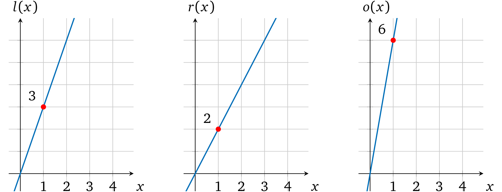
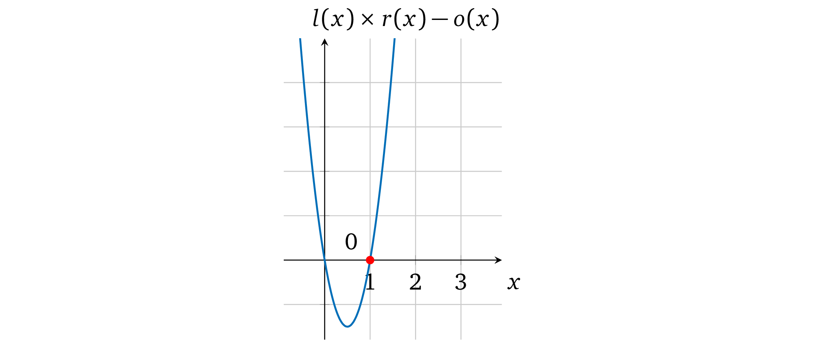

# 执行运算

如果一个证明者声称某两个数字的乘积，验证者要怎样去验证呢？为了证明单个计算的正确性，我们就必须首先确保所提供的操作数的输出（结果）的正确性。我们再来看一下运算的形式：

$$左操作数   运算符   右操作数    输出$$

类似得我们也可以将其表示为一个运算多项式

$$l(x)  运算符   r(x) = o(x)​$$

在一些选定的取值 *a* 处的运算:

- *l*(*x*) — 表示（运算结果为）左操作数
- *r*(*x*) — 表示（运算结果为）右操作数
- *o*(*x*) — 表示运算结果（输出）

因而在计算过程中如果操作数和结果都可以用多项式的形式正确地表示出来，那么  *l(a)  **operator** r(a) = o(a)*  就能够成立。也就是说假如*输出多项式* *o(x)* 所代表的值是由*运算符* 在*操作数多项式*  *l(x)* 和 *r(x)* 上进行**乘法**运算得出的正确结果，那么我们把*输出多项式* *o(x)* 放到等式的左边就能够得到： *l(a)  **operator**  r(a) – o(a) = 0*，这也就表明了当取值为 *a* 时*多项式*  *l(x) **operator** r(x) – o(x)* 计算结果为 0 。那么只要多项式是有效的，*运算多项式* 就一定有一个根 *a*。因此，根据前面的基础这个多项式里面一定包含因式*(x-a)* （可以看**因式分解**一节），这就是我们要证明的*目标多项式*，即 *t*(*x*) = *x – a*。

例如，我们来看一个运算：3×2=6

可以用一个简单的多项式表示它： *l*(*x*) = 3*x*,  *r*(*x*) = 2*x*,  *o*(*x*) = 6*x*，取 *a=1* 进行计算，即 *l*(1) = 3；*r*(1) = 2；*o*(1) = 6。

这个运算多项式就变成了：

$$l(x) × r(x) = o(x)$$

$$3x × 2x =6x$$

$$6x² -6x =0$$

在图上表示为：

注意，这个多项式有一个因子 *(x = 1)* ：

$$6x² -6x = 6x(x-1)$$

因而如果证明者用 *l*(*x*)*, r*(*x*)*, o*(*x*) 这些多项式来代替 *p*(*x*) ，因为它们依然可以被 *t(x)* 整除，所以验证者就可以认为它们是有效的。相反，如果证明者尝试用 4 来代替输出值去欺骗验证者，即 *o*(*x*) = 4*x*，那么运算多项式就变成了 *6x2 – 4x= 0*：

图中这个多项式并没有 *x*=1 的解，因而 *l*(*x*) × *r*(*x*) – *o*(*x*)  就不能被 *t(x)* 整除：

因而验证者不能接受这个*不一致的计算结果*（就像**因式分解**这一章描述的那样）

> 译者注：在前面的协议中，我们要证明的多项式是 p(x) = t(x)h(x)，这里我们修改 p(x)，使得 p(x) = l(x)r(x)-o(x)。这里t(x)目标多项式的根就是对应能够计算出数学表达式的值的 x。
>
> 上面例子里面取 x=1 这个特殊值作为运算编码的位置。当然这里的 1 可以换成任何别的值，比如说换成 x=2，3，或101 等等。在[GGPR]与[PHGR]论文中，这个取值是一个随机值，被称为 “root”。
