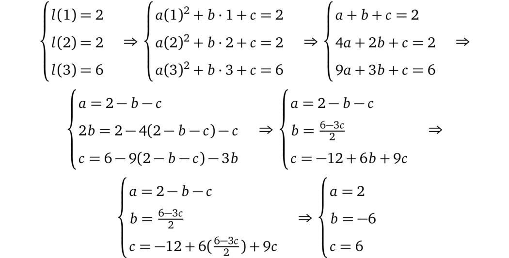
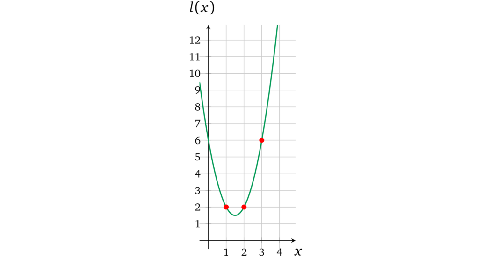
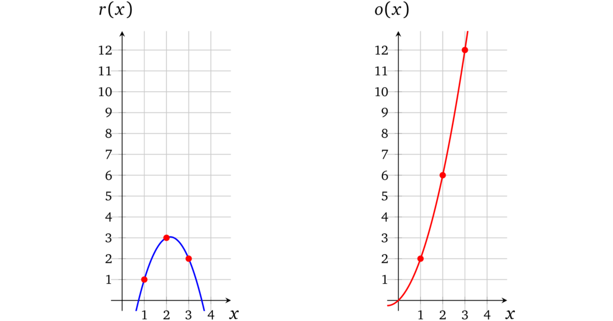

# 多项式插值

为了构造*操作数*和*输出多项式*，我们需要一种方法，对于给定的一组点可以产生通过所有这些点的*弯曲*多项式，这种方法被称为*插值*。有几种不同的方法可以得到这个多项式：

* 具有未知数的方程组
* 牛顿多项式
* 内维尔算法
* 拉格朗日多项式
* 快速傅里叶变换

我们以第一个方法为例。这个方法的思路是存在一个*系数未知*、阶数至多为 \\(n\\) 的唯一多项式能够经过给定的 \\(n + 1\\) 个点，对于每个点 \\(\left\\{ \left(x_i, y_i\right) \right\\}_{i \in [n + 1]}\\)，多项式在 \\(x_i\\) 处的计算结果都等于 \\(y_i\\)。在我们的例子中，三个点对应阶数为 2 的多项式，表示为：

$$ax^2 + bx + c = y$$

让我们令*左操作数多项式*（绿色）在每个点的多项式求值*相等*，并通过用其他系数表达每个系数来求解方程组：

因此*左操作数多项式*为：

$$\color{ForestGreen}{l(x)} = 2x^2 - 6x + 6$$

对应于下图：

我们可以用同样的方法找到 \\(r(x)\\) 和 \\(o(x)\\)：

$$\color{blue}{r(x)} = \frac{-3x^2 + 13x - 8}{2}; \quad \color{red}{o(x)} = x^2 + x$$

