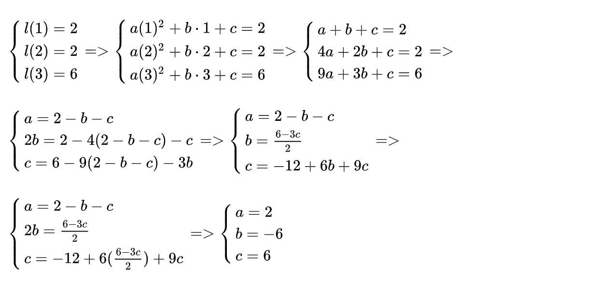

# 多项式插值

为了构造*操作数* 和 *输出多项式*，我们需要一种方法来用给定的一组点去构造一个能经过所有这些点的*弯曲* 多项式，这叫*插值*。有几种不同的方法可以算出这个多项式：

- 一组未知方程
- 牛顿多项式
- 内维尔算法
- 拉格朗日多项式
- 快速傅里叶变换

我们以第一个方法为例。这个方法的思路是存在一个*系数未知* ，阶数至多为 *n* 的特定的多项式 *p(x)* 能够经过给定的 *n*+1 个点，对于每个点 {(*xᵢ*, *yᵢ*)}, *i* ∈ [n+1]来说，多项式在 *xᵢ* 处的计算结果都等于 *yᵢ*，即对于所有的 i，*p(xᵢ) = yᵢ* 。在我们的例子中，三个点就可以变成一个用以下形式所表示的阶数为 2 的多项式：*ax2 + bx +c =y*。

我们令*左运算多项式*（绿色标出的）在每个点处与多项式结果值相等，然后对每个系数用其它术语表示出来再计算等式：

因而 *左操作数多项式* 就是：

*l(x)* *= 2x2-6x+6*

它和下面的图对应：

我们用相同的方式再计算 *r*(*x*) 和 *o*(*x*)：

$\textcolor{blue}{r(x)}=\frac{-3x^2+13x-8}{2}; \quad \textcolor{red}{o(x)}=x^2+x$

