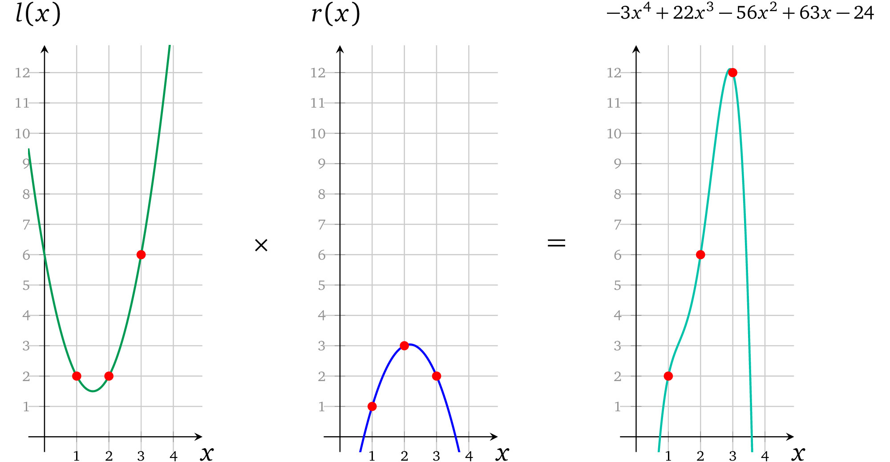

# 多运算多项式

现在我们有了代表三个运算的操作数多项式，再进一步看一下怎么去校验每个计算的正确性。回到验证者寻找等式 *l*(*x*) · *r*(*x*) – *o*(*x*) = *t*(*x*)*h*(*x*) 的过程。在这个例子中，因为计算是在点 *x* *∈ {1*, *2*, *3*} 处被表示出来的，所以目标多项式在这些  *xs​* 点处的计算结果必须为 0，换句话说， *t*(*x*)的根必须是 1，2 和 3，它的基本形式就是：

第一步将 *l(x)* 和 *r(x)* 相乘得到结果：

第二步：从 *l*(*x*) × *r*(*x*) 的结果中将 *o*(*x*)  减去：

这里就已经可以看出每一个操作数相乘都对应了正确的结果。最后一步证明者要算出一个有效因式：

$h(x) = \frac{l(x) \times r(x) -o(x)}{t(x)} = \frac{-3x^4 +22x^3 -57x^2 +63x -24}{(x-1)(x-2)(x-3)}$

通过长除法可以算出：

代入*h*(*x*) = – 3*x*+ 4*a*，验证者可以计算 *t*(*x*)*h*(*x*)：

现在显然 *l*(*x*) × *r*(*x*) – *o*(*x*) = *t*(*x*)*h*(*x*) ，这就是我们要证明的内容。

> 译者注：这里只需要一组多项式 *l*(*x*)，*r*(*x*)， *o*(*x*) 就可以将所有计算的约束关系表示出来了，有几个计算也就对应着目标多项式 t(x) 有几个根。
>
> 当前的协议似乎存在一些缺陷，多项式只能证明证明者拥有一组多项式 *l*(*x*)，*r*(*x*)， *o*(*x*) ，在 t(x) 的几个根的取值处 *l*(*x*)·*r*(*x*)= *o*(*x*)，无法证明这组多项式符合我们要证明的数学表达式：
>
> 1）多个计算关系之间也是分开表示的，这些算式之间的关系也同样无法进行约束
>
> 2）由于证明者生成的证明中只有计算结果，左操作数，右操作数，输出在计算中混用也不会被发现
>
> 3）由于左操作数，右操作数，输出是分开表示的，互相之间的关系无法进行约束
