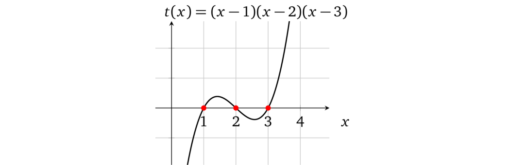
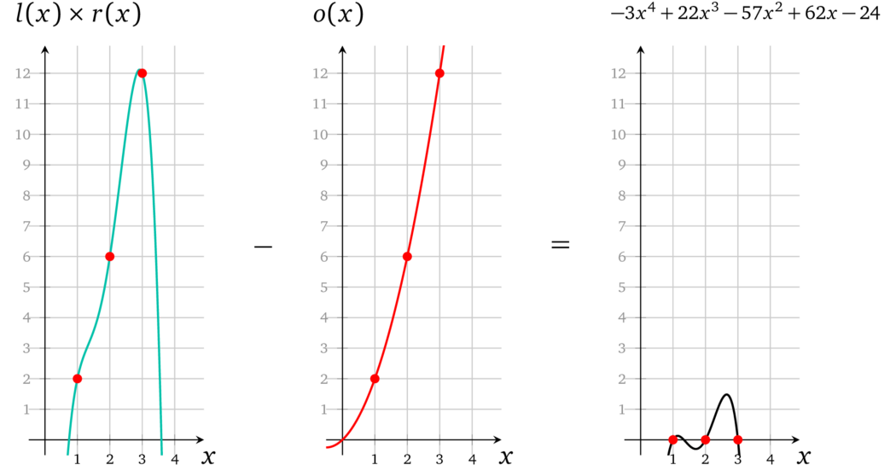
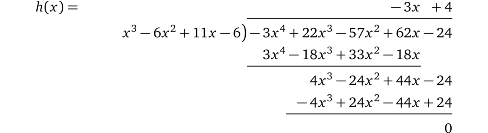
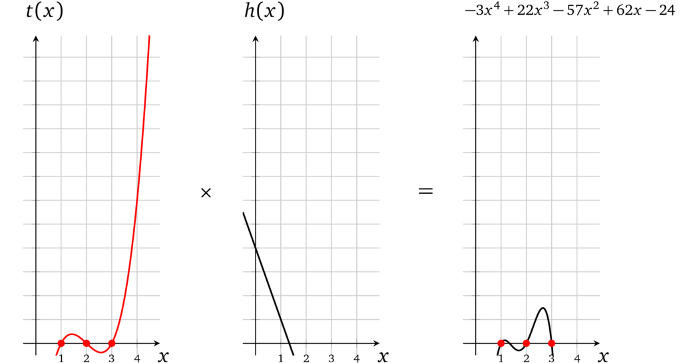

# 多运算多项式

现在我们有了代表三个运算的操作数多项式，让我们一步一步地看看如何验证每个运算的正确性。回想一下，验证者正在寻找等式 \\(l(x) \times r(x) - o(x) = t(x)h(x)\\)。在这种情况下，由于运算在点 \\(x \in \\{1,2,3\\}\\) 处表示，因此目标多项式必须在这些 \\(x\\) 处计算为 \\(0\\)，换句话说，\\(t(x)\\) 的根必须是 1、2 和 3，其基本形式为：

首先，将 \\(l(x)\\) 和 \\(r(x)\\) 相乘，得到：

接着，从 \\(l(x) \times r(x)\\) 的结果中减去 \\(o(x)\\)：

已经可以看出，每个操作数的乘法都对应一个正确的结果。对于最后一步，*证明者*需要提供一个有效的辅因子：

$$h(x) = \frac{l(x) \times r(x) - o(x)}{t(x)} = \frac{-3x^4 + 22x^3 - 57x^2 + 62x - 24}{(x - 1)(x - 2)(x - 3)}$$

使用长除法我们得到：

使用 \\(h(x) = -3x + 4\\)，*验证者*可以计算 \\(t(x)h(x)\\)：

现在很明显 \\(l(x) \times r(x) - o(x) = t(x) h(x)\\)，这就是我们要证明的内容。

> 译者注：这里只需要一组多项式 \\(l(x)\\)、\\(r(x)\\)、\\(o(x)\\) 就可以表示出所有计算的约束关系，计算的数量与目标多项式 \\(t(x)\\) 的根的数量相同。
>
> 当前的协议似乎存在一些缺陷，只能证明证明者拥有一组多项式 \\(l(x)\\)、\\(r(x)\\)、\\(o(x)\\) 在 \\(t(x)\\) 几个根的取值处 \\(l(x) \times r(x) = o(x)\\)，无法证明这组多项式符合我们要证明的数学表达式：
>
> 1. 多个计算关系是分开表示的，这些算式之间的关系也无法进行约束
>
> 2. 由于证明者生成的证明中只有计算结果，左操作数、右操作数、输出在计算中混用也不会被发现
>
> 3. 由于左操作数、右操作数、输出是分开表示的，相互之间的关系无法进行约束
