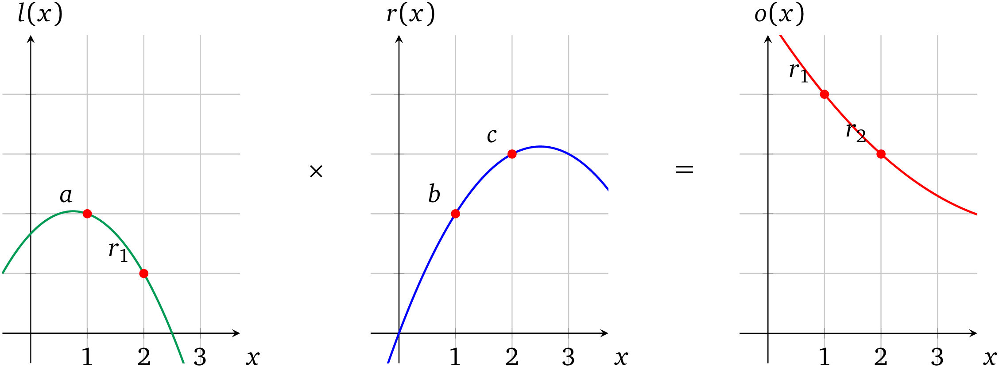
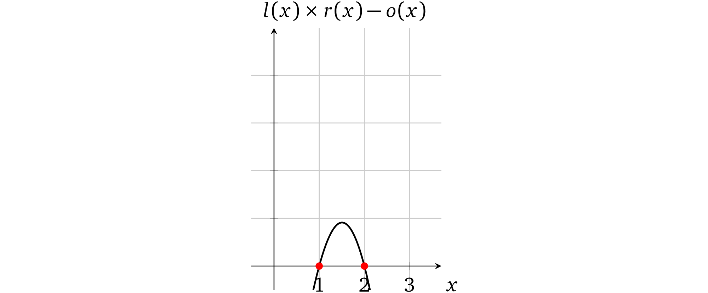

# 多个运算

现在我们已经能证明单个运算了，但要怎样扩展才能证明多个运算（这是我们的最终目标）呢？让我们尝试添加另一个运算。假如需要计算乘积：\\(a \times b \times c\\)。在基本运算模型中，这意味着两个运算：

$$\color{ForestGreen}{a}\quad \times \quad\color{blue}{b}\quad = \quad\color{red}{r_1}$$

$$\color{ForestGreen}{r_1}\quad \times \quad\color{blue}{c}\quad = \quad\color{red}{r_2}$$

在前面的讨论中，我们可以通过使操作数多项式计算为某个任意 \\(x\\) 处的相应值（例如 \\(1\\)）来表示此类运算。有了这个方法，多项式的属性并不会限制我们在不同的 \\(x\\) 处表示其他值（例如 \\(2\\)），即：

这种独立性允许我们一次*执行*两个运算而不会将它们「混合」在一起，也就是说相互之间没有干扰。这个多项式算术的结果就变成了：

可以看出，运算多项式有两个根 \\(x = 1\\) 和 \\(x = 2\\)。因此，这两次计算都被正确*执行*了。

> 译者注：这里的示例为了方便理解，选择了 \\(x = 1\\) 和 \\(x = 2\\) 两个位置。在完整的 zk-SNARK 方案中，这些「root」值必须为有限域内的随机数，否则就会引入安全漏洞。

我们再来看一个有三个乘法运算的例子 \\(2 \times 1 \times 3 \times 2\\)，它按照下面的步骤执行：

$$\color{ForestGreen}{2}\quad \times \quad\color{blue}{1}\quad = \quad\color{red}{2}$$

$$\color{ForestGreen}{2}\quad \times \quad\color{blue}{3}\quad = \quad\color{red}{6}$$

$$\color{ForestGreen}{6}\quad \times \quad\color{blue}{2}\quad = \quad\color{red}{12}$$

我们需要将它们表示为操作数多项式，对于由 \\(x \in \\{1, 2, 3\\}\\) 所表示的计算，\\(l(x)\\) 相应地经过 \\(\color{ForestGreen}{2, 2}\\) 和 \\(\color{ForestGreen}{6}\\)（即经过点 \\((1, \color{ForestGreen}{2}), (2, \color{ForestGreen}{2}), (3, \color{ForestGreen}{6})\\)），同样 \\(r(x) \ni (1, \color{blue}{1}), (2, \color{blue}{3}), (3, \color{blue}{2})\\)，以及 \\(o(x) \ni (1,\color{red}{2}), (2, \color{red}{6}), (3, \color{red}{12})\\)。

但是，我们如何找到经过这些点的多项式呢？对于任何超过一个点的情况，都必须使用特定的数学方法。
