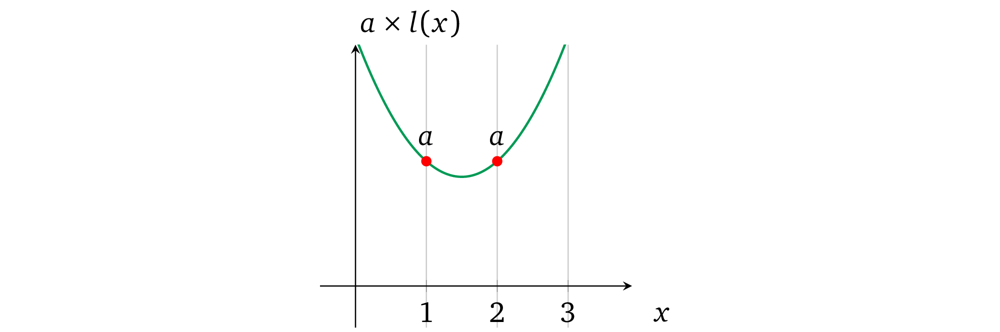

# 单变量操作数多项式

我们来看一个简单的例子（与当前示例一样），在由*左操作数多项式* \\(l(x)\\) 表示的所有左操作数中仅使用一个变量（例如 \\(a\\)）。我们要找出是否可以确保这个多项式在每个运算中都表示相同的 \\(a\\) 值。证明者可以设置不同值的原因是他可以控制 \\(x\\) 的每次幂的每个系数。因此，如果这些系数是固定的，这个可变性问题就被解决了。

让我们仔细观察包含相等值的多项式。例如，分别检查两个表示两个运算相等值的多项式（即，在 \\(x = 1\\) 和 \\(x = 2\\) 处），其中第一个多项式包含值 \\(1\\)，第二个包含值 \\(2\\)：

注意到相应的系数在每个多项式中是成比例的，也就是说第二个多项式中的系数是第一个的两倍，即：

$$2x^2 - 6x + 6 = 2 \times (x^2 - 3x + 3)$$

当我们想要同时改变多项式中的所有值时，我们需要改变它的比例，由于多项式的算术特性，如果我们将多项式乘以一个数字，每个可能的 \\(x\\) 的求值也将乘以这个数字（即按比例缩放）。要验证这一点，可以尝试将第一个多项式乘以 3 或任何其他数字。

因此，如果验证者需要强制证明者在所有运算中设置相同的值，那么应该限制证明者只能修改比例而不是单个系数。

那么如何保持系数比例呢？我们可以从考虑为*左操作数多项式*提供了什么作为证明开始。它是在某个秘密 \\(s\\) 处对 \\(l(x)\\) 的加密求值：\\(g^{l(s)}\\)，也就是说它是一个加密数字。从 3.4 节中我们已经知道如何通过 \\(\alpha\\)-移位来限制验证者仅使用提供的 \\(s\\) 的指数，因此同态乘法是唯一可用的运算。

与限制单个指数类似，验证者可以一次限制整个多项式。不提供单独的加密值 \\(g^{s^1}, g^{s^2}, \ldots, g^{s^d}\\) 和它们的 \\(\alpha\\)-移位 \\(g^{\alpha s^1}, g^{\alpha s^2}, \ldots, g^{\alpha s^d}\\)，协议的过程就是：

* 设置
  * 用对应的系数构造相应的*操作数多项式* \\(l(x)\\)
  * 选择随机值 \\(\alpha\\) 和 \\(s\\)
  * 用加密的 \\(l(s)\\) 生成证明密钥，它是「移位」对：\\(\left( g^{l(s)}, g^{\alpha l(s)} \right)\\)
  * 生成验证密钥：\\(\left( g^\alpha \right)\\)
* 证明
  * 对于操作数的值 \\(v\\)
    * 乘以*操作数多项式*：\\(\left( g^{l(s)} \right)^v\\)
    * 乘以移位的*操作数多项式*：\\(\left( g^{\alpha l(s)} \right)^v\\)
  * 提供*操作数多项式*的乘法证明：\\(\left( g^{v\, l(s)}, g^{v\, \alpha l(s)} \right)\\)
* 验证
  * 将证明解析为 \\(\left( g^{l}, g^{l'} \right)\\)
  * 验证比例：\\(e\left( g^{l'}, g \right) = e\left( g^{l}, g^\alpha \right)\\)

证明者需要以相同的 \\(\alpha\\)-移位进行响应，由于他无法从证明密钥中恢复出 \\(\alpha\\)，所以保持该移位的唯一方法就是用相同的值乘以加密值 \\(g^{l(s)}\\) 和 \\(g^{\alpha l(s)}\\)。这样一来证明者就不能修改 \\(l(x)\\) 的单个系数，例如，如果 \\(l(x) = ax^2 + bx + c\\)，他只能一次将整个多项式乘以某个值 \\(v\\)：\\(v(ax^2 + bx + c)= vax^2 + vbx + vc\\)。由于*配对*，不能与另一个多项式相乘，并且 \\(s\\) 的各个指数的 \\(\alpha\\)-移位也会不可用。证明者既不能加也不能减，因为 \\(g^{\alpha(l(x) + a'x^2 + c')} \neq g^{\alpha l(x)} \cdot g^{a' x^2} \cdot g^{c'}\\)（这同样需要未加密的 \\(\alpha\\) 的知识）。

我们现在有了协议，但应该如何构造*操作数多项式* \\(l(x)\\) 呢？由于任何整数都可以通过乘以 \\(1\\) 得到它本身，因此对于每个相应的运算，多项式的计算结果都应为 \\(1\\)，例如：

这允许证明者*分配* \\(a\\) 的值：

**备注 4.1** 由于验证密钥包含 \\(g^\alpha\\)，因此可以对多项式添加（或减去）任意值 \\(v'\\)，即：

$$g^{v l(s)} \cdot g^{v'} = g^{v l(s) + v'}$$

$$g^{\alpha v l(s)} \cdot \left(g^{\alpha}\right)^{v'} = g^{\alpha (v l(s) + v')}$$

$$e\left( g^{\alpha (v l(s) + v')}, g \right) = e\left( g^{v l(s) + v'}, g^\alpha \right)$$

因此，可以修改多项式使其超出验证者的预期并证明一个不同的陈述。我们将在 4.9.3 节中解决这个问题。

> 译者注：这一节解决的问题是，算术电路中一个 Input Wire 或 Output Wire 可能会同时作为多个门的输入 Wire，如何才能确保约束这些公用 Wire。
>
> 由于要证明的数学表达式是公开的，那么各个算式之间的约束关系也就是公开的，我们就可以把构造多项式的工作交给设置环节，这样证明者只需要填上对应的数值就可以了。
>
> 上文的方法限制了在同一个操作数多项式上，不同的算式中使用同一个值时的约束关系。同样，如果一个操作数多项式中用到了多个值，也可以将这些值全部加起来，下面将会介绍。
