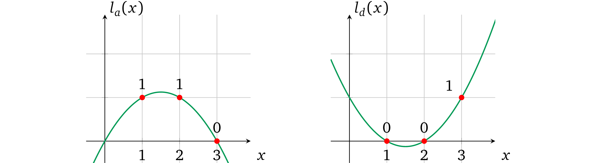
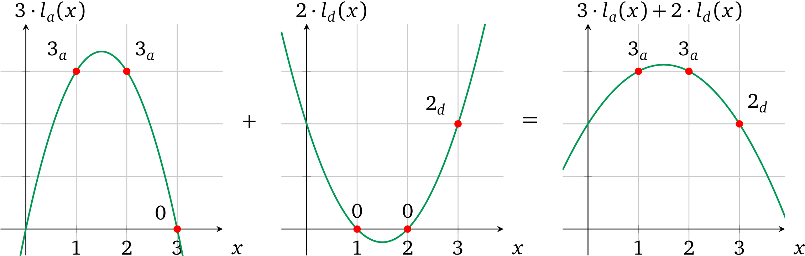

# 多变量操作数多项式

现在，只有当所有左操作数都使用相同的变量时，我们才能单独设置值。如果我们再添加一个 \\(d\\) 呢：

如果使用相同的方法，我们将无法为每个变量单独设置值，并且每个不同的变量都将全部乘在一起。因此，这种受限多项式只能支持一个*变量*。如果检查多项式的性质，我们将看到把多项式相加也会让这些多项式的不同求值相加。因此，我们可以将*操作数多项式* \\(l(x)\\) 分成*操作数变量多项式* \\(l_a(x)\\) 和 \\(l_d(x)\\)（注意下标），从而用与上一节类似的方法分别*赋值*和限制*变量* \\(a\\) 和 \\(d\\)，然后将它们加在一起以表示所有左操作数的变量。因为我们将*操作数变量多项式*相加，所以我们需要确保对于每个运算，操作数多项式只表示所有*变量*中的一个。

使用这个算术性质，我们可以构造每个*操作数变量多项式*，如果*变量*被用作相应运算中的操作数，则它的计算结果置为 \\(1\\)，否则就置为 \\(0\\)。\\(0\\) 乘以任何值都将保持为零，加在一起时将被忽略。对于我们的例子 \\(l_a(x)\\) 必须符合 \\(l_a(1) = 1\\)、\\(l_a(2) = 1\\) 和 \\(l_a(3) = 0\\) 并且 \\(l_d(x)\\) 在 1 和 2 处为零，但在 \\(x = 3\\) 处为 \\(1\\)：

因此，我们可以分别设置每个变量的值，然后将它们相加得到操作数多项式，例如，如果 \\(a = 3\\) 且 \\(d = 2\\)：

> 注：我们在一个值旁边使用下标来指示它代表哪个变量，例如，\\(3_a\\)是一个用值 \\(3\\) 实例化的变量 \\(a\\)。

让我们从现在开始用大写字母表示这样的复合*操作数多项式*，例如，\\(L(x) = a\, l_a(x) + d\, l_d(x)\\)，其求值为 \\(L\\)，即 \\(L = L(s)\\)。这种结构只有在每个*操作数变量多项式*都受验证者限制时才有效，有关左操作数的交互应该相应更改：

* 设置
  * 构造 \\(l_a(x)\\)、\\(l_d(x)\\) 使其在使用它的「运算 \\(x\\)」处经过 1，在所有其他运算中经过 0
  * 选择随机值 \\(s\\)、\\(\alpha\\)
  * 计算并加密*未赋值的变量多项式*：
    $$g^{l_a(s)}, g^{l_d(s)}$$
  * 计算这些多项式的*移位*：
    $$g^{\alpha l_a(s)}, g^{\alpha l_d(s)}$$
  * 生成证明密钥：
    $$\left( g^{l_a(s)}, g^{l_d(s)}, g^{\alpha l_a(s)}, g^{\alpha l_d(s)} \right)$$
  * 生成验证密钥：
    $$\left( g^\alpha \right)$$
* 证明
  * 将变量多项式中的 \\(a\\) 和 \\(d\\) *赋值*：
    $$\left(g^{l_a(s)}\right)^a, \left( g^{l_d(s)} \right)^d$$
  * 为*移位*的多项式*赋*相同的*值*：
    $$\left(g^{\alpha l_a(s)}\right)^a, \left( g^{\alpha l_d(s)} \right)^d$$
  * 将所有*赋值*的变量多项式相加，形成一个*操作数多项式*的形式：
    $$g^{L(s)} = g^{a l_a(s)} \cdot g^{d l_d(s)} = g^{a l_a(s) + d l_d(s)}$$
  * 将*移位*并*赋值*的*变量多项式*相加，形成一个*移位的操作数多项式*的形式：
    $$g^{\alpha L(s)} = g^{a \alpha l_a(s)} \cdot g^{d \alpha l_d(s)} = g^{\alpha \left(a l_a(s) + d l_d(s) \right)}$$
  * 提供*左操作数*有效赋值的证明：
    $$\left( g^{L(s)}, g^{\alpha L(s)} \right)$$
* 验证
  * 将证明解析为 \\(\left( g^L, g^{L'} \right)\\)
  * 检查提供的多项式是否是最初提供的*未赋值的变量多项式*的倍数之和：
    $$e\left( g^{L'}, g \right) = e\left( g^{L}, g^\alpha \right)$$
    也就是检查了
    $$\alpha\, a l_a(s) + \alpha\, d l_d(s) = \alpha \times (a l_a(s) + d l_d(s))$$

> 注：\\(L(s)\\) 和 \\(\alpha L(s)\\) 一次表示所有变量多项式，由于 \\(\alpha\\) 仅用于变量多项式的求值，因此证明者别无选择，只能使用提供的加密值并给原始和移位的变量多项式分配相同的系数。

结果，证明者：

* 除了「分配」值以外，不能通过改变系数来修改提供的*变量多项式*，因为证明者只提供这些多项式的加密值，也因为 \\(s\\) 的必要加密幂不能与它们的 \\(\alpha\\)-移位分开
* 无法对提供的多项式加上另一个多项式，因为 \\(\alpha\\)-比率将会被破坏
* 不能通过乘以其他多项式 \\(u(x)\\) 来修改操作数多项式，这可能让修改的值不成比例，因为在预配对空间中无法进行加密乘法

> 注：如果我们将一个多项式（例如 \\(l_a(x)\\)）与另一个多项式（例如 \\(l_d'(x) = c_{d} \cdot l_d(x) + c_{a}' \cdot l_a(x)\\)）相加（或相减），这并不是对多项式 \\(l_d(x)\\) 的真正修改，而是对 \\(l_a(x)\\) 的结果系数的改变，因为它们最后会被加到一起：
> $$L(x) = c_{a} \cdot l_a(x) + l_d'(x) = \left(c_a + c_a'\right) \cdot l_a(x) + c_d \cdot l_d(x)$$

虽然证明者限制了多项式的使用，但仍然存在一些可允许范围内的自由：

* 如果证明者决定不加入一些赋值的变量多项式 \\(l_i(x)\\) 来形成操作数多项式 \\(L(x)\\) 也是可以接受的，因为这种情况与赋值为 \\(0\\) 时相同：\\(g^{a l_a(x)} = g^{a l_a(x) + 0 l_d(x)}\\)
* 如果证明者多次加入相同的变量多项式也是可以接受的，因为它与一次分配该值的倍数次时相同，例如 \\(g^{a l_a(x)}\cdot g^{a l_a(x)} \cdot g^{a l_a(x)} = g^{3a l_a(x)}\\)

这种方法在右操作数和输出多项式 \\(R(x)\\)、\\(O(x)\\) 上也同样适用。

> 译者注：目前证明协议的大致思路为：
>
> 1. 将要证明的程序转换为用数学语言表达的形式（即加减乘除的计算）
> 2. 用多项式在某处的取值来进行计算以表示数学运算，进而进行证明
> 3. 用多项式在多处的取值来进行计算以表示多个数学运算，进而进行证明
> 4. 对证明的「程序」在不同计算中使用的相同变量进行约束
>
> 当前的协议约束只解决了部分问题，还有许多可以改进的地方，下一节中将会展开讨论这些改进，并对证明协议进行优化。
