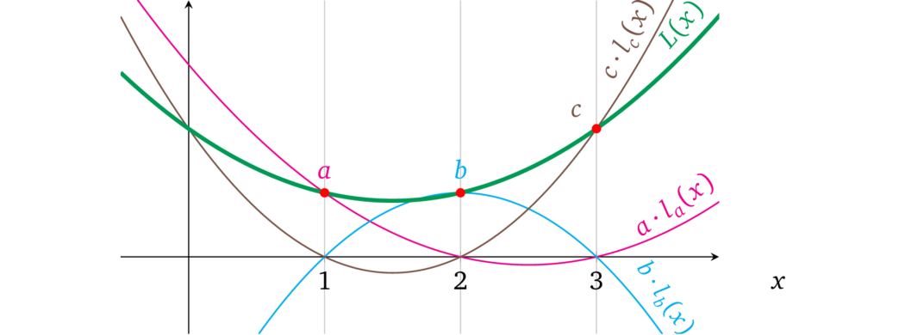
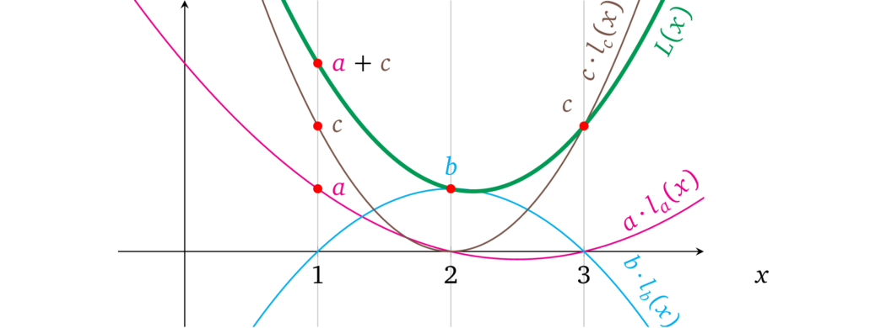

# 无成本加法

看一下更新后的结构，很明显在多项式表示中，由一些不同的 \\(x\\) 表示的每个*操作数*都是所有*操作数变量多项式*的总和，因此只有单个*使用*的变量可以具有非零值，而所有其他变量都为零。下图很好地说明了这一点：

我们可以利用这种结构，允许为运算中的每个操作数添加任意数量的必要*变量*。例如在第一个运算中，我们可以先做加法 \\(a + c\\)，然后再乘以其他操作数，例如 \\(\color{ForestGreen}{(a + c)} \times \color{blue}{b} = \color{red}{r}\\)，这可以表示为：

因此，可以在单个*操作数*中添加任意数量的当前变量，对它们中的每一个使用任意系数，这样可以根据各个程序的需要来生成将在相应运算中使用的操作数值。这种特性有效地允许将运算结构更改为：

$$\color{ForestGreen}{(c_{\textrm{l},a} \cdot a + c_{\textrm{l},b} \cdot b + \ldots)}\quad \times \quad\color{blue}{(c_{\textrm{r},a} \cdot a + c_{\textrm{r},b} \cdot b + \ldots)}\quad = \quad\color{red}{(c_{\textrm{o},a} \cdot a + c_{\textrm{o},b} \cdot b + \ldots)}$$

或更正式地说，对于变量 \\(v_i \in \\{v_1, v_2, ..., v_n\\}\\) 和操作数变量系数 \\(c_{\textrm{l},i} \in \\{c_{\textrm{l},1}, c_{\textrm{l},2}, ..., c_{\textrm{r},n}\\}\\)，\\(c_{\textrm{r},i} \in \\{c_{\textrm{r},1}, c_{\textrm{r},2}, ..., c_{\textrm{r},n}\\}\\)，\\(c_{\textrm{o},i} \in \\{c_{\textrm{o},1}, c_{\textrm{o},2}, ..., c_{\textrm{o},n}\\}\\)：

$$\color{ForestGreen}{\sum_{i=1}^{n} c_{\textrm{l},i} \cdot v_i}\quad \times \quad\color{blue}{\sum_{i=1}^{n} c_{\textrm{r},i} \cdot v_i}\quad = \quad\color{red}{\sum_{i=1}^{n} c_{\textrm{o},i} \cdot v_i}$$

> 注：每个运算的操作数都有自己的一组系数 \\(c\\)。

> 译者注：乘法运算是关键，而加法运算可以被合并到一个更大的乘法运算里。
