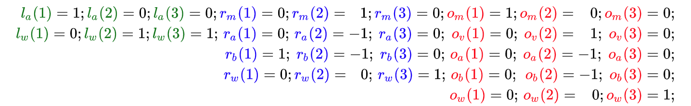
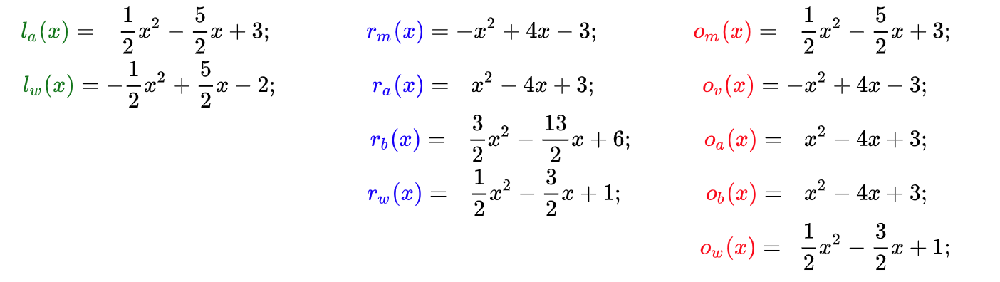

# 示例计算

有了一组通用的运算结构，我们就可以将我们原始的程序（上一篇文章中的例子）转换成一组运算，然后再转换成多项式的形式。我们先来想一下算法的数学形式（用变量 *v* 表示运算结果）：

$ w \times (a \times b) + (1 - w) \times (a+b) = v$

这里有三个乘法，但是由于运算结构只支持一个乘法操作，所以这里至少就要做三次运算。但是，我们可以将它简化为:

$w \times (a \times b) + a + b -w \times (a + b) = v$

$w \times (a \times b - a - b) = v -a- b$

现在要包含同样的关系只需要两个乘法。这种运算的完整形式就是：

$1: \qquad  \textcolor{green}{1 \cdot a} \times \textcolor{blue}{1 \cdot b }= \textcolor{red}{1 \cdot m} $

$2:  \qquad \textcolor{green}{1 \cdot w} \times \textcolor{blue}{1 \cdot m + -1 \cdot a + -1 \cdot b} = \textcolor{red}{1 \cdot v + -1 \cdot a + -1 \cdot b}$

我们还可以再增加一条约束使 *w* 必须为二进制数，否则证明者就可以代入任何值去执行一个错误的运算了：

$3：  \qquad \textcolor{green}{1 \cdot w} \times \textcolor{blue}{1 \cdot w}  = \textcolor{red}{1 \cdot w} $

要了解为什么 *w* 只能为 0 或者 1，我们可以把等式表示为 *w*² – *w* = 0，也就是 *(w – 0)(w – 1) = 0* 这里 0 和 1 是唯一解。

现在一共有 5 个变量，以及 2 个左操作符， 4 个右操作符和 5 个输出。操作符多项式为：

$\textcolor{green}{L(x) = a \cdot l_a(x) + w \cdot l_w(x)}$

$\textcolor{blue}{R(x) = m \cdot r_m(x) + a \cdot r_a(x) + b \cdot r_b(x)}$

$\textcolor{red}{O(x) = m \cdot o_m(x) + v \cdot o_v(x) + a \cdot o_a(x) + b \cdot o_b(x)}$

在三次运算中必须为每个*变量多项式 都分别算出一个对应的系数或者如果这个多项式在计算的操作数或者输出中没有被用到的话系数就置为 0。

结果因式多项式就是  *t(x) = (x – 1)(x –2)(x –3)*，它必须确保这三个运算都能被正确计算。

接下来，我们利用多项式插值法来找到每个变量多项式：

绘制出来就是：

我们准备通过多项式去证明计算，首先，选择函数的输入值，例如： *w* *= 1*, *a* *= 3*, *b*= 2。其次，计算过程中的中间变量值为：

$$m=a × b =6$$

$$v = w(m-a-b)+a+b=6$$

然后，我们把所有计算结果中的值赋值到 *变量多项式* 中，然后相加得到操作数或者输出多项式的形式：

$\textcolor{green}{L(x)}=\textcolor{green}{3 \cdot l_a(x) +1 \cdot l_w(x)} = x^2 -5x+7$

$\textcolor{blue}{R(x)}=\textcolor{blue}{6 \cdot r_m(x) + 3 \cdot r_a(x) + 2 \cdot r_b(x) + 1 \cdot r_w(x)} = \frac{1}{2}x^2 -2 \frac{1}{2}x +4$

$\textcolor{red}{O(x)}=\textcolor{red}{6 \cdot o_m(x) + 6 \cdot o_v(x) + 3 \cdot o_a(x)+ 2 \cdot o_b(x) + 1 \cdot o_w(x)}= 2 \frac{1}{2}x^2 + 12 \frac{1}{2}x +16$

在图中就表示为：

把他们相加成对应运算中的操作数和输出值：

我们需要去证明  *L*(*x*) × *R*(*x*) – *O*(*x*) = *t*(*x*)*h*(*x*)，因而我们先找出 *h*(*x*)：

$h(x) = \frac{L(x) \times R(x) - O(x)}{t(x)} = \frac{\frac{1}{2}x^4 - 5x^3 + \frac{35}{2}x^2 -25x +12}{(x-1)(x-2)(x-3)} = \frac{1}{2}x - 2$

以图的形式表示为：

这里很明显多项式 *L*(*x*) × *R*(*x*) – *O*(*x*) 的解为 *x*= 1， *x*= 2 和 *x*= 3，因而 *t(x)* 是它的因式，假如使用了和它不一致的变量值，情况就不是这样了。

这就是一组能够正确计算的变量值，如何在多项式层面上证明出来的。下面证明者还要再继续处理协议的密码学部分。
