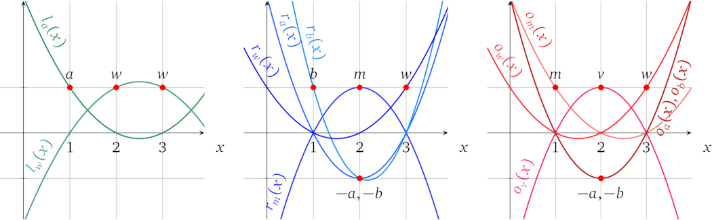

# 示例计算

有了通用运算的结构，我们就可以将原来的算法 1 转换为一组运算，并进一步转换为多项式形式。算法的数学形式是（我们将使用变量 \\(v\\) 来表示运算结果）：

$$w \times (a \times b) + (1 - w) \times (a + b) = v$$

它有三个乘法，由于运算结构只支持一个乘法，所以至少会有 3 个运算。但是，我们可以简化方程：

$$w \times (a \times b) + a + b - w \times (a + b) = v$$

$$w \times (a \times b - a - b) = v - a - b$$

现在要保持同样的关系只需要两个乘法。运算的完整形式是：

$$1:\quad\color{ForestGreen}{1\cdot a}\quad \times \quad\color{blue}{1\cdot b}\quad = \quad\color{red}{1 \cdot m}$$

$$2:\quad\color{ForestGreen}{1\cdot w}\quad \times \quad\color{blue}{1\cdot m\ +\ -1\cdot a\ + \ -1\cdot b}\quad = \quad\color{red}{1 \cdot v\ +\ -1 \cdot a\ +\ -1 \cdot b}$$

我们还可以添加一个要求 \\(w\\) 必须是二进制的约束，否则证明者就可以使用其他的 \\(w\\) 取值去执行一个不正确的运算：

$$3:\quad\color{ForestGreen}{1\cdot w}\quad \times \quad\color{blue}{1\cdot w}\quad = \quad\color{red}{1\cdot w}$$

要说明为什么 \\(w\\) 只能是 0 或 1，我们可以将方程表示为 \\(w^2 - w = 0\\)，然后进一步表示为 \\((w - 0)(w - 1) = 0\\)，其中 0 和 1 是唯一的解。

这里总共有 5 个变量，其中 2 个在左操作数中，4 个在右操作数中，5 个在输出中。操作数多项式为：

$$\color{ForestGreen}{L(x)} = \color{ForestGreen}{ a \cdot l_a(x) + w \cdot l_w(x) }$$

$$\color{blue}{R(x)} = \color{blue}{ m \cdot r_{m}(x) + a \cdot r_a(x) + b \cdot r_b(x) + w\cdot r_w(x) }$$

$$\color{red}{O(x)} = \color{red}{ m \cdot o_{m}(x) + v \cdot o_v(x) + a \cdot o_a(x) + b \cdot o_b(x) + w\cdot o_w(x) }$$

其中每个*变量多项式*必须为 3 个运算中的每一个运算计算出一个相应的系数，如果变量不存在于运算的操作数或输出中，则计算为 0：

因此，辅因子多项式是 \\(t(x) = (x-1)(x-2)(x-3)\\)，这可以确保所有三个运算都已经被正确计算。

接下来我们利用多项式插值来找到每个*变量多项式*：

绘制出来就是：

现在我们就可以通过多项式来证明计算了。首先，我们为函数选择输入值，例如 \\(w = 1, a = 3, b = 2\\)。接着，从运算中计算中间变量的值：

$$m = a \times b = 6$$

$$v = w(m - a - b) + a + b = 6$$

之后，我们将计算结果所涉及的所有值赋给相应的*变量多项式*，并将它们相加，形成操作数和输出多项式的形式：

$$\color{ForestGreen}{L(x)} = \color{ForestGreen}{ 3 \cdot l_a(x) + 1 \cdot l_w(x) } = x^2 - 5x + 7$$

$$\color{blue}{R(x)} = \color{blue}{ 6 \cdot r_{m}(x) + 3 \cdot r_a(x) + 2 \cdot r_b(x) + 1\cdot r_w(x) } = \frac{1}{2} x^2 - 2\frac{1}{2}x + 4$$

$$\color{red}{O(x)} = \color{red}{ 6 \cdot o_{m}(x) + 6 \cdot o_v(x) + 3 \cdot o_a(x) + 2 \cdot o_b(x) + 1\cdot o_w(x) } = 2\frac{1}{2} x^2 - 12\frac{1}{2}x + 16$$

在图中表示为：

加起来表示相应运算中的操作数和输出值：

我们需要证明 \\(L(x) \times R(x) - O(x) = t(x)\, h(x)\\)，因此要找出 \\(h(x)\\)：

$$h(x) = \frac{L(x) \times R(x) - O(x)}{t(x)} = \frac{\frac{1}{2}x^4 - 5x^3 + \frac{35}{2} x^2 - 25x + 12}{(x-1)(x-2)(x-3)} = \frac{1}{2}x - 2$$

在图中表示为：

可见多项式 \\(L(x)\times R(x) - O(x)\\) 有解 \\(x = 1\\)、\\(x = 2\\) 和 \\(x = 3\\)，因此 \\(t(x)\\) 是它的辅因子，如果我们使用不一致的变量值，情况就不是这样了。

这就是正确计算执行的变量值的知识在多项式层面上证明的方法。下面证明者还要继续处理协议的密码学部分。
